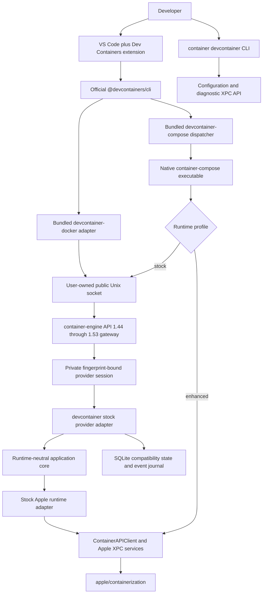
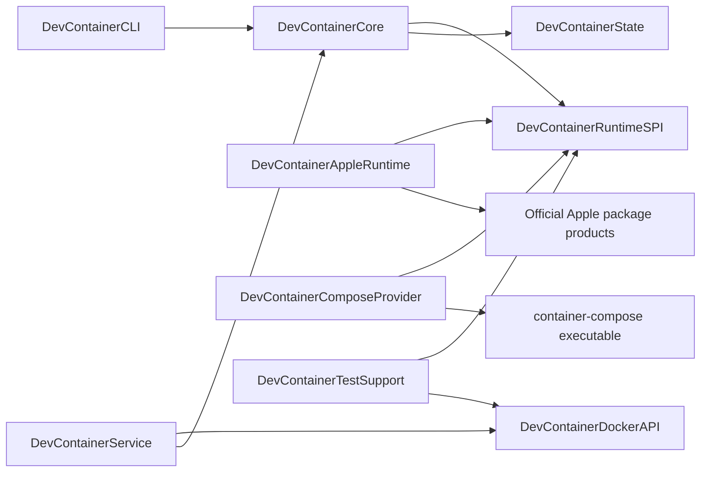
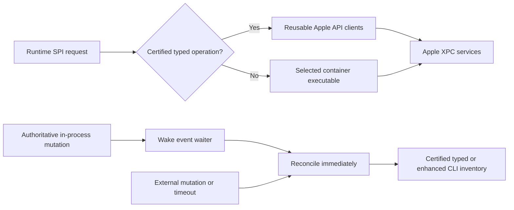
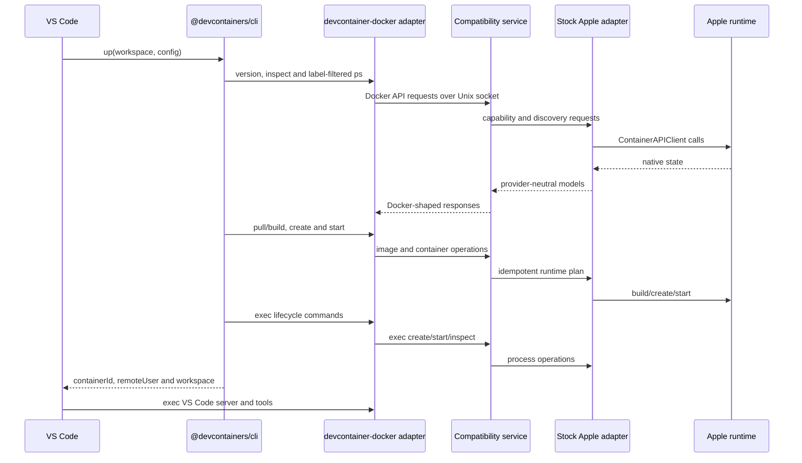
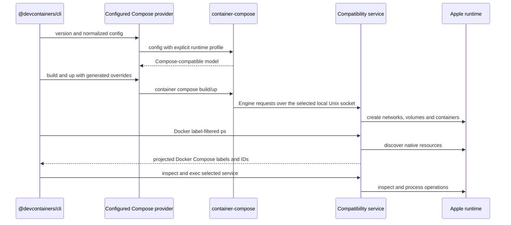
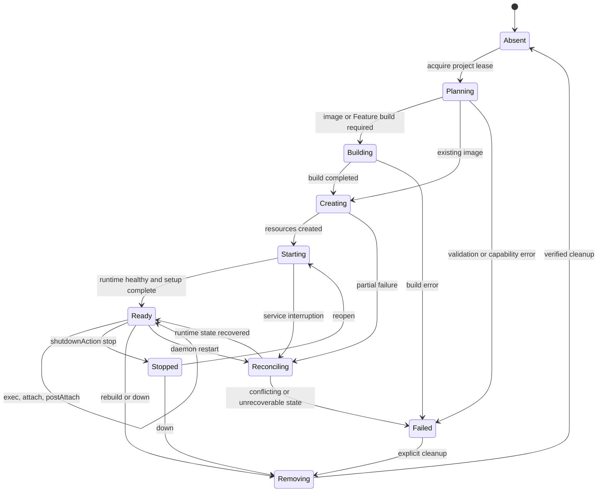

# Software design

## Status and decision

This document describes the implemented `devcontainer` architecture. The
project provides unmodified VS Code Dev Containers compatibility through a
project-owned, Apple-backed Engine API adapter. It implements the required
Docker-shaped protocol directly with Apple-native runtime providers and never
proxies Docker software. A companion `container devcontainer` CLI manages configuration and
diagnostics; it does not replace or fork the Dev Container specification
engine.

The product has two first-class runtime modes:

1. **Stock Apple mode:** only tagged upstream `apple/container` and `apple/containerization` runtime dependencies are used. Single-container operations run through the Docker-compatible service and multi-service operations use the required, process-isolated native `container-compose` executable.
2. **Enhanced Container mode:** the same compatibility service and native Compose boundary run against Stephen Clarke's enhanced Container distribution. The runtime is selected explicitly and is never installed or substituted by this project.

The selected provider is immutable while a Dev Container project owns resources. Changing providers requires an explicit down/recreate operation so container identifiers, labels, networks, and volumes never become split-brain state.
Engine startup also requires the selected backend to match the runtime's
reported distribution; stock and enhanced provider identities cannot be
mislabelled or silently substituted.

## Goals

- Reach 100% behavioural parity across the complete audited, Docker-independent Development Containers surface.
- Reach comparable or better user-visible performance than the matching Docker oracle, measured independently from functional parity.
- Work with the stock VS Code Dev Containers extension and the official `@devcontainers/cli` without patching either.
- Target official, tagged Apple `container` releases without requiring Stephen's forks.
- Support image, Dockerfile, Feature, and Compose `devcontainer.json` scenarios.
- Bundle an exact stock-profile `container-compose` build as the native Compose
  implementation, while permitting a separately fingerprinted enhanced build
  only through explicit selection.
- Reproduce the Docker-visible behavior that Dev Containers actually consumes, including JSON shapes, labels, streams, events, mounts, users, ports, and errors.
- Fail explicitly when an Apple runtime cannot represent a requested operation; never silently discard a security, mount, network, or lifecycle option.
- Bind every compatibility claim to pinned Docker, Dev Containers, Apple, Compose, macOS, and project versions.
- Keep local state reconstructable from runtime resources and labels.
- Ship a local-only, least-privilege service with deterministic cleanup and diagnostics.

These are north-star goals, not a claim beyond the exact certified release.
Configurations that require a host Docker daemon or its socket are permanently
excluded by the Docker-less product boundary. Current releases remain bounded
by the exact certified fixtures and known gaps in
[`CONFORMANCE.md`](CONFORMANCE.md). [`PARITY-ROADMAP.md`](PARITY-ROADMAP.md)
defines full-parity acceptance, the comparable-performance objective, the
current baseline, and audited implementation issues.
[`UNSUPPORTED-CAPABILITIES.md`](UNSUPPORTED-CAPABILITIES.md) defines the
field-by-field implementation and certification design for every current
unsupported capability.

## Non-goals

- General Docker Engine compatibility outside the endpoint and semantic surface required by the maintained Dev Container fixtures.
- A fork of VS Code, `@devcontainers/cli`, or the Dev Container specification.
- Installing or launching Docker CLI, Docker Compose, Docker Desktop, Docker Engine, Colima, Podman, or nerdctl in a product path.
- Reimplementing Compose parsing, interpolation, profiles, dependency planning, or reconciliation inside the core.
- Exposing a Docker-compatible TCP port by default.
- Kubernetes orchestration, production container scheduling, or Linux host support.
- Hiding unsupported stock-Apple primitives behind success responses.
- Treating the current matched `container-compose` fork stack as stock Apple.

Runtime-affecting fields in the modelled container, exec, network, and volume
request objects now use strict nested schemas. Unknown members fail with a
Docker-shaped `400`; known but unenforceable non-default fields fail with
`501`, before native or metadata side effects. Complete schema-derived
coverage for every Docker endpoint remains an explicit blocker, so arbitrary
`runArgs` are not a blanket support claim.

## Normative and implementation references

The Dev Containers organization is the primary source for configuration and lifecycle behavior:

| Reference | Design use |
| --- | --- |
| [github.com/devcontainers](https://github.com/devcontainers) | Maintained project organization and repository index |
| [Development Containers Specification](https://github.com/devcontainers/spec) | Configuration discovery, metadata merging, lifecycle, Features, and scenario semantics |
| [Dev Container JSON reference](https://github.com/devcontainers/spec/blob/main/docs/specs/devcontainerjson-reference.md) | Property-level runtime requirements |
| [Dev Container lifecycle reference](https://github.com/devcontainers/spec/blob/main/docs/specs/devcontainer-reference.md) | Create, resume, command ordering, user, and environment behavior |
| [Features specification](https://github.com/devcontainers/spec/blob/main/docs/specs/devcontainer-features.md) | OCI Feature resolution, ordering, installation, and lock behavior |
| [Schema](https://github.com/devcontainers/spec/blob/main/schemas/devContainer.base.schema.json) | Machine-readable configuration contract |
| [`@devcontainers/cli`](https://github.com/devcontainers/cli) | Reference implementation and black-box consumer |
| [Features](https://github.com/devcontainers/features), [Templates](https://github.com/devcontainers/templates), and [Images](https://github.com/devcontainers/images) | Published artifact compatibility fixtures |
| [Dev Container CI](https://github.com/devcontainers/ci) | Automation and prebuild compatibility |
| [containers.dev](https://containers.dev/) | Specification portal and supporting-tool registry |

The runtime integration follows [Apple container](https://github.com/apple/container), [Apple containerization](https://github.com/apple/containerization), and the [Apple API documentation](https://apple.github.io/container/documentation/). The stock Apple plug-in loader supports both external CLI commands and launchd-managed XPC services. Docker behavior is constrained to the versioned [Docker Engine API](https://docs.docker.com/reference/api/engine/) and the concrete command/API traffic observed from the pinned Dev Container CLI.

## System context



VS Code never talks directly to an Apple API. Its existing toolchain sees the Docker-shaped invocation and protocol contracts it expects because the packaged `devcontainer-docker` adapter targets the project Unix socket. The adapter is first-party project software, not the Docker CLI. This follows Apple's stated preference for ecosystem compatibility in an external bridge rather than Docker-shaped behavior in the native `container` CLI.

## Deployment units

The archive exposes a CLI plug-in entry point plus independently runnable
service and Compose-dispatch executables:

| Unit | Apple plug-in name | Responsibility |
| --- | --- | --- |
| `devcontainer` | `devcontainer` CLI plug-in | Packaged alias of the `devcontainer` command for `version`, `doctor`, privacy-redacted `diagnostics`, `configure`, `context`, explicit plug-in registration, and durable `backend` ownership |
| `container-engine` | Normal executable from exact `container-engine-api` revision `48e44d74d738ca3d24351ba02c4869be1a3e6998` | Owns the public compatibility Unix listener, generated API 1.44 through 1.53 route ledger, persistent provider selection, RFC 6455 framing, and fail-closed dispatch to one private provider session |
| `devcontainer-engine` | Normal executable | Stock-provider adapter, state reconciliation, and event handling; normal mode starts an internal private provider session behind the shared public gateway, while `--provider-socket` exposes only that private session for an external `container-engine` process |
| `ContainerEngineWire`, `ContainerEngineRouter`, `ContainerUnixHTTPServer`, `ContainerEngineRuntimeSPI`, `ContainerEngineProviderSession`, and `ContainerEngineGateway` | Exact `container-engine-api` revision `48e44d74d738ca3d24351ba02c4869be1a3e6998` libraries | Shared compatibility wire, generated route ledger, hardened bounded raw/WebSocket listener, provider-owned immutable state-root identity, private schema-2 session protocol, and gateway dispatch; no Apple or Compose dependency |
| `devcontainer-compose` | Docker Compose plug-in-compatible executable | Adapts the invocation contract to an explicitly resolved native `container-compose`; it has no Docker executable fallback |
| `DevContainerCore` | Swift library | Provider-neutral use cases, compatibility rules, identity, reconciliation, and errors |
| `DevContainerRuntimeSPI` | Swift library | Narrow runtime, build, process, archive, network, volume, forwarding, and capability protocols |
| `DevContainerAppleRuntime` | Swift library | Translation to official `ContainerAPIClient` and versioned Apple models |
| `DevContainerComposeProvider` | Swift library | Validates and invokes a configured `container-compose` executable; contains no `ComposeCore` source dependency |
| `DevContainerDockerAPI` | Swift library | Stock-provider endpoint policy and DTO projection over the shared wire/router contracts |
| `DevContainerState` | Swift library | SQLite schema, migrations, leases, event cursor, and rebuildable compatibility metadata |
| `DevContainerTestSupport` | Swift library | Fakes, controllable clocks, stream recorders, fault injection, and observation models |



Only adapter targets may import Apple or Compose-specific types. Wire DTOs do not cross into the provider SPI, and Apple DTOs do not enter the core. This preserves source isolation as Apple package APIs evolve.

## Runtime SPI

The runtime SPI is capability-driven and asynchronous. Its initial protocol groups are:

- `RuntimeIdentityProvider`: version, source, commit, distribution, API protocol, and capabilities.
- `ImageRuntime`: pull, list, inspect, tag, remove, and streamed build.
- `ContainerRuntime`: create, start, stop, kill, wait, remove, list, and inspect.
- `ProcessRuntime`: create exec, start attached/detached exec, resize TTY, inspect exit state, and cancel.
- `ArchiveRuntime`: POSIX tar upload/download with ownership, mode, timestamps, symlink, and long-path fidelity.
- `NetworkRuntime`: create, inspect, connect, disconnect, aliases, DNS, and remove.
- `VolumeRuntime`: create, inspect, mount, list, and remove.
- `ForwardingRuntime`: publish TCP/UDP ports and forward Unix sockets.
- `EventRuntime`: ordered lifecycle/image/network/volume/exec events with resumable cursors.
- `ComposeProvider`: version/capability probe, config, build, up, stop, down, and primary-service discovery.

Every request receives a correlation identifier and deadline. Mutating
requests also receive an operation identifier, selected backend fingerprint,
configuration hash, project key, and generation through the production
coordinator. Explicit idempotency keys deduplicate an in-process replay and
reject conflicting reuse; persistent replay across service restart remains a
roadmap blocker. Decoded unsupported behaviour returns a typed
`unsupportedCapability` error before resources are created.

The Apple adapter also probes `container create --help` once per selected
executable. Stock Apple 1.4.1 lacks hostname, security-option, and privileged
switches: requests for those semantics fail before mount or container side
effects. A separately fingerprinted enhanced runtime uses its native switches.
Capability discovery is behavioural and never inferred from an install path
or attributed across provider lanes.

### Apple adapter fast path

The adapter keeps reusable official clients for the lifetime of each engine
process. Stock Apple container inventory and exact inspection use the typed
1.4.1 schema. A separately fingerprinted enhanced distribution retains its
CLI JSON inventory path because decoding it through the stock schema would
discard additive exit, hostname, security, alias, and health fields. Network,
archive, and managed `/etc/hosts` transfers continue to use distribution-safe
direct clients. Operations without a certified typed equivalent continue
through the selected `container` executable.



The event loop wakes immediately after an in-process mutation and retains a
200ms reconciliation fallback for changes made by another process. Managed
host-file content is cached by container runtime identifier, creation
timestamp, and desired block. Runtime bootstrap recreates the guest's default
`/etc/hosts`, so the cache is invalidated on every adapter-owned start,
including transient archive starts, as well as container recreation, removal,
or archive upload.

For a coordinated provider migration, the adapter exports one atomic,
quiescence-checked identity/lifecycle view. Each record preserves the canonical
name, Docker identifier, immutable Apple bundle key, selected-provider
fingerprint, and exact stopped-state snapshot. Running containers, running
execs, starts, and create/start/stop/restart/kill/rename/remove/exit mutations
reject the handoff. The legacy polling event source is not a durable journal,
so its portable event history is deliberately empty rather than fabricated.

## Docker-compatible API boundary

The generated shared route ledger contains all 107 method/path operations in the pinned Moby Engine API specifications from 1.44 through 1.53. The gateway advertises only operations declared by the selected provider, rejects every known but unavailable operation with a Docker-shaped `501`, and returns `404` for paths outside the ledger. The stock adapter currently declares and returns Docker-shaped identifiers, JSON, headers, streams, status codes, and errors for this tested surface:

| Area | Required endpoints or behavior |
| --- | --- |
| Negotiation | `/_ping`, `/version`, `/info`, version-prefixed routes |
| Containers | list, create, inspect, start, stop, kill, wait, remove, logs, raw attach, and binary WebSocket attach; running-container resize remains unavailable on stock Apple because the public API cannot retrieve the exact active init-process handle |
| Exec | create, start, resize, inspect, stdin/stdout/stderr multiplexing |
| Files | archive upload/download and path stat headers |
| Images | list, inspect, create/pull, build, tag, remove |
| Resources | volume and network create/list/inspect/connect/disconnect/remove |
| Events | label-filtered, ordered JSON event stream with reconnect cursor |

Each HTTP/1.1 connection has a 1 GiB aggregate retained-body budget and a bounded pending-request queue. The project Docker CLI creates Dockerfile build archives inside a mode-0700 temporary directory, streams the file to the project-owned socket in bounded chunks, verifies its owner, link count, type, and length before transfer, and removes the staging directory on every return path. The engine currently transfers large request bodies from SwiftNIO storage into `Data` without copying the bytes; completing file-backed engine ingress remains an explicit optimisation in [`PARITY-ROADMAP.md`](PARITY-ROADMAP.md). A client that exceeds either the per-request, aggregate-byte, or queue bound is rejected without allowing a later pipelined response to overtake an earlier one.

The build-context selector compiles Docker-ignore rules into Go-compatible scalar tokens. Literal-only rules compare exact Unicode-scalar sequences in linear time without consuming the wildcard budget. Wildcard rules use deterministic dynamic programming and share a 33,554,432-work-unit budget across the complete context walk; character-class member scans are charged individually rather than treated as a constant-time state. A workspace that exhausts that budget fails before an archive is submitted, preventing a syntactically valid near-64 KiB pattern or character class from multiplying unbounded matching work across context entries. When an excluded real directory cannot contain a valid re-inclusion under Docker's parent-exclusion rule, enumeration prunes that subtree; symbolic links are never traversed or treated as pruneable directories.

Automatic removal uses one actor-isolated registration across the native runtime ID, Docker ID, and container name. Concurrent exit observations through different aliases therefore converge on one deletion, while the registration retains the pre-inspection creation timestamp and refuses to delete a same-name replacement.

Buildx support is advertised only when session and streaming semantics pass the pinned Dev Container Feature and Dockerfile-build fixtures. Until then, the compatibility service forces the reference CLI's proven non-Buildx path instead of returning a false-positive `buildx version`.

## Identity and label projection

The Apple runtime is the source of truth for container existence and lifecycle state. The SQLite store contains only compatibility data that cannot be recovered from Apple resources, such as exec instance state, Docker event sequence numbers, provider leases, and normalized metadata.

Every project resource carries:

- the Dev Container discovery labels used by `@devcontainers/cli`, including `devcontainer.local_folder` and `devcontainer.config_file`;
- standard Docker Compose project/service labels when a Compose scenario is active;
- project-owned labels recording backend kind, configuration digest, project identifier, and schema version;
- native Apple labels needed by the selected provider.

`container-compose` currently uses provider-owned compatibility labels in the
`com.apple.container.compose.*` namespace. These labels do not represent an
Apple-authored Compose product. The provider adapter and inspection layer
project them into `com.docker.compose.*` labels and translate Docker label
filters back to native discovery queries. A projected label never overwrites
conflicting runtime data; conflict is a reconciliation error.

## Provider selection

Provider choice is explicit and recorded in a project lease:

```text
stock
  single-container -> Docker API bridge -> stock Apple adapter
  Compose          -> native container-compose -> same Engine socket -> stock Apple adapter

container-compose
  single-container -> Docker API bridge -> selected Apple runtime
  Compose          -> native container-compose -> enhanced Apple runtime
  inspect/exec     -> Docker API bridge -> runtime discovery
```

Before every resource-changing Compose command, the dispatcher consumes the complete supported global-option grammar, including inline Boolean forms, and fails closed on an option it cannot classify. Dry-run, help, and version requests do not acquire an ownership claim. Explicit project names are validated against the Compose naming contract; otherwise the selected Compose implementation resolves the canonical name through `config --format json`, preserving the official `-f`, `COMPOSE_FILE`, top-level `name:`, project-directory, and current-directory precedence. The canonical name, rather than an invocation directory alias, keys the immutable provider claim.

The dispatcher passes an explicit runtime profile, exact Container executable,
and local Engine socket to `container-compose`. In stock mode Compose uses that
socket as its runtime SPI, so it shares the same stock adapter, state authority,
and lifecycle journal as single-container operations and never loads an
enhanced XPC client against Apple's service. In enhanced mode the independently
released provider may use its richer native API after exact capability and
provenance negotiation. It never infers compatibility from an installed path.

## Single-container request sequence



## Compose request sequence



The bridge does not maintain a second Compose lifecycle database. Project leases store provider selection, canonical Compose identity, and diagnostic invocation metadata; live state is reconciled from runtime resources.

## Lifecycle and reconciliation



The service uses Swift actors for state isolation and a keyed async lock per project and resource. Runtime calls honor cancellation and deadlines. Startup reconciliation:

1. verifies schema and acquires a single-instance database lease;
2. lists project-labelled runtime resources;
3. validates the shared, immutable state-root provider fingerprint and configuration digests;
4. reconstructs recoverable state and event cursors;
5. marks conflicts for explicit repair rather than deleting them;
6. removes only invocation-owned stale exec metadata.

Cleanup requires both a project label and the invocation lease. Broad name prefixes, shell globs, and unverified filesystem roots are never deletion authority.

## Error model

Provider errors become a stable internal error taxonomy before Docker serialization:

- invalid request or configuration;
- unsupported capability;
- conflict or already exists;
- not found;
- deadline exceeded or cancelled;
- authentication or registry failure;
- build failure;
- runtime unavailable;
- provider protocol mismatch;
- state corruption or reconciliation conflict.

The Docker layer maps these to the status, JSON message, stream error, and exit behavior expected by the pinned client. Diagnostics retain the internal cause and correlation ID without leaking credentials or host-private paths.

## Security architecture

- The project-owned compatibility socket is created under a user-owned runtime directory with mode `0600`; no TCP listener exists.
- The XPC service validates the connecting audit token and rejects cross-user access.
- Registry credentials remain in Apple's existing credential mechanism and are never written to SQLite.
- Secrets, build arguments marked secret, authentication headers, SSH agent paths, and environment values matching redaction rules are removed from logs and diagnostic bundles.
- Host mount paths are canonicalized, checked for symlink escapes, and authorized before resource creation.
- Bind mounts whose resolved source is a Docker or Docker Desktop runtime socket are rejected before container creation; the product has no daemon-socket proxy mode.
- The wrappers ignore ambient `DOCKER_HOST` and compatibility-adapter overrides, inject only the project-owned adapters and socket, and require runtime selection to resolve to an executable named `container`. Its version record must identify stock `apple/container` or the explicit `stephenlclarke/container` distribution; every other custom distribution is rejected before project work. Docker, Colima, Podman, and nerdctl executable selections fail before launch, and `docker` is not an accepted backend or Compose-provider configuration value. Every product child-process launch passes through the shared `ProcessRunner`, which reapplies that Docker-less executable and resolved-symlink policy before execution; the source audit rejects direct process-launch APIs outside that runner. The official client wrapper always uses the checksum-pinned packaged script and constrains Node selection to an executable named `node`. A separately selected native Compose executable must use a native provider filename and return an exact semantic version, 40-character source commit, and `stephenlclarke/container-compose` source identity before it can receive a project command. Explicit socket selection also rejects `docker.sock` and `docker.raw.sock`, including symlink aliases, before any connection attempt. A cached, side-effect-free identity probe must then identify the listening process as `devcontainer-engine` before the adapter sends its first workload request, so a foreign Docker-compatible endpoint cannot be selected under another socket filename.
- Every main product dependency is pinned through `Package.resolved`; release artifacts include Apache-compatible notices, SPDX SBOMs, checksums, and provenance attestations. The process-isolated Compose payload additionally vendors its exact Go build list and carries a separate provider SBOM plus full legal texts for its SwiftPM dependencies, Go modules, and Go standard library.
- Public pull requests never execute on the physical Apple runtime runner.

See [SECURITY.md](SECURITY.md) and [QUALITY.md](QUALITY.md) for disclosure and release gates.

## Configuration and state

User configuration lives in `~/.config/devcontainer/config.toml`. By default,
the generated `socket` is the absolute path returned by
`FileManager.default.temporaryDirectory`, followed by
`devcontainer/engine.sock`; on macOS this is the current user's private
per-login temporary root. The following example instead selects an explicit
stable user-owned runtime path:

```toml
backend = "stock"
socket = "~/.local/run/devcontainer/engine.sock"

[runtime]
executable = "/usr/local/bin/container"

[state]
database = "~/Library/Application Support/devcontainer/state.sqlite"

[compose]
provider = "container-compose"

[compatibility]
strict = true
```

All public commands resolve the same selection with this precedence: explicit
command option, documented environment variable, configuration file, then the
user-scoped default. `DEVCONTAINER_CONFIG`, `DEVCONTAINER_BACKEND`,
`DEVCONTAINER_COMPOSE_PROVIDER`, `DEVCONTAINER_CONTAINER_BIN`,
`DEVCONTAINER_SOCKET`, and `DEVCONTAINER_STATE` are the supported overrides;
ambient `DOCKER_HOST` is never an authority source. When the pinned reference
CLI or native Compose provider needs that compatibility variable, devcontainer
overwrites it with its selected project-owned Apple-backed socket.
Unknown or duplicate configuration keys and relative runtime, state, or socket
paths fail closed. Per-project provider choice and configuration digest live in
the service database. Secrets are not accepted in configuration files.
`container devcontainer doctor --format json` emits a machine-readable backend
fingerprint and capability report.

## Observability

Structured logs use correlation, project, resource, endpoint, provider, and elapsed-time fields. Values are privacy-redacted before emission. Metrics are local by default and include request latency, stream termination reason, reconciliation outcome, resource leak count, and parity fixture timing. Parity evidence compares stock Apple with Docker, the enhanced provider with Docker, and the enhanced provider directly with stock Apple for every matching fixture. Comparable or better performance (`<=1.00x` the matching comparator) is the objective, and any completed result above `2.50x` requires further investigation. A result at or above `10.00x` its matching comparator, non-completion, or missing or invalid timing evidence fails the gate without changing the separately reported functional result. The full target and current implementation gaps are defined in [`PARITY-ROADMAP.md`](PARITY-ROADMAP.md). There is no outbound telemetry in the initial product.

`container devcontainer diagnostics` creates a reviewable archive containing versions, capability probes, redacted logs, runtime resource summaries, config hashes, and recent event state. The command prints the archive manifest before writing it.

## Packaging

The release archive contains a valid Apple CLI plug-in directory, standalone
executables, build metadata, license, notices, SBOM, and service definition.
The Homebrew formula installs this project without forcing either Apple runtime
distribution. `devcontainer plugin register` creates the one explicit symlink
under the active runtime's reported installation root; it is idempotent and
refuses to replace a foreign file, directory, or link. Registration can
therefore be tested independently against an official Apple package and
Stephen's Homebrew runtime.

Stable formulae use immutable semantic release assets. The generated
`devcontainer-current` formula uses a monotonically increasing
`current.RUN.SHA12` version and an immutable `current-SHA40` prerelease with a
commit-identified asset. The release is published and authenticated before the
formula fetch test, and the tap is pushed only after that exact formula passes.
A stable release remains non-latest until the tested tap commit is pushed;
only then is its editable Latest marker promoted. A retry after publication
recovers the published bytes rather than assuming a new notarized build is
byte-identical. The complete fail-closed transaction is defined in
[RELEASE.md](RELEASE.md).

## Release definition of done

A stable tag is prohibited until:

- every fixture in `Tests/Parity/manifest.json` is implemented;
- Docker oracle, stock Apple 1.4.1, and `container-compose` 0.15.1 recordings pass;
- real pinned VS Code and Dev Containers extension E2E passes;
- no functional difference is normalized, waived, retried into success, or marked expected;
- hosted CI, coverage, Sonar, CodeQL, dependency review, sanitizers, Docs, package validation, SBOM, attestation, and Homebrew tests are bound to the exact tag commit;
- the Homebrew-installed artifact passes a physical-runner smoke test;
- documentation and the compatibility ledger match the evidence.

## Risks and mitigations

| Risk | Consequence | Mitigation |
| --- | --- | --- |
| Apple package source instability | Adapter fails after minor upgrades | Exact stable pin, isolated adapter target, capability probe |
| Docker wire-semantic mismatch | VS Code fails despite successful native calls | Raw protocol tests and Docker/Dev Containers black-box oracle |
| Missing Apple primitive | Requested configuration cannot be represented | Typed fail-fast capability error, upstream issue, no false success |
| Compose label/model mismatch | Primary service cannot be discovered or reused | Native-to-Docker label projection and filter translation |
| Split provider state | Leaks, wrong attach target, unsafe cleanup | Immutable project lease and runtime-as-source-of-truth reconciliation |
| Stream/TTY differences | Broken terminal, server install, or exit status | Byte-level multiplexing, PTY resize, cancellation, and VS Code E2E fixtures |
| Self-hosted runner compromise | Release credentials or host exposed | Trusted exact commits only, ephemeral state, no fork PR code, least privilege |
| Mutable upstream oracle | Parity results drift | Checked-in exact refs, versions, image digests, and fixture revisions |
| Overbroad Docker claim | Users assume unsupported production behavior | Advertise only the tested API range and Dev Containers compatibility scope |
