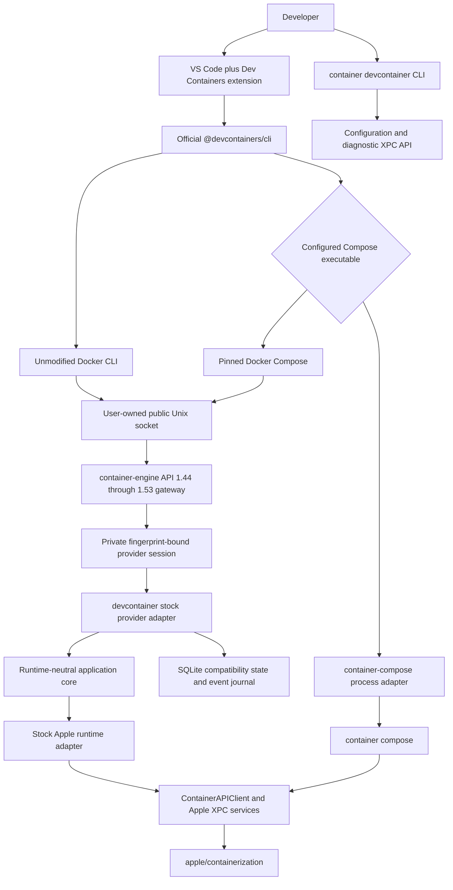
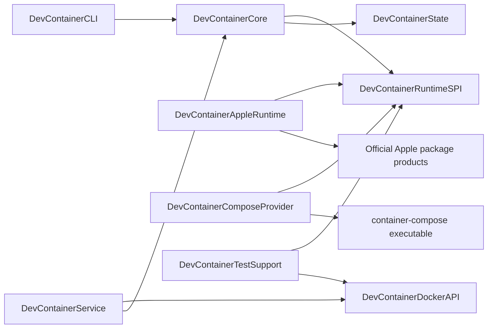
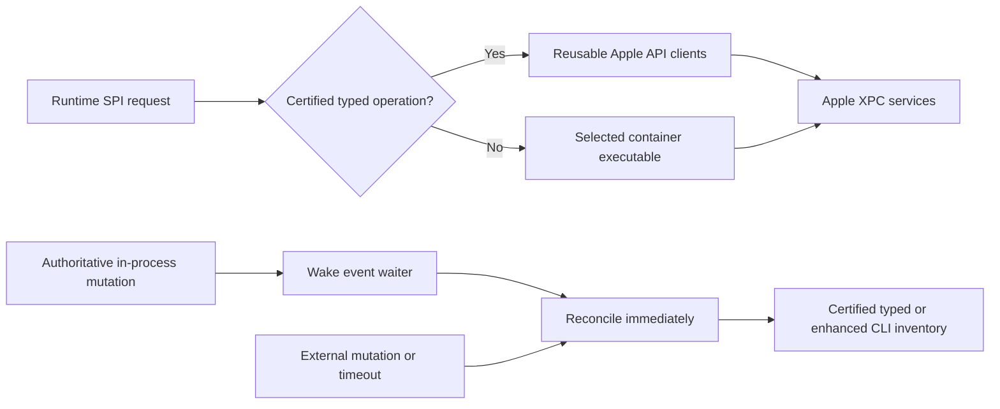
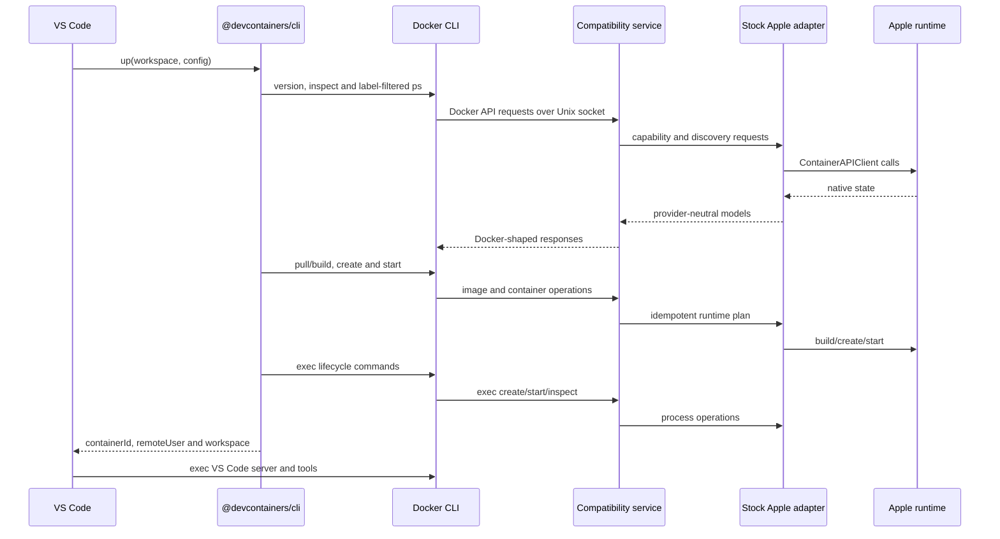
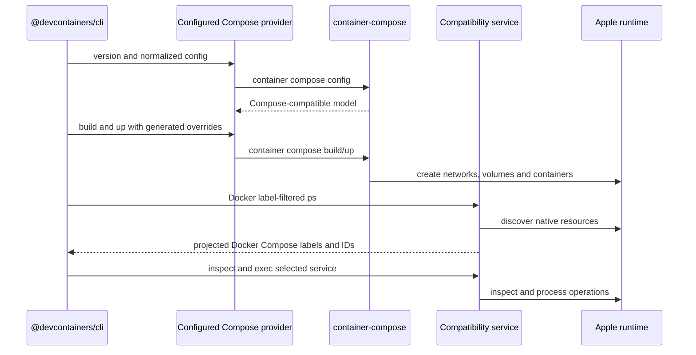
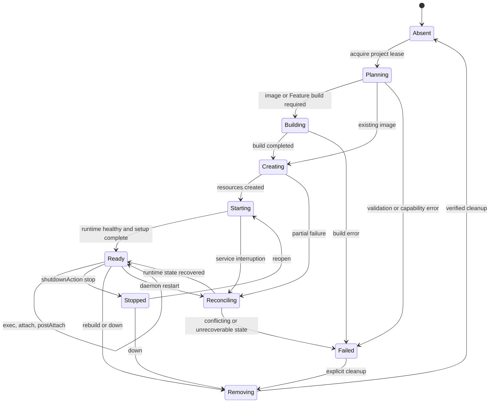

# Software design

## Status and decision

This document describes the implemented `devcontainer` architecture. The
project provides unmodified VS Code Dev Containers compatibility by placing a
Docker Engine API compatibility service in front of Apple-native runtime
providers. A companion `container devcontainer` CLI manages configuration and
diagnostics; it does not replace or fork the Dev Container specification
engine.

The product has two first-class runtime modes:

1. **Stock Apple mode:** only tagged upstream `apple/container` and `apple/containerization` runtime dependencies are used. Single-container and Compose configurations run through the Docker-compatible service; Docker Compose uses the same service.
2. **container-compose mode:** the same compatibility service handles Docker inspection, exec, copy, event, and attach traffic, while `container-compose` performs Compose planning and lifecycle operations. The provider is process-isolated and optional.

The selected provider is immutable while a Dev Container project owns resources. Changing providers requires an explicit down/recreate operation so container identifiers, labels, networks, and volumes never become split-brain state.

D06's captured startup command adds explicit IPv4/fixed TCP publication to the unreleased frontend. It sends `ExposedPorts` and `HostConfig.PortBindings` through the shared Unix transport; it does not create a second forwarding service or invoke Docker. Native inspection derives host bindings from the stored runtime specification, excluding expose-only entries. Dynamic ports, ranges, IPv6 and UDP publish syntax remain rejected by this bounded frontend until qualified. The reference-only Colima VM's narrowly scoped SSH forwarder is test infrastructure, not a candidate dependency. [D06 evidence](docs/bazel-test-harness.md#d06-published-ports) records passing Docker and stock-native runs; enhanced qualification remains blocked on its exact guest input.

D07 adds typed bind/named-volume projection to the same frontend mount parser. It preserves the named source and target in `HostConfig.Mounts`; the existing runtime remains the sole volume owner and no Docker process is introduced. Anonymous or advanced mount forms fail before create until separately qualified. Rebuild's `rm -f/--force` accepts exactly one full container ID and sends forced deletion through the selected private socket, without deleting volumes or resolving names. Unsupported forms fail before mutation; engine errors propagate. The [D07 contract](docs/bazel-test-harness.md#d07-reuse-and-cleanup) binds repeated CLI generations to the same owned volume and requires actual hook counters and resource absence.

## Goals

C02's unreleased stock Compose bridge carries requested health policy in a bounded versioned native label, negotiated before project resources. The stock adapter validates and adopts it; the existing Engine evaluator executes guest probes and derives observed health. Unique probe reservations reject late results across reset/restart/removal. No Docker process or enhanced fork dependency is introduced. This bounded inspect-driven bridge does not claim autonomous Docker health scheduling or event persistence; [the contract](docs/bazel-test-harness.md#c02-dependency-health-and-service-selection) records qualification and unsupported fields.

The unreleased Bazel candidate adds a project-owned `devcontainer-docker` frontend beneath its private official Dev Containers CLI bundle. D02 builds use the shared Unix HTTP transport, local tar contexts and the selected stock/enhanced Apple builder. Generated Dockerfiles outside the workspace are injected with archive-only exclusions; build errors remain failures even inside HTTP 200 progress streams. The current bounded frontend rejects existing `.dockerignore` files and unsupported flags rather than claiming full Docker-build semantics. Native image inspection projects ordered uncompressed layer digests from descriptor-bound OCI configuration. Candidate live qualification remains distinct from the immutable stable-release matrix.

- Reach 100% behavioural parity with Docker-based Development Containers across the complete audited Development Containers surface.
- Reach comparable or better user-visible performance than the matching Docker oracle, measured independently from functional parity.
- Work with the stock VS Code Dev Containers extension and the official `@devcontainers/cli` without patching either.
- Target official, tagged Apple `container` releases without requiring Stephen's forks.
- Support image, Dockerfile, Feature, and Compose `devcontainer.json` scenarios.
- Support `container-compose` as a separately installed, first-class provider.
- Reproduce the Docker-visible behavior that Dev Containers actually consumes, including JSON shapes, labels, streams, events, mounts, users, ports, and errors.
- Fail explicitly when an Apple runtime cannot represent a requested operation; never silently discard a security, mount, network, or lifecycle option.
- Bind every compatibility claim to pinned Docker, Dev Containers, Apple, Compose, macOS, and project versions.
- Keep local state reconstructable from runtime resources and labels.
- Ship a local-only, least-privilege service with deterministic cleanup and diagnostics.

These are north-star goals, not claims about version 1.0.1. Current releases remain bounded by the exact certified fixtures and known gaps in [`CONFORMANCE.md`](CONFORMANCE.md). [`PARITY-ROADMAP.md`](PARITY-ROADMAP.md) defines full-parity acceptance, the comparable-performance objective, the current baseline, and audited implementation issues. [`UNSUPPORTED-CAPABILITIES.md`](UNSUPPORTED-CAPABILITIES.md) defines the field-by-field implementation and certification design for every current unsupported capability.

## Non-goals

- General Docker Engine compatibility outside the endpoint and semantic surface required by the maintained Dev Container fixtures.
- A fork of VS Code, `@devcontainers/cli`, Docker CLI, Docker Compose, or the Dev Container specification.
- Reimplementing Compose parsing, interpolation, profiles, dependency planning, or reconciliation inside the core.
- Exposing a Docker-compatible TCP port by default.
- Kubernetes orchestration, production container scheduling, or Linux host support.
- Hiding unsupported stock-Apple primitives behind success responses.
- Treating the current matched `container-compose` fork stack as stock Apple.

Runtime-affecting fields in the modelled container, exec, network, and volume
request objects now use strict nested schemas. Unknown members fail with a
Docker-shaped `400`; known but unenforceable non-default fields fail with
`501`, before native or metadata side effects. Complete schema-derived
coverage for every Docker endpoint remains an explicit blocker, so arbitrary
`runArgs` are not a blanket support claim.

## Normative and implementation references

The Dev Containers organization is the primary source for configuration and lifecycle behavior:

| Reference | Design use |
| --- | --- |
| [github.com/devcontainers](https://github.com/devcontainers) | Maintained project organization and repository index |
| [Development Containers Specification](https://github.com/devcontainers/spec) | Configuration discovery, metadata merging, lifecycle, Features, and scenario semantics |
| [Dev Container JSON reference](https://github.com/devcontainers/spec/blob/main/docs/specs/devcontainerjson-reference.md) | Property-level runtime requirements |
| [Dev Container lifecycle reference](https://github.com/devcontainers/spec/blob/main/docs/specs/devcontainer-reference.md) | Create, resume, command ordering, user, and environment behavior |
| [Features specification](https://github.com/devcontainers/spec/blob/main/docs/specs/devcontainer-features.md) | OCI Feature resolution, ordering, installation, and lock behavior |
| [Schema](https://github.com/devcontainers/spec/blob/main/schemas/devContainer.base.schema.json) | Machine-readable configuration contract |
| [`@devcontainers/cli`](https://github.com/devcontainers/cli) | Reference implementation and black-box consumer |
| [Features](https://github.com/devcontainers/features), [Templates](https://github.com/devcontainers/templates), and [Images](https://github.com/devcontainers/images) | Published artifact compatibility fixtures |
| [Dev Container CI](https://github.com/devcontainers/ci) | Automation and prebuild compatibility |
| [containers.dev](https://containers.dev/) | Specification portal and supporting-tool registry |

The runtime integration follows [Apple container](https://github.com/apple/container), [Apple containerization](https://github.com/apple/containerization), and the [Apple API documentation](https://apple.github.io/container/documentation/). The stock Apple plug-in loader supports both external CLI commands and launchd-managed XPC services. Docker behavior is constrained to the versioned [Docker Engine API](https://docs.docker.com/reference/api/engine/) and the concrete command/API traffic observed from the pinned Dev Container CLI.

## System context



VS Code never talks directly to an Apple API. Its existing toolchain sees a Docker-compatible CLI because the unmodified Docker CLI targets the project Unix socket. This follows Apple's stated preference for ecosystem compatibility in an external bridge rather than Docker-shaped behavior in the native `container` CLI.

## Deployment units

The archive exposes a CLI plug-in entry point plus independently runnable
service and Compose-dispatch executables:

| Unit | Apple plug-in name | Responsibility |
| --- | --- | --- |
| `devcontainer` | `devcontainer` CLI plug-in | Packaged alias of the `devcontainer` command for `version`, `doctor`, privacy-redacted `diagnostics`, `configure`, `context`, explicit plug-in registration, and durable `backend` ownership |
| `container-engine` | Normal executable from exact `container-engine-api` revision `84830606abf9` | Owns the public Docker Engine Unix listener, generated API 1.44 through 1.53 route ledger, persistent provider selection, RFC 6455 framing, and fail-closed dispatch to one private provider session |
| `devcontainer-engine` | Normal executable | Stock-provider adapter, state reconciliation, and event handling; normal mode starts an internal private provider session behind the shared public gateway, while `--provider-socket` exposes only that private session for an external `container-engine` process |
| `ContainerEngineWire`, `ContainerEngineRouter`, `ContainerUnixHTTPServer`, `ContainerEngineRuntimeSPI`, `ContainerEngineProviderSession`, and `ContainerEngineGateway` | Exact `container-engine-api` revision `84830606abf9` libraries | Shared Docker wire, generated route ledger, hardened bounded raw/WebSocket listener, provider-owned immutable state-root identity, private schema-2 session protocol, and gateway dispatch; no Apple or Compose dependency |
| `devcontainer-compose` | Docker Compose plug-in-compatible executable | Dispatches to upstream Docker Compose over the socket or an explicitly configured external `container-compose` |
| `DevContainerCore` | Swift library | Provider-neutral use cases, compatibility rules, identity, reconciliation, and errors |
| `DevContainerRuntimeSPI` | Swift library | Narrow runtime, build, process, archive, network, volume, forwarding, and capability protocols |
| `DevContainerAppleRuntime` | Swift library | Translation to official `ContainerAPIClient` and versioned Apple models |
| `DevContainerComposeProvider` | Swift library | Validates and invokes a configured `container-compose` executable; contains no `ComposeCore` source dependency |
| `DevContainerDockerAPI` | Swift library | Stock-provider endpoint policy and DTO projection over the shared wire/router contracts |
| `DevContainerState` | Swift library | SQLite schema, migrations, leases, event cursor, and rebuildable compatibility metadata |
| `DevContainerTestSupport` | Swift library | Fakes, controllable clocks, stream recorders, fault injection, and observation models |



Only adapter targets may import Apple or Compose-specific types. Wire DTOs do not cross into the provider SPI, and Apple DTOs do not enter the core. This preserves source isolation as Apple package APIs evolve.

## Runtime SPI

The runtime SPI is capability-driven and asynchronous. Its initial protocol groups are:

- `RuntimeIdentityProvider`: version, source, commit, distribution, API protocol, and capabilities.
- `ImageRuntime`: pull, list, inspect, tag, remove, and streamed build.
- `ContainerRuntime`: create, start, stop, kill, wait, remove, list, and inspect.
- `ProcessRuntime`: create exec, start attached/detached exec, resize TTY, inspect exit state, and cancel.
- `ArchiveRuntime`: POSIX tar upload/download with ownership, mode, timestamps, symlink, and long-path fidelity.
- `NetworkRuntime`: create, inspect, connect, disconnect, aliases, DNS, and remove.
- `VolumeRuntime`: create, inspect, mount, list, and remove.
- `ForwardingRuntime`: publish TCP/UDP ports and forward Unix sockets.
- `EventRuntime`: ordered lifecycle/image/network/volume/exec events with resumable cursors.
- `ComposeProvider`: version/capability probe, config, build, up, stop, down, and primary-service discovery.

Every request receives a correlation identifier and deadline. Mutating
requests also receive an operation identifier, selected backend fingerprint,
configuration hash, project key, and generation through the production
coordinator. Explicit idempotency keys deduplicate an in-process replay and
reject conflicting reuse; persistent replay across service restart remains a
roadmap blocker. Decoded unsupported behaviour returns a typed
`unsupportedCapability` error before resources are created.

The Apple adapter also probes `container create --help` once per selected
executable. Stock Apple 1.1.0 lacks hostname, security-option, and privileged
switches: requests for those semantics fail before mount or container side
effects. A separately fingerprinted enhanced runtime uses its native switches.
Capability discovery is behavioural and never inferred from an install path
or attributed across provider lanes.

### Apple adapter fast path

The adapter keeps reusable official clients for the lifetime of each engine
process. Stock Apple container inventory and exact inspection use the typed
1.1.0 schema. A separately fingerprinted enhanced distribution retains its
CLI JSON inventory path because decoding it through the stock schema would
discard additive exit, hostname, security, alias, and health fields. Network,
archive, and managed `/etc/hosts` transfers continue to use distribution-safe
direct clients. Operations without a certified typed equivalent continue
through the selected `container` executable.

Archive uploads validate their tar input before host extraction and preserve member permission bits independently of the service's file-creation mask. Extraction uses a child of an untouched private `0700` temporary directory: an archive's `.` entry may change the child mode but cannot expose the enclosing host staging tree. Both direct-client and CLI copy paths upload only that extracted child. This does not claim UID/GID or extended-attribute parity beyond the separately qualified fixture scope.



The event loop wakes immediately after an in-process mutation and retains a
200ms reconciliation fallback for changes made by another process. Managed
host-file content is cached by container runtime identifier, creation
timestamp, observed start timestamp, and desired block. Runtime bootstrap recreates the guest's default
`/etc/hosts`, so the cache is invalidated on every adapter-owned start,
including transient archive starts, as well as container recreation, removal,
or archive upload.

Running-state reconciliation is serialized across file-transfer awaits and obtains an unfiltered inventory after entering that queue. Native Compose service names are eligible only when the versioned native identity and Docker label mirrors agree, the container is not a one-off, and the name is safe for a hosts entry. Addresses come exclusively from observed shared network attachments. Native Compose exec preparation reconciles only the requested target, not every project; ordinary inventory and inspect calls do not write guest files. Reconciliation propagates request cancellation, checks target creation/start identity before transfers and before caching success, and preserves unmanaged hosts entries. These changes are supporting C02 work, not proof of startup-time resolution or a completed parity contract.

#### Startup-time name resolution: remaining C02 implementation

The creation adapter now preserves prepared typed mounts when adding parsed user mounts, and journals that complete configuration before native submission. User mounts that lexically overlap a prepared mount (including ancestors, descendants and normalized paths) fail before kernel lookup or journalling. This is a prerequisite only: no managed hosts backing file is allocated yet, and lexical checks cannot establish image-internal symlink safety. The stock CLI parser rejects regular-file bind sources even though the typed runtime supports them, so the managed file must not be passed through CLI mount parsing.

The pinned stock runtime's global DNS lookup traverses all networks, so assigning bare service names to it is not a network-isolated replacement. A pre-entrypoint file-copy shortcut is also invalid: the outer API requires a running container, and although the runtime-service copy/dial methods accept a booted state, their underlying `LinuxContainer` calls require the started state. Stopping that partly bootstrapped container also needs care because the outer service's cached stopped snapshot can skip normal exit cleanup. No preboot copy adapter is connected to the product.

The viable stock primitive is a single-file bind mount, installed by `FileMountContext` before `LinuxProcess.start`. Its source parent is shared through VirtioFS, so the proposed backing file must live alone in a private, generation-owned directory; ownership metadata and credentials must never share that directory. Integrate allocation/adoption/removal with the existing creation journal rather than creating a second resource authority. Preserve the bound inode during updates, retain unmanaged entries, define explicit behavior for a user-provided `/etc/hosts` mount, and validate incarnation and mount provenance before writes or cleanup. Native Compose creation must negotiate and enter this managed creation/start boundary rather than bypassing it with detached CLI `run`. Running-peer updates and restart recovery must not depend on an event-stream subscriber or a later exec. This path still requires implementation, failure/recovery tests, a pre-entrypoint reference fixture, and stock/enhanced live proof before a DNS parity claim.

For a coordinated provider migration, the adapter exports one atomic,
quiescence-checked identity/lifecycle view. Each record preserves the canonical
name, Docker identifier, immutable Apple bundle key, selected-provider
fingerprint, and exact stopped-state snapshot. Running containers, running
execs, starts, and create/start/stop/restart/kill/rename/remove/exit mutations
reject the handoff. The legacy polling event source is not a durable journal,
so its portable event history is deliberately empty rather than fabricated.

## Docker Engine compatibility boundary

The generated shared route ledger contains all 107 method/path operations in the pinned Moby Engine API specifications from 1.44 through 1.53. The gateway advertises only operations declared by the selected provider, rejects every known but unavailable operation with a Docker-shaped `501`, and returns `404` for paths outside the ledger. The stock adapter currently declares and returns Docker-shaped identifiers, JSON, headers, streams, status codes, and errors for this tested surface:

| Area | Required endpoints or behavior |
| --- | --- |
| Negotiation | `/_ping`, `/version`, `/info`, version-prefixed routes |
| Containers | list, create, inspect, start, stop, kill, wait, remove, logs, raw attach, and binary WebSocket attach; running-container resize remains unavailable on stock Apple because the public API cannot retrieve the exact active init-process handle |
| Exec | create, start, resize, inspect, stdin/stdout/stderr multiplexing |
| Files | archive upload/download and path stat headers |
| Images | list, inspect, create/pull, build, tag, remove |
| Resources | volume and network create/list/inspect/connect/disconnect/remove |
| Events | label-filtered, ordered JSON event stream with reconnect cursor |

Each HTTP/1.1 connection has a 1 GiB aggregate retained-body budget and a bounded pending-request queue. Large request bodies transfer from SwiftNIO storage into `Data` without copying the bytes, and a client that exceeds either the per-request, aggregate-byte, or queue bound is rejected without allowing a later pipelined response to overtake an earlier one.

Buildx support is advertised only when session and streaming semantics pass the pinned Dev Container Feature and Dockerfile-build fixtures. Until then, the compatibility service forces the reference CLI's proven non-Buildx path instead of returning a false-positive `buildx version`.

## Identity and label projection

The Apple runtime is the source of truth for container existence and lifecycle state. The SQLite store contains only compatibility data that cannot be recovered from Apple resources, such as exec instance state, Docker event sequence numbers, provider leases, and normalized metadata.

Every project resource carries:

- the Dev Container discovery labels used by `@devcontainers/cli`, including `devcontainer.local_folder` and `devcontainer.config_file`;
- standard Docker Compose project/service labels when a Compose scenario is active;
- project-owned labels recording backend kind, configuration digest, project identifier, and schema version;
- native Apple labels needed by the selected provider.

`container-compose` currently uses provider-owned compatibility labels in the
`com.apple.container.compose.*` namespace. These labels do not represent an
Apple-authored Compose product. The provider adapter and inspection layer
project them into `com.docker.compose.*` labels and translate Docker label
filters back to native discovery queries. A projected label never overwrites
conflicting runtime data; conflict is a reconciliation error.

### Image identity binding

Docker image IDs are the SHA-256 digest of the original OCI configuration blob, not Apple's image-index identifier and not a hash of re-encoded JSON. The adapter resolves that digest from the selected platform manifest using the stock `ClientImage` API. Listings and inspection group tags sharing a configuration ID; `repository@digest` matching ignores tags but must still bind the canonical repository. The source correction is under Bazel validation; it is not yet published runtime evidence.

Creation and image mutations must preserve that identity through the native operation. Do not translate a digest to a mutable tag and record the original digest as if the operation were pinned. The draft native create path captures `ImageDescription` and platform, rereads configuration from that descriptor, validates process/security/network/mount inputs before allocating volumes, and sends a complete `ContainerConfiguration` through stock `ContainerClient.create`. It checks the returned descriptor/platform before publishing compatibility metadata. Both named and digest-addressed requests use this path when the direct API is enabled; missing captured content must not trigger a mutable-tag pull. Empty user and working-directory overrides inherit the image defaults, including non-root USER. Its live SDK transport and init/kernel closure still require integration proof.

Stock `ClientImage.tag(new:)` resolves a source reference, so it is not a descriptor-bound substitute. Config-ID deletion must account for every alias and Docker force/conflict semantics. Digest-addressed tag/delete still fail before CLI mutation. Digest creation is also refused if the direct API is explicitly disabled: forwarding a config digest is unsafe because stock CLI may parse it as a repository/tag and fetch different content. These remaining refusals are visible implementation gaps, not accepted parity or a final solution.

### Native creation recovery

The draft native path requires a durable `RuntimeCreationStore`; production supplies `SQLiteStateStore`. It resolves volume arguments, final native mounts, the kernel and the request deadline before recording a possible container submission. Immediately before the native create RPC, a callback records a distinct operation UUID, native identifier, exact creation timestamp, selected configuration-image ID, requested spec and final encoded native configuration including mounts. Preparation errors leave no pending container intent, so repairing a corrupt volume or missing kernel permits retry; separately created volume resources are not implicitly deleted. This is intent, not successful metadata. After creation, final typed inspection must match the captured identifier, descriptor, platform and timestamp. Only then does one database transaction publish compatibility metadata and remove the matching intent. Inventory adoption rejects pending intent in its own transaction, closing the concurrent reconciliation race.

Failure, cancellation, verification mismatch or metadata failure retains the intent. Bridge start/restart/exec, rename and both archive-transfer directions reject the unresolved incarnation; read-only inspection remains available. A demonstrably different native incarnation is not quarantined, but never clears the earlier operation's evidence. Neither absence nor a name-based delete proves a timed-out RPC cannot still complete. No automatic rollback deletion is issued for failed native creation, because stock Apple provides no incarnation-conditional deletion. Explicit deletion retains unresolved intent as well. The separate CLI compatibility-create path is unchanged and is not covered by this native recovery guarantee.

Schema 4 adds `runtime_container_creations` transactionally while preserving schema-2/3 metadata. `RuntimeCreationStore` implementations must reject ordinary metadata writes while an intent exists and atomically validate operation/spec/image/timestamp at completion. Its token-checked discard primitive is reserved for explicit reconciliation after proving the old writer cannot still create; a safe operator reconciliation interface and live crash/restart proof remain release blockers. Do not delete journal rows to make a test pass. For rollback to a schema-3 binary, restore the quiescent pre-upgrade database backup rather than lowering the schema number or dropping the journal.

## Provider selection

Provider choice is explicit and recorded in a project lease:

```text
stock
  single-container -> Docker API bridge -> stock Apple adapter
  Compose          -> Docker Compose -> Docker API bridge -> stock Apple adapter

container-compose
  single-container -> Docker API bridge -> selected Apple runtime
  Compose          -> container-compose -> selected Apple runtime
  inspect/exec     -> Docker API bridge -> runtime discovery
```

Before every resource-changing Compose command, the dispatcher consumes the complete supported global-option grammar, including inline Boolean forms, and fails closed on an option it cannot classify. Dry-run, help, and version requests do not acquire an ownership claim. Explicit project names are validated against the Compose naming contract; otherwise the selected Compose implementation resolves the canonical name through `config --format json`, preserving the official `-f`, `COMPOSE_FILE`, top-level `name:`, project-directory, and current-directory precedence. The canonical name, rather than an invocation directory alias, keys the immutable provider claim.

The `container-compose` provider probes `container compose version --short` and a machine-readable capability command. It never infers compatibility from an installed path. Because the currently released provider depends on Stephen's matched runtime, reports identify that lane as `container-compose/matched-fork`, not stock Apple. The stock lane is installed and executed separately.

## Single-container request sequence



## Compose request sequence



The bridge does not maintain a second Compose lifecycle database. Project leases store provider selection, canonical Compose identity, and diagnostic invocation metadata; live state is reconciled from runtime resources.

## Lifecycle and reconciliation



The service uses Swift actors for state isolation and a keyed async lock per project and resource. Runtime calls honor cancellation and deadlines. Startup reconciliation:

1. verifies schema and acquires a single-instance database lease;
2. lists project-labelled runtime resources;
3. validates the shared, immutable state-root provider fingerprint and configuration digests;
4. reconstructs recoverable state and event cursors;
5. marks conflicts for explicit repair rather than deleting them;
6. removes only invocation-owned stale exec metadata.

Cleanup requires both a project label and the invocation lease. Broad name prefixes, shell globs, and unverified filesystem roots are never deletion authority.

## Error model

Provider errors become a stable internal error taxonomy before Docker serialization:

- invalid request or configuration;
- unsupported capability;
- conflict or already exists;
- not found;
- deadline exceeded or cancelled;
- authentication or registry failure;
- build failure;
- runtime unavailable;
- provider protocol mismatch;
- state corruption or reconciliation conflict.

The Docker layer maps these to the status, JSON message, stream error, and exit behavior expected by the pinned client. Diagnostics retain the internal cause and correlation ID without leaking credentials or host-private paths.

## Security architecture

- The Docker socket is created under a user-owned runtime directory with mode `0600`; no TCP listener is enabled by default.
- The XPC service validates the connecting audit token and rejects cross-user access.
- Registry credentials remain in the existing Apple/Docker credential mechanisms and are never written to SQLite.
- Secrets, build arguments marked secret, authentication headers, SSH agent paths, and environment values matching redaction rules are removed from logs and diagnostic bundles.
- Host mount paths are canonicalized, checked for symlink escapes, and authorized before resource creation.
- Arbitrary Docker socket mounting into development containers is disabled unless the user explicitly enables the documented proxy mode.
- The wrapper does not modify the user's current Docker context automatically.
- Every dependency is pinned through `Package.resolved`; release artifacts include Apache-compatible notices, an SPDX SBOM, checksums, and provenance attestations.
- Public pull requests never execute on the physical Apple runtime runner.

See [SECURITY.md](SECURITY.md) and [QUALITY.md](QUALITY.md) for disclosure and release gates.

## Configuration and state

User configuration lives in `~/.config/devcontainer/config.toml`:

```toml
backend = "stock"
socket = "~/.local/run/devcontainer/docker.sock"

[runtime]
executable = "/usr/local/bin/container"

[state]
database = "~/Library/Application Support/devcontainer/state.sqlite"

[compose]
provider = "docker"

[compatibility]
strict = true
```

All public commands resolve the same selection with this precedence: explicit
command option, documented environment variable, configuration file, then the
user-scoped default. `DEVCONTAINER_CONFIG`, `DEVCONTAINER_BACKEND`,
`DEVCONTAINER_COMPOSE_PROVIDER`, `DEVCONTAINER_CONTAINER_BIN`,
`DEVCONTAINER_SOCKET`, and `DEVCONTAINER_STATE` are the supported overrides;
`DOCKER_HOST` is accepted only when it names an absolute local Unix socket.
Unknown or duplicate configuration keys and relative runtime, state, or socket
paths fail closed. Per-project provider choice and configuration digest live in
the service database. Secrets are not accepted in configuration files.
`container devcontainer doctor --format json` emits a machine-readable backend
fingerprint and capability report.

The unreleased Compose wrapper defaults an omitted provider to `container-compose`; existing explicit provider choices are not rewritten. It passes the resolved socket as `CONTAINER_COMPOSE_ENGINE_SOCKET` and the resolved executable as both `CONTAINER_BIN` and `CONTAINER_COMPOSE_CONTAINER`, including configuration and cleanup probes. These values supersede inherited Compose-specific settings. Project ownership comes from the resolved runtime backend, not the frontend. Both frontend choices preserve the same runtime claim and reject conflicts before mutation. The selected frontend must be executable before project state is created; a missing native executable never triggers a Docker fallback. These checks establish configuration and state consistency, not runtime-service identity qualification. The explicit Docker example above documents the legacy opt-in path.

## Observability

Structured logs use correlation, project, resource, endpoint, provider, and elapsed-time fields. Values are privacy-redacted before emission. Metrics are local by default and include request latency, stream termination reason, reconciliation outcome, resource leak count, and parity fixture timing. Parity evidence compares each candidate fixture with the matching Docker wall time. Comparable or better performance (`<=1.00x` Docker) is the objective, and any completed result above `2.50x` requires further investigation. Non-completion and missing or invalid timing evidence fail the gate; a completed timing ratio alone does not alter functional parity. The full target and current implementation gaps are defined in [`PARITY-ROADMAP.md`](PARITY-ROADMAP.md). There is no outbound telemetry in the initial product.

`container devcontainer diagnostics` creates a reviewable archive containing versions, capability probes, redacted logs, runtime resource summaries, config hashes, and recent event state. The command prints the archive manifest before writing it.

## Packaging

The release archive contains a valid Apple CLI plug-in directory, standalone
executables, build metadata, license, notices, SBOM, and service definition.
The Homebrew formula installs this project without forcing either Apple runtime
distribution. `devcontainer plugin register` creates the one explicit symlink
under the active runtime's reported installation root; it is idempotent and
refuses to replace a foreign file, directory, or link. Registration can
therefore be tested independently against an official Apple package and
Stephen's Homebrew runtime.

Stable formulae use immutable semantic release assets. The generated
`devcontainer-current` formula uses a monotonically increasing
`current.RUN.SHA12` version and a commit-identified asset; publication remains
fail-closed until the trusted release runner, signing, notarization, and tap
promotion controls described in [RELEASE.md](RELEASE.md) are provisioned.

## Release definition of done

A stable tag is prohibited until:

- every fixture in `Tests/Parity/manifest.json` is implemented;
- Docker oracle, stock Apple 1.1.0, and `container-compose` 0.10.1 recordings pass;
- real pinned VS Code and Dev Containers extension E2E passes;
- no functional difference is normalized, waived, retried into success, or marked expected;
- hosted CI, coverage, Sonar, CodeQL, dependency review, sanitizers, Docs, package validation, SBOM, attestation, and Homebrew tests are bound to the exact tag commit;
- the Homebrew-installed artifact passes a physical-runner smoke test;
- documentation and the compatibility ledger match the evidence.

## Risks and mitigations

| Risk | Consequence | Mitigation |
| --- | --- | --- |
| Apple package source instability | Adapter fails after minor upgrades | Exact stable pin, isolated adapter target, capability probe |
| Docker wire-semantic mismatch | VS Code fails despite successful native calls | Raw protocol tests and Docker/Dev Containers black-box oracle |
| Missing Apple primitive | Requested configuration cannot be represented | Typed fail-fast capability error, upstream issue, no false success |
| Compose label/model mismatch | Primary service cannot be discovered or reused | Native-to-Docker label projection and filter translation |
| Split provider state | Leaks, wrong attach target, unsafe cleanup | Immutable project lease and runtime-as-source-of-truth reconciliation |
| Stream/TTY differences | Broken terminal, server install, or exit status | Byte-level multiplexing, PTY resize, cancellation, and VS Code E2E fixtures |
| Self-hosted runner compromise | Release credentials or host exposed | Trusted exact commits only, ephemeral state, no fork PR code, least privilege |
| Mutable upstream oracle | Parity results drift | Checked-in exact refs, versions, image digests, and fixture revisions |
| Overbroad Docker claim | Users assume unsupported production behavior | Advertise only the tested API range and Dev Containers compatibility scope |
