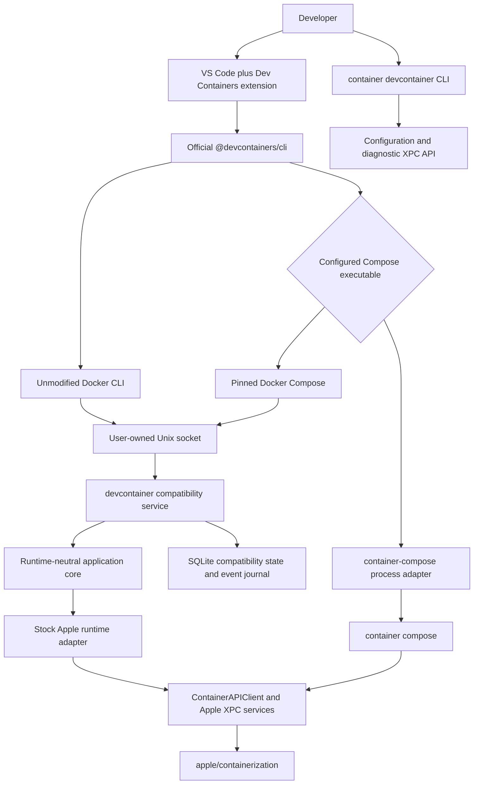
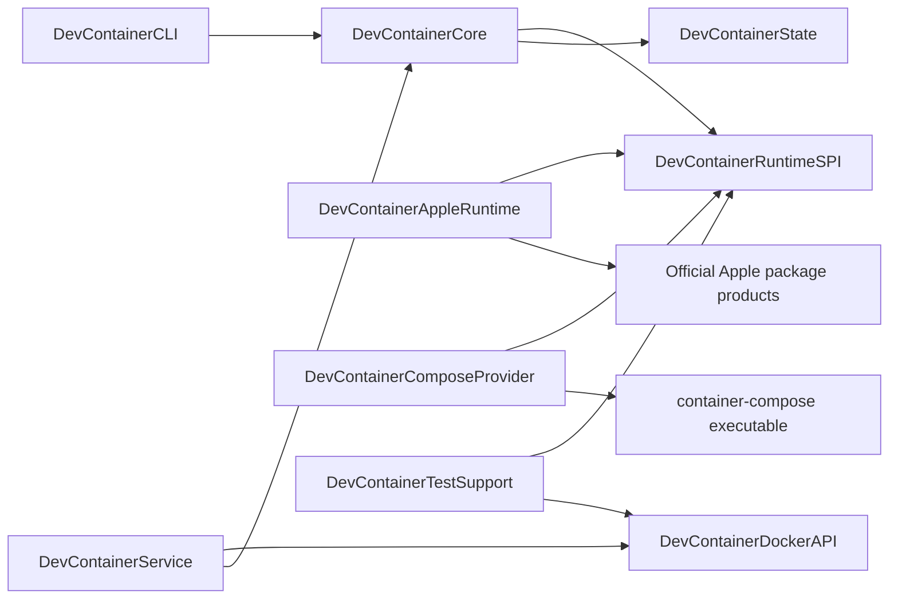
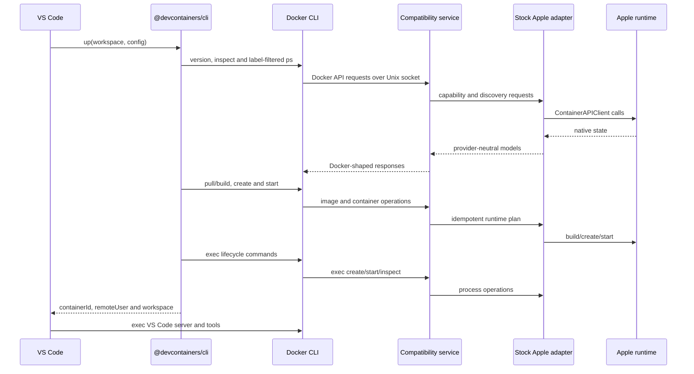
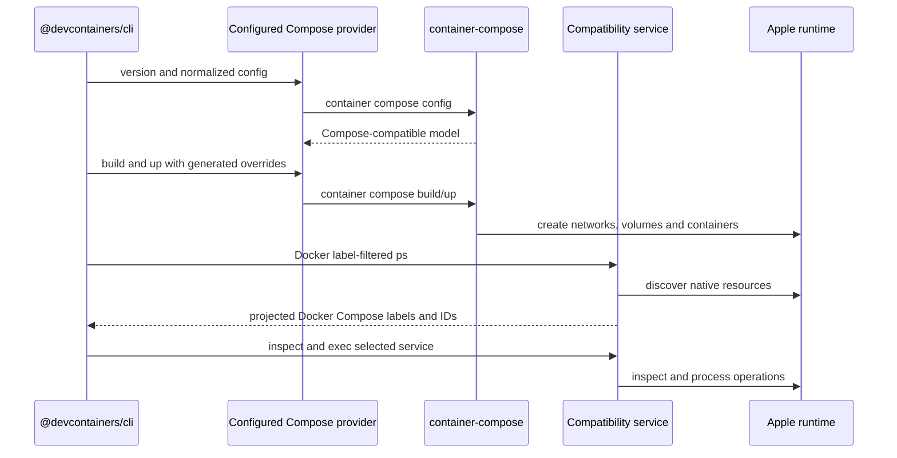
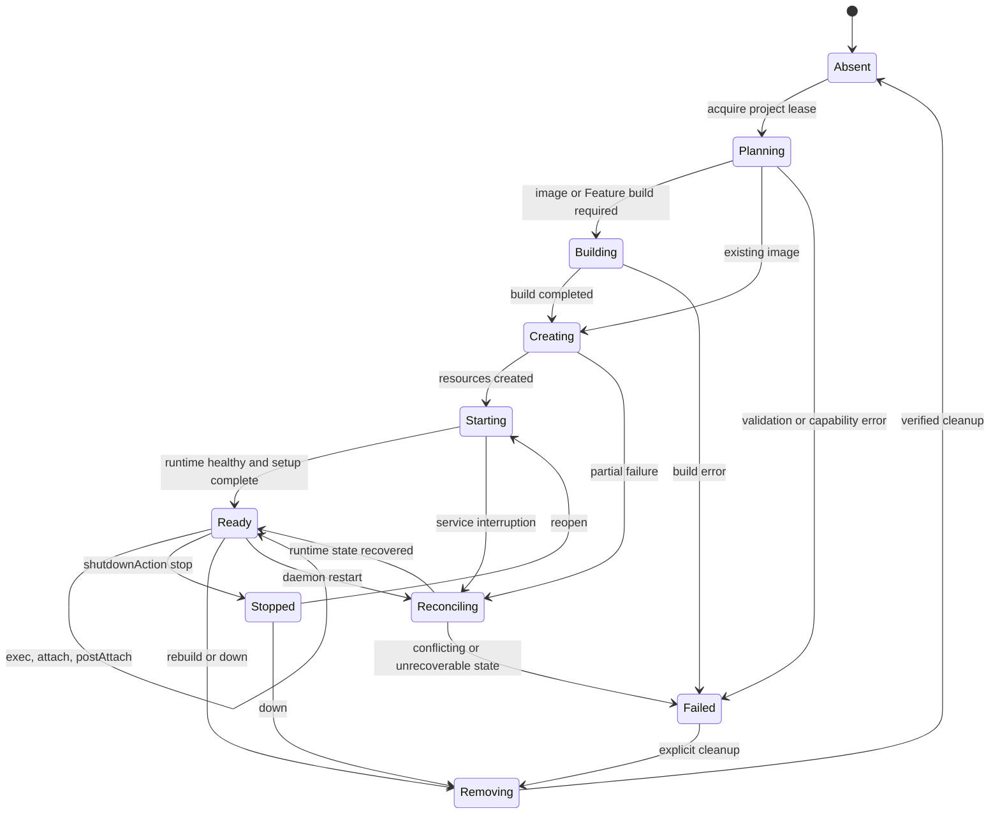

# Software design

## Status and decision

This document describes the implemented `devcontainer` architecture. The
project provides unmodified VS Code Dev Containers compatibility by placing a
Docker Engine API compatibility service in front of Apple-native runtime
providers. A companion `container devcontainer` CLI manages configuration and
diagnostics; it does not replace or fork the Dev Container specification
engine.

The product has two first-class runtime modes:

1. **Stock Apple mode:** only tagged upstream `apple/container` and `apple/containerization` runtime dependencies are used. Single-container and Compose configurations run through the Docker-compatible service; Docker Compose uses the same service.
2. **container-compose mode:** the same compatibility service handles Docker inspection, exec, copy, event, and attach traffic, while `container-compose` performs Compose planning and lifecycle operations. The provider is process-isolated and optional.

The selected provider is immutable while a Dev Container project owns resources. Changing providers requires an explicit down/recreate operation so container identifiers, labels, networks, and volumes never become split-brain state.

## Goals

- Work with the stock VS Code Dev Containers extension and the official `@devcontainers/cli` without patching either.
- Target official, tagged Apple `container` releases without requiring Stephen's forks.
- Support image, Dockerfile, Feature, and Compose `devcontainer.json` scenarios.
- Support `container-compose` as a separately installed, first-class provider.
- Reproduce the Docker-visible behavior that Dev Containers actually consumes, including JSON shapes, labels, streams, events, mounts, users, ports, and errors.
- Fail explicitly when an Apple runtime cannot represent a requested operation; never silently discard a security, mount, network, or lifecycle option.
- Bind every compatibility claim to pinned Docker, Dev Containers, Apple, Compose, macOS, and project versions.
- Keep local state reconstructable from runtime resources and labels.
- Ship a local-only, least-privilege service with deterministic cleanup and diagnostics.

## Non-goals

- General Docker Engine compatibility outside the endpoint and semantic surface required by the maintained Dev Container fixtures.
- A fork of VS Code, `@devcontainers/cli`, Docker CLI, Docker Compose, or the Dev Container specification.
- Reimplementing Compose parsing, interpolation, profiles, dependency planning, or reconciliation inside the core.
- Exposing a Docker-compatible TCP port by default.
- Kubernetes orchestration, production container scheduling, or Linux host support.
- Hiding unsupported stock-Apple primitives behind success responses.
- Treating the current matched `container-compose` fork stack as stock Apple.

## Normative and implementation references

The Dev Containers organization is the primary source for configuration and lifecycle behavior:

| Reference | Design use |
| --- | --- |
| [github.com/devcontainers](https://github.com/devcontainers) | Maintained project organization and repository index |
| [Development Containers Specification](https://github.com/devcontainers/spec) | Configuration discovery, metadata merging, lifecycle, Features, and scenario semantics |
| [Dev Container JSON reference](https://github.com/devcontainers/spec/blob/main/docs/specs/devcontainerjson-reference.md) | Property-level runtime requirements |
| [Dev Container lifecycle reference](https://github.com/devcontainers/spec/blob/main/docs/specs/devcontainer-reference.md) | Create, resume, command ordering, user, and environment behavior |
| [Features specification](https://github.com/devcontainers/spec/blob/main/docs/specs/devcontainer-features.md) | OCI Feature resolution, ordering, installation, and lock behavior |
| [Schema](https://github.com/devcontainers/spec/blob/main/schemas/devContainer.base.schema.json) | Machine-readable configuration contract |
| [`@devcontainers/cli`](https://github.com/devcontainers/cli) | Reference implementation and black-box consumer |
| [Features](https://github.com/devcontainers/features), [Templates](https://github.com/devcontainers/templates), and [Images](https://github.com/devcontainers/images) | Published artifact compatibility fixtures |
| [Dev Container CI](https://github.com/devcontainers/ci) | Automation and prebuild compatibility |
| [containers.dev](https://containers.dev/) | Specification portal and supporting-tool registry |

The runtime integration follows [Apple container](https://github.com/apple/container), [Apple containerization](https://github.com/apple/containerization), and the [Apple API documentation](https://apple.github.io/container/documentation/). The stock Apple plug-in loader supports both external CLI commands and launchd-managed XPC services. Docker behavior is constrained to the versioned [Docker Engine API](https://docs.docker.com/reference/api/engine/) and the concrete command/API traffic observed from the pinned Dev Container CLI.

## System context



VS Code never talks directly to an Apple API. Its existing toolchain sees a Docker-compatible CLI because the unmodified Docker CLI targets the project Unix socket. This follows Apple's stated preference for ecosystem compatibility in an external bridge rather than Docker-shaped behavior in the native `container` CLI.

## Deployment units

The archive exposes a CLI plug-in entry point plus independently runnable
service and Compose-dispatch executables:

| Unit | Apple plug-in name | Responsibility |
| --- | --- | --- |
| `devcontainer` | `devcontainer` CLI plug-in | Packaged alias of the `devcontainer` command for `version`, `doctor`, privacy-redacted `diagnostics`, `configure`, `context`, explicit plug-in registration, and durable `backend` ownership |
| `devcontainer-engine` | Normal executable | Docker Engine HTTP API on a user-owned Unix socket, stock Apple translation, state reconciliation, and event handling |
| `devcontainer-compose` | Docker Compose plug-in-compatible executable | Dispatches to upstream Docker Compose over the socket or an explicitly configured external `container-compose` |
| `DevContainerCore` | Swift library | Provider-neutral use cases, compatibility rules, identity, reconciliation, and errors |
| `DevContainerRuntimeSPI` | Swift library | Narrow runtime, build, process, archive, network, volume, forwarding, and capability protocols |
| `DevContainerAppleRuntime` | Swift library | Translation to official `ContainerAPIClient` and versioned Apple models |
| `DevContainerComposeProvider` | Swift library | Validates and invokes a configured `container-compose` executable; contains no `ComposeCore` source dependency |
| `DevContainerDockerAPI` | Swift library | Versioned HTTP routing, Docker wire DTOs, streaming, hijack, and error envelopes |
| `DevContainerState` | Swift library | SQLite schema, migrations, leases, event cursor, and rebuildable compatibility metadata |
| `DevContainerTestSupport` | Swift library | Fakes, controllable clocks, stream recorders, fault injection, and observation models |



Only adapter targets may import Apple or Compose-specific types. Wire DTOs do not cross into the provider SPI, and Apple DTOs do not enter the core. This preserves source isolation as Apple package APIs evolve.

## Runtime SPI

The runtime SPI is capability-driven and asynchronous. Its initial protocol groups are:

- `RuntimeIdentityProvider`: version, source, commit, distribution, API protocol, and capabilities.
- `ImageRuntime`: pull, list, inspect, tag, remove, and streamed build.
- `ContainerRuntime`: create, start, stop, kill, wait, remove, list, and inspect.
- `ProcessRuntime`: create exec, start attached/detached exec, resize TTY, inspect exit state, and cancel.
- `ArchiveRuntime`: POSIX tar upload/download with ownership, mode, timestamps, symlink, and long-path fidelity.
- `NetworkRuntime`: create, inspect, connect, disconnect, aliases, DNS, and remove.
- `VolumeRuntime`: create, inspect, mount, list, and remove.
- `ForwardingRuntime`: publish TCP/UDP ports and forward Unix sockets.
- `EventRuntime`: ordered lifecycle/image/network/volume/exec events with resumable cursors.
- `ComposeProvider`: version/capability probe, config, build, up, stop, down, and primary-service discovery.

Each request contains an idempotency key, correlation identifier, deadline, selected backend fingerprint, and project lease. Unsupported behavior returns a typed `unsupportedCapability` error before resources are created.

The Apple adapter also probes `container create --help` once per selected executable. Stock Apple 1.1.0 lacks hostname, security-option, and privileged switches: privileged requests map to the stock capability model, while explicit hostname or security-option requests fail before mount or container side effects. A separately fingerprinted enhanced runtime uses its native switches. Capability discovery is behavioral and never inferred from an install path or attributed across provider lanes.

## Docker Engine compatibility boundary

The service advertises only the Docker API versions proven by the parity suite. It returns Docker-shaped identifiers, JSON, headers, streams, status codes, and errors for this tested surface:

| Area | Required endpoints or behavior |
| --- | --- |
| Negotiation | `/_ping`, `/version`, `/info`, version-prefixed routes |
| Containers | list, create, inspect, start, stop, kill, wait, remove, logs, attach |
| Exec | create, start, resize, inspect, stdin/stdout/stderr multiplexing |
| Files | archive upload/download and path stat headers |
| Images | list, inspect, create/pull, build, tag, remove |
| Resources | volume and network create/list/inspect/connect/disconnect/remove |
| Events | label-filtered, ordered JSON event stream with reconnect cursor |

Buildx support is advertised only when session and streaming semantics pass the pinned Dev Container Feature and UID-update fixtures. Until then, the compatibility service forces the reference CLI's proven non-Buildx path instead of returning a false-positive `buildx version`.

## Identity and label projection

The Apple runtime is the source of truth for container existence and lifecycle state. The SQLite store contains only compatibility data that cannot be recovered from Apple resources, such as exec instance state, Docker event sequence numbers, provider leases, and normalized metadata.

Every project resource carries:

- the Dev Container discovery labels used by `@devcontainers/cli`, including `devcontainer.local_folder` and `devcontainer.config_file`;
- standard Docker Compose project/service labels when a Compose scenario is active;
- project-owned labels recording backend kind, configuration digest, project identifier, and schema version;
- native Apple labels needed by the selected provider.

`container-compose` currently uses Apple-specific Compose labels. The provider adapter and inspection layer project those into `com.docker.compose.*` labels and translate Docker label filters back to native discovery queries. A projected label never overwrites conflicting runtime data; conflict is a reconciliation error.

## Provider selection

Provider choice is explicit and recorded in a project lease:

```text
stock
  single-container -> Docker API bridge -> stock Apple adapter
  Compose          -> Docker Compose -> Docker API bridge -> stock Apple adapter

container-compose
  single-container -> Docker API bridge -> selected Apple runtime
  Compose          -> container-compose -> selected Apple runtime
  inspect/exec     -> Docker API bridge -> runtime discovery
```

The `container-compose` provider probes `container compose version --short` and a machine-readable capability command. It never infers compatibility from an installed path. Because the currently released provider depends on Stephen's matched runtime, reports identify that lane as `apple-compose/matched-fork`, not stock Apple. The stock lane is installed and executed separately.

## Single-container request sequence



## Compose request sequence



The bridge does not maintain a second Compose lifecycle database. Project leases store only provider selection and the configuration digest; live state is reconciled from runtime resources.

## Lifecycle and reconciliation



The service uses Swift actors for state isolation and a keyed async lock per project and resource. Runtime calls honor cancellation and deadlines. Startup reconciliation:

1. verifies schema and acquires a single-instance database lease;
2. lists project-labelled runtime resources;
3. validates provider fingerprints and configuration digests;
4. reconstructs recoverable state and event cursors;
5. marks conflicts for explicit repair rather than deleting them;
6. removes only invocation-owned stale exec metadata.

Cleanup requires both a project label and the invocation lease. Broad name prefixes, shell globs, and unverified filesystem roots are never deletion authority.

## Error model

Provider errors become a stable internal error taxonomy before Docker serialization:

- invalid request or configuration;
- unsupported capability;
- conflict or already exists;
- not found;
- deadline exceeded or cancelled;
- authentication or registry failure;
- build failure;
- runtime unavailable;
- provider protocol mismatch;
- state corruption or reconciliation conflict.

The Docker layer maps these to the status, JSON message, stream error, and exit behavior expected by the pinned client. Diagnostics retain the internal cause and correlation ID without leaking credentials or host-private paths.

## Security architecture

- The Docker socket is created under a user-owned runtime directory with mode `0600`; no TCP listener is enabled by default.
- The XPC service validates the connecting audit token and rejects cross-user access.
- Registry credentials remain in the existing Apple/Docker credential mechanisms and are never written to SQLite.
- Secrets, build arguments marked secret, authentication headers, SSH agent paths, and environment values matching redaction rules are removed from logs and diagnostic bundles.
- Host mount paths are canonicalized, checked for symlink escapes, and authorized before resource creation.
- Arbitrary Docker socket mounting into development containers is disabled unless the user explicitly enables the documented proxy mode.
- The wrapper does not modify the user's current Docker context automatically.
- Every dependency is pinned through `Package.resolved`; release artifacts include Apache-compatible notices, an SPDX SBOM, checksums, and provenance attestations.
- Public pull requests never execute on the physical Apple runtime runner.

See [SECURITY.md](SECURITY.md) and [QUALITY.md](QUALITY.md) for disclosure and release gates.

## Configuration and state

User configuration lives in `~/.config/devcontainer/config.toml`:

```toml
backend = "stock"
socket = "~/.local/run/devcontainer/docker.sock"

[compose]
provider = "docker"

[compatibility]
strict = true
```

Per-project provider choice and configuration digest live in the service database. Environment variables may override paths for tests, but secrets are not accepted in config files. `container devcontainer doctor --format json` emits a machine-readable backend fingerprint and capability report.

## Observability

Structured logs use correlation, project, resource, endpoint, provider, and elapsed-time fields. Values are privacy-redacted before emission. Metrics are local by default and include request latency, stream termination reason, reconciliation outcome, resource leak count, and parity fixture timing. There is no outbound telemetry in the initial product.

`container devcontainer diagnostics` creates a reviewable archive containing versions, capability probes, redacted logs, runtime resource summaries, config hashes, and recent event state. The command prints the archive manifest before writing it.

## Packaging

The release archive contains a valid Apple CLI plug-in directory, standalone
executables, build metadata, license, notices, SBOM, and service definition.
The Homebrew formula installs this project without forcing either Apple runtime
distribution. `devcontainer plugin register` creates the one explicit symlink
under the active runtime's reported installation root; it is idempotent and
refuses to replace a foreign file, directory, or link. Registration can
therefore be tested independently against an official Apple package and
Stephen's Homebrew runtime.

Stable formulae use immutable semantic release assets. The generated
`devcontainer-current` formula uses a monotonically increasing
`current.RUN.SHA12` version and a commit-identified asset; publication remains
fail-closed until the trusted release runner, signing, notarization, and tap
promotion controls described in [RELEASE.md](RELEASE.md) are provisioned.

## Release definition of done

A stable tag is prohibited until:

- every fixture in `Tests/Parity/manifest.json` is implemented;
- Docker oracle, stock Apple 1.1.0, and `container-compose` 0.10.1 recordings pass;
- real pinned VS Code and Dev Containers extension E2E passes;
- no functional difference is normalized, waived, retried into success, or marked expected;
- hosted CI, coverage, Sonar, CodeQL, dependency review, sanitizers, Docs, package validation, SBOM, attestation, and Homebrew tests are bound to the exact tag commit;
- the Homebrew-installed artifact passes a physical-runner smoke test;
- documentation and the compatibility ledger match the evidence.

## Risks and mitigations

| Risk | Consequence | Mitigation |
| --- | --- | --- |
| Apple package source instability | Adapter fails after minor upgrades | Exact stable pin, isolated adapter target, capability probe |
| Docker wire-semantic mismatch | VS Code fails despite successful native calls | Raw protocol tests and Docker/Dev Containers black-box oracle |
| Missing Apple primitive | Requested configuration cannot be represented | Typed fail-fast capability error, upstream issue, no false success |
| Compose label/model mismatch | Primary service cannot be discovered or reused | Native-to-Docker label projection and filter translation |
| Split provider state | Leaks, wrong attach target, unsafe cleanup | Immutable project lease and runtime-as-source-of-truth reconciliation |
| Stream/TTY differences | Broken terminal, server install, or exit status | Byte-level multiplexing, PTY resize, cancellation, and VS Code E2E fixtures |
| Self-hosted runner compromise | Release credentials or host exposed | Trusted exact commits only, ephemeral state, no fork PR code, least privilege |
| Mutable upstream oracle | Parity results drift | Checked-in exact refs, versions, image digests, and fixture revisions |
| Overbroad Docker claim | Users assume unsupported production behavior | Advertise only the tested API range and Dev Containers compatibility scope |
