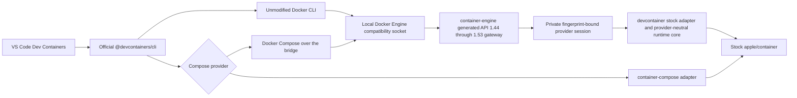

# devcontainer

<!-- markdownlint-disable MD013 MD033 -->
<p>
  
  <a href="https://github.com/stephenlclarke/devcontainer/actions/workflows/ci.yml?query=branch%3Amain"></a>
  <a href="https://github.com/stephenlclarke/devcontainer/actions/workflows/codeql.yml?query=branch%3Amain"></a>
  <a href="https://github.com/stephenlclarke/devcontainer/actions/workflows/docs.yml?query=branch%3Amain"></a>
  <a href="https://github.com/stephenlclarke/devcontainer/actions/workflows/homebrew.yml?query=branch%3Amain"></a>
  <a href="https://github.com/stephenlclarke/devcontainer/actions/workflows/prebuilt-binaries.yml?query=branch%3Amain"></a>
  <a href="https://sonarcloud.io/summary/new_code?id=stephenlclarke_devcontainer"></a>
  <a href="https://sonarcloud.io/summary/new_code?id=stephenlclarke_devcontainer"></a>
  <a href="https://sonarcloud.io/summary/new_code?id=stephenlclarke_devcontainer"></a>
  <a href="https://sonarcloud.io/summary/new_code?id=stephenlclarke_devcontainer"></a>
  <a href="https://sonarcloud.io/summary/new_code?id=stephenlclarke_devcontainer"></a>
  <a href="https://sonarcloud.io/summary/new_code?id=stephenlclarke_devcontainer"></a>
  <a href="https://sonarcloud.io/summary/new_code?id=stephenlclarke_devcontainer"></a>
  <a href="https://sonarcloud.io/summary/new_code?id=stephenlclarke_devcontainer"></a>
  
</p>
<br clear="left" />
<br>
<!-- markdownlint-enable MD033 -->

Run VS Code-compatible Development Containers on Apple silicon through stock [`apple/container`](https://github.com/apple/container), with first-class support for [`container-compose`](https://github.com/stephenlclarke/container-compose).

The project's north-star goal is 100% behavioural parity with Docker-based Development Containers, with comparable or better user-visible performance. Current releases make narrower evidence-bound claims until the complete specification and performance objectives are proved. The audited findings and solution designs are in the [full parity and performance roadmap](PARITY-ROADMAP.md).

> [!IMPORTANT]
> Version 1.0.1 is the latest immutable stable baseline. Its exact tag
> certification ran all 18 CLI fixtures plus the real VS Code end-to-end
> fixture against real Docker, unmodified Apple `container` 1.1.0, and the
> separately maintained `container-compose` 0.10.1 provider stack with zero
> normalized semantic differences. [COMPATIBILITY.md](COMPATIBILITY.md)
> records those exact release fingerprints without rewriting the historical
> evidence as the source dependency graph changes.

The latest source-bearing `main` revision (`1b71fe3ec105`) passes hosted CI,
the stock Apple compile/test lane, documentation, Homebrew validation,
AddressSanitizer, ThreadSanitizer, CodeQL, and SonarQube. Its 15 September 2026
SonarQube analysis reports 95.5% coverage, 0.1% duplicated lines, and zero
bugs, vulnerabilities, code smells, or security hotspots. The live runtime
workflow did not produce the expected lane result files, so this source is not
yet a replacement for the immutable 1.0.1 runtime-parity baseline. The
published Current package also still points to July source
`b31e80b2b9c09`; do not infer a current-source release from the green hosted
quality badges.

Current source has distinct dependency profiles. The stock profile resolves
unmodified Apple `container` 1.4.1 and `containerization` 0.45.0; the enhanced
profile resolves the exact Stephen-owned revisions recorded in
[COMPATIBILITY.md](COMPATIBILITY.md). Neither profile has replaced the 1.0.1
runtime-parity baseline because the latest source-bearing runtime workflow did
not produce complete lane evidence.

## See it work


The recording starts the local compatibility endpoint, runs the official
`@devcontainers/cli` against the checked-in [hello example](Examples/hello),
executes its lifecycle hook, reads the mounted workspace from the running
Apple container, and proves exact cleanup. It is generated from
[docs/devcontainer-demo.tape](docs/devcontainer-demo.tape) with
[VHS](https://github.com/charmbracelet/vhs); every displayed result comes from
the live command immediately above it. Recreate it on a release host with
`make demo`.

## Design promise

The project keeps the official [Dev Containers](https://github.com/devcontainers)
toolchain above a local Docker Engine compatibility service. VS Code and the
reference [`@devcontainers/cli`](https://github.com/devcontainers/cli) remain
unmodified; the service translates their tested Docker API subset into
Apple-native runtime operations.



The `container-compose` integration is first-class but independently installed.
The core does not import `ComposeCore`, and installing this project never
silently replaces stock Apple `container` with the matched fork stack.

The stock adapter can export a stopped container's canonical name, stable
Docker identifier, immutable Apple bundle key, and lifecycle snapshot for a
coordinated provider handoff. The export fails closed while a selected
container is running or any create, start, stop, restart, kill, rename, remove,
exec, or exit transition can race the snapshot; it never invents event history
that the legacy poller cannot prove.

## Compatibility target

| Lane | Purpose | Stable-release requirement |
| --- | --- | --- |
| Real Docker | Behavioral oracle using pinned Docker Engine, Docker Compose, and `@devcontainers/cli` | Complete raw and normalized evidence |
| Stock Apple | Official `apple/container` only; Docker Compose uses the compatibility API | Zero semantic differences in every claimed fixture |
| `container-compose` provider | Stephen Clarke's separately installed `container-compose`, with its exact runtime provenance recorded | Zero semantic differences in every claimed fixture |

The test plan covers image, Dockerfile, Features, users, environment, lifecycle hooks, workspace mounts, ports, reuse, Compose services, networks, volumes, failure recovery, and real VS Code attach/rebuild behavior. See [TESTING.md](TESTING.md), [COMPATIBILITY.md](COMPATIBILITY.md), and the explicit [standards conformance audit](CONFORMANCE.md).

Stock `apple/container` 1.1.0 does not expose create-time hostname, full Docker
privileged mode, or most Docker security-option fields. Requests for those
semantics fail before runtime creation; privileged mode is never approximated
with `CapAdd ALL`. Runtime-affecting container, exec, network, and volume
request objects use strict nested decoding. Unknown fields return a Docker
`400`, and known fields that the selected runtime cannot enforce return `501`,
before side effects. Arbitrary `runArgs` remain outside the compatibility
claim until their exact behaviour is certified. See
[CONFORMANCE.md](CONFORMANCE.md) before using security, device, resource, or
advanced mount options.

## Project layout

| Path | Purpose |
| --- | --- |
| [USER_GUIDE.md](USER_GUIDE.md) | Installation-to-operation user manual for the stock and optional provider paths |
| [DESIGN.md](DESIGN.md) | Implemented architecture, data flow, runtime boundaries, security, and release definition |
| [Docker-free review and design](docs/docker-free-review-and-design.md) | September 2026 audit, current defects, stock/enhanced architecture, Compose reuse, and optimisation/test plan; proposed work |
| [PARITY-ROADMAP.md](PARITY-ROADMAP.md) | North-star parity and performance criteria, audited defects, and designed solutions |
| [UNSUPPORTED-CAPABILITIES.md](UNSUPPORTED-CAPABILITIES.md) | Field-by-field implementation and certification design for every current unsupported capability |
| [CONFORMANCE.md](CONFORMANCE.md) | Complete audited Dev Containers property ledger and explicit 1.0.1 non-conformances |
| [PERFORMANCE.md](PERFORMANCE.md) | Full repeated-run parity timing analysis and optimization priorities |
| [TESTING.md](TESTING.md) | Docker, stock Apple, and separate `container-compose` differential harness |
| [QUALITY.md](QUALITY.md) | Software-quality analysis, measurable gates, and supply-chain controls |
| [BUILD.md](BUILD.md) | Current local build, test, coverage, sanitizer, parity, and package commands |
| [INSTALL.md](INSTALL.md) | Source, prebuilt, Homebrew, provider, and uninstall contract |
| [RELEASE.md](RELEASE.md) | CI/CD, GitHub Pages, release authority, and Homebrew tap design |
| [COMPATIBILITY.md](COMPATIBILITY.md) | Compatibility contract and explicit claim policy |
| [SECURITY.md](SECURITY.md) | Private vulnerability reporting and supported-version policy |
| [Tests/Parity](Tests/Parity) | Machine-readable parity manifest and executable differential fixtures |
| [Examples/hello](Examples/hello) | Minimal image-based Dev Container used by the live demonstration |
| `container-engine-api` revision `84830606abf9` | Shared executable and libraries pinned by both source profiles, including the generated 107-operation Docker API 1.44 through 1.53 ledger, wire/router/server contracts, schema-2 private provider-session transport, bounded raw/WebSocket streaming, deterministic listener ownership/shutdown, and provider-owned immutable state-root identity. This revision is newer than the published 0.3.5 tag and is not stable-release evidence. |
| `Sources/DevContainerDockerAPI` | Stock-provider Docker Engine endpoint policy and DTO projection |
| `Sources/DevContainerAppleRuntime` | Stock Apple runtime adapter and process/port/archive support |
| `Sources/DevContainerService` | Stock-provider adapter; normal mode starts one internal private provider session behind the shared public gateway, while `--provider-socket` exposes only the private session for an external `container-engine` process |
| `Sources/DevContainerComposeProvider` | Optional external `container-compose` dispatcher |

## Development

D06 passes actual CLI forwarding metadata, guest and host HTTP access, a specific owned-container port collision and cleanup in Docker (`524dce17-469a-4819-9258-a210a414d7cb`) and stock Apple Container (`ecf30eb5-335e-4144-8747-65c91e32975b`). The candidate frontend projects explicit IPv4/fixed TCP publish options without Docker, and inspection reports recorded port bindings. Enhanced-lane qualification remains blocked by its exact guest input; these functional runs are neither quiet paired benchmarks nor a released support claim. See the [D06 contract](docs/bazel-test-harness.md#d06-published-ports).

D07 reuse/rebuild/cleanup is the current contract. Docker passes immutable container identity, hook idempotence, persistent volume counters and ownership-bound removal. Stock execution exposed missing named-volume parsing; the candidate frontend now projects named mounts through the existing native API, with corrected stock live proof pending. See the [D07 contract](docs/bazel-test-harness.md#d07-reuse-and-cleanup). Component success does not qualify a release.

D04 lifecycle hooks passes the original host-initialization and ordered guest-hook assertions plus cleanup in Docker (`7c41a35a-01bc-4aaa-b866-2a580cb3c560`) and stock Apple (`76ebd27c-8b98-4df1-969b-fa12c3f2e159`). The candidate reused the `533f9a7` archive without rebuilding. Enhanced qualification remains blocked; these separate functional runs are not quiet paired benchmarks or complete release proof. See the [D04 evidence](docs/bazel-test-harness.md#d04-lifecycle-hooks).

D05 locked Features passes all four original observations and cleanup in Docker (`9cd52ed5-55cc-4245-8058-8671ba0e948d`) and stock Apple (`f80ebfc8-b5c8-45d1-b155-b6a1e9006e2e`), without a product rebuild. Missing frozen locks must fail for the specific lockfile reason; unrelated errors cannot pass. Enhanced qualification remains blocked, and these are functional observations rather than quiet benchmarks. See the [D05 evidence](docs/bazel-test-harness.md#d05-locked-features). This does not change the stable release's support claims.

D03 users/environment passes all seven observations and cleanup in the Docker reference and the Docker-free stock Apple candidate: non-root UID 1000, home directory, container/remote variables, expansion and post-create output through the pinned official CLI. Stock proof uses source `533f9a7`, invocation `495adb97-3b5e-435f-83ec-2e9bccd9b674`; enhanced qualification remains blocked by its pinned guest-release prerequisite. See the [exact evidence and isolation boundary](docs/bazel-test-harness.md#d03-users-and-environment). These functional runs are not quiet paired benchmarks or full three-lane release qualification.

In current source, Compose project ownership follows the selected runtime backend, independently of the selected Compose frontend. Switching frontends cannot migrate an existing runtime claim. A missing selected frontend fails before creating project state, without trying Docker as a fallback. This correction does not change the published compatibility matrix or remove the remaining Docker client dependencies.

Native container creation finishes mount and kernel preparation before journalling possible submission. A failed prerequisite can be repaired and retried without leaving a spurious pending-create record; errors after submission still retain recovery evidence. This development correction is covered by focused stock/enhanced tests, not yet a released runtime guarantee.

The opt-in [native Bazel build](docs/bazel-workflow.md) builds the native executables and runs the unit suites against either stock Apple or enhanced dependencies. Use `make bazel-configure` once, then `make bazel-build` and `make bazel-unit`; add `BAZEL_PROFILE=stock` for the stock graph. `make bazel-package` includes four executables plus the checksum-pinned private Node/Dev Containers CLI and licences. It tests the unsigned extracted executable/plugin layout, provenance, real private CLI configuration reading and explicit native Compose-provider handoff without installing or starting services. `make bazel-docs` reuses optimized native modules to generate and test a standalone DocC site without a second SwiftPM build; publication remains in the final documentation phase. Scratch and caches stay on the enrolled external SSD; test evidence and candidate archives are retained together on internal storage, with authenticated restore that requires no rebuild. Runtime parity, signing and release publication have not yet moved to this workflow.

In the unreleased candidate, `devcontainer configure` preserves existing settings omitted from the command, including strict compatibility. Use `--strict` or `--no-strict` to change that setting explicitly; new configurations remain strict by default. Changing only the socket no longer silently resets stored strictness. Backend and Compose frontend choices remain independent.

The candidate also preserves progress from failed Apple image builds and returns a Docker-compatible error record without recording success. Preflight rejection, cancellation and abandonment remain distinct failures. [Component tests](docs/bazel-test-harness.md#image-build-contract) cover this in both profiles; live E04 build parity and stable publication are still required.

The opt-in E04 harness now downloads the published builder images with `make bazel-prepare-builders` (`OFFLINE=1` for verified reuse), submits owned image builds, checks the intended failing command actually ran, and verifies scoped cleanup. It does not rebuild reference runtimes or modify your Container configuration. Interrupted builds with uncertain completion remain quarantined; complete live parity and unattended recovery qualification are still pending.

For a completed E04 Docker build whose cleanup was interrupted, `make bazel-recover-runtime` reports the exact owned images without changing state. `make bazel-recover-runtime-apply CASE_ID=<reported-id>` revalidates the original downloaded tools, VM process identities and complete build responses before removing those images and stopping only the owned test VM. Recovery preserves the failed test result and never resubmits a build. Unknown build completion or interrupted VM shutdown still requires explicit reconciliation.

Use `make bazel-coverage-report INVOCATION=ID` to export a retained unit run's LCOV and Sonar XML without rerunning tests. `Tools/bazel/run.sh coverage-report ID --minimum-percent 90` also checks the raw measured percentage and fails below the target, while leaving the report available for diagnosis. The receipt identifies the tested commit/profile; exporting historical coverage does not make it current-head quality evidence. The shared checker also supports Compose's reviewed profile-specific test and production-source inventories.

Consumer coverage keeps unit-only evidence distinct from an explicitly declared `unit-cli` inventory. Compose's combined inventory includes all unit targets plus its native no-runtime CLI contracts; use `--inventory=unit-cli` at its quality gate. The receipt and gate bind that choice as well as source/profile/policy. Devcontainer's current native aggregate remains unit-only; neither scope establishes live integration or parity.

New Bazel build/test invocations also retain elapsed timings, platform/toolchain identity and cache metrics. Use `make bazel-build-timings INVOCATION=ID BASELINE=ID` to compare matching configurations. Ordinary timings are labelled observations; controlled quiet-machine benchmarks remain a separate performance gate.

The [test-harness replacement](docs/bazel-test-harness.md) is in progress. `make bazel-harness` runs its deterministic recovery and real Unix-socket component tests, including Engine negotiation, lifecycle, exec-stream, archive-copy and network/volume assertions, and journalled test-resource ownership, under Bazel without building products or starting container services. These checks do not yet establish live runtime parity; all 19 existing fixtures remain required for cutover.

The new harness has a [recorded three-lane E01 functional comparison](docs/evidence/released-common-e01-20260918b.md), with [exact fingerprints and raw timings](docs/evidence/released-common-e01-20260918b.json). It passes that protocol fixture only, not the complete matrix or performance gate. Raw Apple-lane operation ratios exceed 10x and require quiet paired investigation. `make bazel-parity-report CAMPAIGN=<id>` reads sealed results without rerunning workloads; missing fixtures fail instead of silently narrowing scope. Select one fixture explicitly with `CASE_FIXTURE=<id>` and choose JSON, Markdown or JUnit with `REPORT_FORMAT=json|markdown|junit`. Private logs and unexpected payloads are never exported.

The [final delivery contract](docs/bazel-workflow.md#final-delivery-and-public-evidence) includes stable releases of both projects, a full published-binary test cycle, public quiet-host benchmark evidence, both DocC sites, and installation-first live demos. Stock E01 passes against published binaries; E02 lifecycle, E03 exec/streams, E05 archive copy and E06 network/volume fixtures now have passing retained-candidate results against stock Apple. E05's archive-permission difference under a restrictive host file mask was fixed and passed its unchanged live assertions. These results do not replace the certified historical release matrix, close the transport coverage shortfall or establish new full parity.

The development native-create path now uses a durable creation journal (state schema 4). Failed or uncertain creates remain inspectable but cannot be started, restarted, executed, renamed or used for archive transfers through the bridge until reconciled. Ordinary deletion does not erase unresolved intent. An operator reconciliation interface remains unfinished; do not treat this draft recovery path as release-ready. Upgrading a disposable development state root is supported from schema 2/3; older binaries cannot reopen schema 4. Back up a quiescent production state root before migration and retain it for rollback. See [creation recovery](DESIGN.md#native-creation-recovery).

`make bazel-prepare-guest-images` prepares the digest-pinned stock initialization and shared workload images without Docker or a VM, reusing Compose's OCI validator. Download staging stays on the enrolled SSD; verified archives remain on internal storage. `OFFLINE=1` reuses retained inputs without network access. This preparation requires Homebrew Skopeo. `make bazel-prepare-guest-kernel` separately prepares the checksum-pinned kernel recommended by stock Container 1.4.1, using Homebrew Zstandard for extraction; `OFFLINE=1` also supports verified reuse. Neither command installs or boots a guest. Enhanced initialization-image acquisition and complete guest-runtime qualification remain outstanding.

`make bazel-prepare-releases` verifies the pinned GitHub releases, extracts them on the enrolled SSD, and retains their verified executable trees on internal storage as long-lived assets. It does not install packages or rebuild products. Add `OFFLINE=1` to use verified retained downloads. Repeated preparation reuses complete durable trees without re-extraction; interrupted publication resumes only its registered files, and changed sealed files fail closed. Disposable state/build/test work remains on SSD. This prepares binaries only, not the complete guest-image, Docker-oracle or VS Code runtime environment.

`make bazel-prepare-docker-oracle` prepares the pinned published Colima/Lima tools and compressed Docker VM image through that same path; `OFFLINE=1` supports verified reuse. `make bazel-prepare-docker-cli` separately downloads the existing Docker 29.6.2 oracle's exact Homebrew bottle from public GitHub Packages using Skopeo, checks its executable checksum against the parity manifest, and retains the client plus licence/notices without installing Homebrew packages. `OFFLINE=1` verifies the retained client without downloading, extracting or repairing it. Neither preparation command starts a VM, changes Docker contexts or touches existing Colima profiles. The opt-in `make bazel-engine-case CAMPAIGN=<id> LANE=docker` adapter uses a private SSD VM for E01, E02, E03, E05 and E06; live qualification and interrupted-VM recovery remain unfinished. It does not connect to an installed Docker daemon. Docker is a test reference only, not a product installation dependency.

`make bazel-prepare-devcontainers-cli` prepares the pinned official Dev Container CLI 0.88.0 and a private prebuilt Node 24.21.0 for the Docker reference lane. These tools use their official npm/Node distributions, an explicit exception to GitHub-release sourcing; no source build, global install, npm hook or VM startup occurs. Downloads and extraction stage on SSD; verified archives, executables and licences remain on internal storage. `OFFLINE=1` verifies retained inputs without download or repair. This command prepares test-reference tools only. Separately, the native candidate archive now packages the same pinned Node/CLI versions behind its public lifecycle facade; neither path certifies D01 parity or makes Docker an installation dependency. See [reference-tool preparation](docs/bazel-test-harness.md#dev-container-reference-tools).

The opt-in `make bazel-engine-case CAMPAIGN=<id> LANE=docker CASE_FIXTURE=D01-image-config` uses that pinned official CLI in the private Docker VM. It copies the existing fixture to SSD, fetches its exact published image digest, runs `up` and `exec`, and verifies environment, workspace, post-create output and user without rebuilding the products. Candidate D01 uses `LANE=apple-stock` or `LANE=container-compose` with `CANDIDATE_INVOCATION=<prepared-schema-2-archive-invocation>` and invokes the packaged public CLI; old archives without the private bundle fail admission. Stock candidate D01 now passes its four observations and cleanup; enhanced guest prerequisites and live qualification remain outstanding. See [D01 execution and recovery](docs/bazel-test-harness.md#d01-image-configuration-reference); this is not full parity or release certification.

The unreleased `//:devcontainer-docker` target implements local version probes, server version, JSON info, typed image/container inspection, quiet container lookup, non-TTY `exec`, foreground `run` and JSON `events` through the shared Unix gateway. Exec supports the pinned upstream client's `-i`, `-u`, `-e NAME=value` and `-w` forms, preserves stdin EOF, separate stdout/stderr and the observed exit status, and accepts native UUID identities. Terminal-state publication is observed for at most five seconds after output EOF; malformed responses and identity changes fail immediately. The development CLI uses a finite 24-hour interactive execution ceiling, 30-second metadata calls and bounded diagnostic writes. Custom library input/output callbacks must cooperate with cancellation; the built-in providers do. The output writer requires sole ownership of writes and the executable's SIGPIPE policy, without changing inherited pipe flags. TTY mode, unsupported commands/flags, Buildx and remote endpoints fail rather than invoking Docker. `Tools/bazel/run.sh test --config=stock //:DevContainerDockerClientTests` exercises parsing, framing, cancellation and the actual executable against a private socket with no Docker clients on `PATH`. The native candidate includes this frontend and the private CLI lifecycle facade. Live candidate proof and signed production packaging remain unfinished; it is not yet included in stable/Homebrew packages.

Foreground `run` currently accepts the recorded `--sig-proxy=false`, stdout/stderr attachment, explicit environment/labels, entrypoint and absolute bind-mount forms. It attaches before start, preserves creation warnings and output, and waits for the real exit status under one execution deadline; output EOF alone is not completion. It does not auto-remove a created container after failure or disconnection. JSON `events` accepts event/label filters, applies output backpressure, limits partial records to 1 MiB and preserves their original JSON numbers. HTTP error bodies are diagnostic-only. Unsupported run modes, quoted mount CSV and event filters fail before connecting or creating resources. These commands are component-tested, not yet live D01-qualified.

The public source CLI also registers `up`, `build`, `exec`, `read-configuration` and `run-user-commands`. These forward unchanged arguments to an installation-private Node/Dev Containers CLI bundle, use exact project frontend paths, and preserve process streams and exit status. Backend-path overrides (including upstream camelCase aliases) and Node startup hooks cannot redirect this boundary. Missing private assets fail clearly without npm or Docker fallback. Forwarding unit tests use a stand-in child; native package tests additionally use the real bundled runtime for configuration reading against an isolated inventory socket and plugin help. Live lifecycle qualification and signed distribution remain pending, so current stable/Homebrew packages do not yet expose this implementation.

The Docker D01 reference now passes all four observations and verified cleanup (`83e7687b-5db8-4788-8dc2-5cf3b33ca656`, source `c6daa35`). Its retained functional-run timings are not quiet paired benchmarks or evidence that either candidate D01 lane passes.

The first live stock candidate started successfully but exposed a harness cleanup error around the CLI's persistent attachment. That failed result is preserved; the owned test instance was removed and original services restored. The corrected harness (`e346eed`) removes the verified guest before waiting for its attachment to exit. Stock D01 now passes all four unchanged observations and cleanup in `46a33e35-686a-45f4-9168-80ba6ecafa31`, reusing the retained `f8dc210` product without rebuilding. Setup, operation and cleanup took 6.772554542, 2.210318375 and 1.615386041 seconds. These are functional-run timings, not quiet paired benchmarks, complete three-lane parity or a new stable release.

D02 Dockerfile configuration passes all four unchanged observations and cleanup in both the isolated Docker reference (`0686509c-bf9c-4ba3-a405-02fb0ebca041`, source `05cae9e`) and the Docker-free stock Apple candidate (`3530b684-a77e-42fb-b1a0-11e4c507e401`, source `106144a`). The reference uses the legacy Engine build path, not an unpinned global Buildx builder. Its setup/operation/cleanup took 17.683057833/1.214592000/2.948016291 seconds; the stock candidate took 11.082251250/5.716879250/2.264501042 seconds. No owned resources remain and runtime recovery is clear. These are functional observations from separate campaigns, not quiet paired benchmarks or complete three-lane parity. The enhanced lane remains blocked by its pinned guest-release prerequisite; reference execution does not create a Docker installation dependency for the product.

The unreleased frontend also implements the observed `build -f FILE -t TAG --target STAGE --build-arg NAME=value CONTEXT` path. It uploads a local tar context to the selected Unix gateway, preserves external generated Dockerfiles without adding them to `COPY .`, and fails on streamed build errors even under HTTP 200. Preparation has a 60-second deadline, a 64 MiB archive limit and a 1 MiB regular Dockerfile limit. `TMPDIR` selects staging (the Bazel workflow sets it to SSD); SIGINT/SIGTERM cancel and join owned work before exit. Existing root or Dockerfile-specific `.dockerignore` files, remote/stdin contexts, implicit environment build arguments and unsupported flags currently fail explicitly. They are not silently ignored or certified as supported. Native image inspection now supplies ordered `RootFS.Layers` from descriptor-bound OCI configuration; older providers lacking that data omit the field rather than invent ancestry.

`make bazel-engine-case CAMPAIGN=<explicit-id> LANE=apple-stock` runs the released Engine negotiation case; use `LANE=container-compose` for the enhanced runtime binary. It requires already prepared releases, serializes access with Compose, and retains case evidence internally. On an idle host it temporarily suspends the explicitly scoped family services/CI listeners, starts the selected released API with SSD-only state, and restores the original services afterward. This opt-in metadata/protocol test does not launch guest workloads or establish full parity. See the harness document for quarantine and recovery limitations before using legacy runtime workflows alongside it.

For development-only integration, first run `make bazel-prepare-candidate CANDIDATE_INVOCATION=<retained-build-id>`, then add that same `CANDIDATE_INVOCATION` to `make bazel-engine-case`. This restores and authenticates a clean native candidate without rebuilding; the provider and guest inputs still come from published assets. Results are explicitly marked `local-candidate-integration-only`, cannot mix with a published-release comparison, and do not satisfy final release parity. Retained candidate admission works after disposable SSD build outputs have been removed.

The runtime harness owns a disposable keychain inside each isolated SSD test HOME; it does not reset or change your login keychain. Creation/deletion helpers are journalled, bounded and noninteractive. Uncertain helper completion retains quarantine instead of deleting its files. See [test-keychain recovery](docs/bazel-test-harness.md#isolated-test-keychain) if a run stops during credential initialization.

Adding `CASE_FIXTURE=E02-container-lifecycle`, `CASE_FIXTURE=E03-exec-streams`, `CASE_FIXTURE=E05-archive-copy` or `CASE_FIXTURE=E06-network-volume` selects the new guest-backed adapter. It requires read-only admission of the retained kernel, exact provider initialization image and workload image before changing services. Setup loads those local archives only into the disposable provider store; it does not build or pull images. Guest and network/volume cleanup precedes Engine/provider shutdown. This path is implemented and component-tested but not yet live-qualified; enhanced admission currently refuses its missing initialization input, and uncertain guest/process recovery still requires explicit reconciliation. Do not treat these targets as release qualification or bypass an outstanding host permission/quarantine.

After an interrupted transaction, `make bazel-recover-runtime` reports whether its journal can be reconciled without changing services. If it reports `ready-to-restore`, `ready-to-retain-and-restore`, `ready-to-remove-stopped-docker` or `ready-to-clear`, use `make bazel-recover-runtime-apply CASE_ID=<reported-case-id>` to finish the identified cleanup. Apple cases retain missing verified-stopped setup diagnostics and restore recorded services; Docker cases require a verified VM-shutdown receipt and recheck process/socket absence without starting or signalling anything. Both remove only the authenticated owned scratch directory and can resume interrupted deletion. Recovery preserves the original failed case and refuses live or uncertain client processes; it is not permission to bypass quarantine or rerun a failed case.

Requirements are Xcode 26, Swift 6.2 or newer, Python 3, Ruby 2.7 or newer
(including its standard JSON and Psych YAML libraries), and `make`.
Runtime parity additionally requires a physical Apple-silicon Mac on macOS 26,
stock Apple `container`, real Docker, the pinned Dev Container CLI, and the
selected Compose provider.

The stock multi-service path uses the upstream `docker-compose` client over
this project's compatibility socket. The separately selected
`container-compose` provider remains optional and independently installed.

```console
make check
make test
make docs
make serve-docs
DEVCONTAINER_VSCODE_LIVE=1 make parity-vscode-docker
```

Use `devcontainer diagnostics --output devcontainer-diagnostics.tar.gz` to
create a bounded, privacy-redacted support archive whose JSON manifest is
printed before the archive is written.

In the unreleased candidate, `devcontainer doctor` rejects invalid output formats before running commands and applies a five-second deadline to each runtime/Compose probe, followed by owned-process cleanup. Socket checks verify ownership, type and private permissions only; a missing socket is a warning, and a metadata pass is not an HTTP health check. Candidate process launch uses Compose's POSIX-spawn approach to avoid fork-error teardown deadlocks. Service lifetime cleanup now runs after startup, waiter and cancellation failures; these component-tested changes still require live release qualification.

The unreleased Compose bridge limits project-name and remaining-volume discovery to 30 seconds per probe (or an earlier caller deadline), drains and reaps cancelled children, and rejects output exceeding 1 MiB per stream. Uncertain volume discovery retains project ownership; caller cancellation is not reported as success. These limits do not shorten the actual Compose operation or change the default provider.

Support-archive collection in current source also limits each external probe to five seconds. An individual timeout is recorded in the archive and other probes continue; cancellation or an expired enclosing request aborts collection and removes staging rather than returning a successful partial bundle. These changes are not in published 1.0.1.

Live runtime tests are deliberately not run on public pull-request code or GitHub-hosted macOS. They execute on an isolated physical runner only after a trusted exact commit has passed hosted checks.

## Documentation

Start with the [user guide](USER_GUIDE.md), then consult the
[compatibility contract](COMPATIBILITY.md), [standards conformance
audit](CONFORMANCE.md), [full parity and performance roadmap](PARITY-ROADMAP.md),
and [parity timing analysis](PERFORMANCE.md). The
generated [DocC site](https://stephenlclarke.github.io/api/devcontainer/) in the
[Container developer API collection](https://stephenlclarke.github.io/api/)
contains the public Swift API reference plus architecture, use, compatibility,
conformance, testing, and performance articles. GitHub Pages publishes it from
the exact `main` commit that passes the documentation workflow.

## Primary upstream references

The design follows the maintained sources in the [Dev Containers GitHub organization](https://github.com/devcontainers):

- [Development Containers Specification](https://github.com/devcontainers/spec)
- [Dev Container CLI reference implementation](https://github.com/devcontainers/cli)
- [Dev Container Features](https://github.com/devcontainers/features)
- [Dev Container Templates](https://github.com/devcontainers/templates)
- [Dev Container Images](https://github.com/devcontainers/images)
- [Dev Container CI](https://github.com/devcontainers/ci)
- [containers.dev specification and supporting tools](https://containers.dev/)

Runtime references are [Apple container](https://github.com/apple/container), [Apple containerization](https://github.com/apple/containerization), and the [Apple container API documentation](https://apple.github.io/container/documentation/). VS Code behavior is documented in [Developing inside a Container](https://code.visualstudio.com/docs/devcontainers/containers).

## Install

Requirements are an Apple-silicon Mac running macOS Tahoe 26 or later and
Apple [`container` 1.1.0](https://github.com/apple/container/releases/tag/1.1.0).
Install Apple's signed package first, then install `devcontainer`:

When macOS asks whether the selected runtime's `container-runtime-linux` may
find and connect to devices on the local network, choose **Allow**. Stock mode
uses Apple's signed helper; the optional provider stack uses its separately
installed helper. macOS can list them as distinct Local Network entries.
Denying either helper leaves its host listener open but resets connections with
`No route to host`.

```console
brew tap stephenlclarke/tap
brew trust --tap stephenlclarke/tap
brew install stephenlclarke/tap/devcontainer
/usr/local/bin/container system start
brew services start stephenlclarke/tap/devcontainer
devcontainer doctor --container /usr/local/bin/container
```

Use the compatibility socket only in the shell that needs it:

```console
eval "$(devcontainer context)"
npx --yes @devcontainers/cli@0.88.0 up \
  --workspace-folder /path/to/project
```

For VS Code, configure the Compose wrapper once and launch the workspace from
that configured shell:

```json
{
  "dev.containers.dockerComposePath": "/opt/homebrew/bin/devcontainer-compose"
}
```

```console
eval "$(devcontainer context)"
code /path/to/project
```

Optional Apple CLI plug-in registration is explicit and reversible:

```console
devcontainer plugin register
container devcontainer doctor
```

The stable formula installs this project with upstream Docker CLI and Docker
Compose protocol-client dependencies; it does not install a container runtime.
Plug-in registration is an explicit, reversible symlink into the active
runtime's reported install root, and it never replaces a foreign registration.
Current source builds bound installation discovery to five seconds and reap a stalled probe before returning; `--install-root` skips discovery. This improvement is not yet in the published 1.0.1 release.
`container-compose` remains an explicit optional installation and provider
choice. See [INSTALL.md](INSTALL.md) for stock/custom runtime selection,
service management, upgrades, verification, troubleshooting, and removal.

## Independence and trademarks

This is an independent open-source project. It is not affiliated with or endorsed by Apple, Docker, Microsoft, or the Dev Containers maintainers. Apple, Docker, Visual Studio Code, and other marks belong to their respective owners.

## License

Licensed under [Apache License 2.0](LICENSE), matching `apple/container` and
`apple/containerization`. The package builder includes third-party notices,
deterministic build metadata, checksums, and an SPDX 2.3 SBOM.
