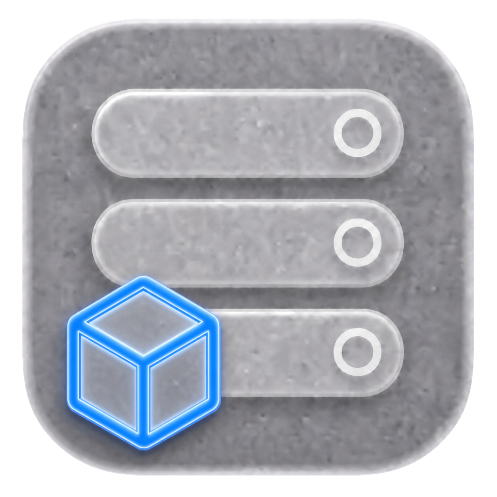
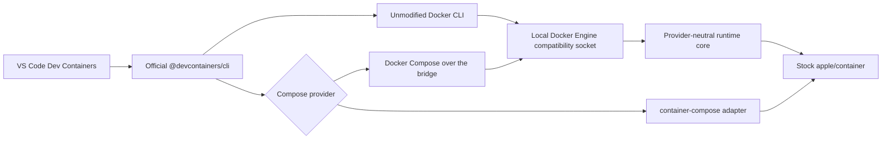

# devcontainer

<!-- markdownlint-disable MD033 -->
<p>
  
  <a href="https://sonarcloud.io/summary/new_code?id=stephenlclarke_devcontainer"></a>
  <a href="https://sonarcloud.io/summary/new_code?id=stephenlclarke_devcontainer"></a>
  <a href="https://sonarcloud.io/summary/new_code?id=stephenlclarke_devcontainer"></a>
  <a href="https://sonarcloud.io/summary/new_code?id=stephenlclarke_devcontainer"></a>
  <a href="https://sonarcloud.io/summary/new_code?id=stephenlclarke_devcontainer"></a>
  <a href="https://sonarcloud.io/summary/new_code?id=stephenlclarke_devcontainer"></a>
  <a href="https://sonarcloud.io/summary/new_code?id=stephenlclarke_devcontainer"></a>
  <a href="https://sonarcloud.io/summary/new_code?id=stephenlclarke_devcontainer"></a>
  <a href="https://sonarcloud.io/summary/new_code?id=stephenlclarke_devcontainer"></a>
  <a href="https://sonarcloud.io/summary/new_code?id=stephenlclarke_devcontainer"></a>
  <a href="https://sonarcloud.io/summary/new_code?id=stephenlclarke_devcontainer"></a>
  <a href="https://sonarcloud.io/summary/new_code?id=stephenlclarke_devcontainer"></a>
  <a href="https://github.com/stephenlclarke/devcontainer/actions/workflows/codeql.yml?query=branch%3Amain"></a>
  <a href="https://github.com/stephenlclarke/devcontainer/actions/workflows/ci.yml?query=branch%3Amain"></a>
  <a href="https://github.com/stephenlclarke/devcontainer/actions/workflows/docs.yml?query=branch%3Amain"></a>
  <a href="https://github.com/stephenlclarke/devcontainer/releases/latest"></a>
  <a href="LICENSE"></a>
  
</p>
<br clear="left" />
<br>
<!-- markdownlint-enable MD033 -->

Run VS Code-compatible Development Containers on Apple silicon through stock [`apple/container`](https://github.com/apple/container), with first-class support for [`container-compose`](https://github.com/stephenlclarke/container-compose).

> [!IMPORTANT]
> Version 1.0.0 is the current release candidate, not yet a published stable
> release. Its eventual compatibility claim is bound to the exact versions in
> [COMPATIBILITY.md](COMPATIBILITY.md) and is published only after real Docker,
> unmodified Apple `container` 1.1.0, and the separately maintained
> `container-compose` provider stack pass all 18 CLI fixtures plus the real
> VS Code end-to-end fixture with zero normalized semantic differences.

## See it work


The recording starts the local compatibility endpoint, runs the official
`@devcontainers/cli` against the checked-in [hello example](Examples/hello),
executes its lifecycle hook, reads the mounted workspace from the running
Apple container, and proves exact cleanup. It is generated from
[docs/devcontainer-demo.tape](docs/devcontainer-demo.tape) with
[VHS](https://github.com/charmbracelet/vhs); every displayed result comes from
the live command immediately above it. Recreate it on a release host with
`make demo`.

## Design promise

The project keeps the official [Dev Containers](https://github.com/devcontainers)
toolchain above a local Docker Engine compatibility service. VS Code and the
reference [`@devcontainers/cli`](https://github.com/devcontainers/cli) remain
unmodified; the service translates their tested Docker API subset into
Apple-native runtime operations.



The `container-compose` integration is first-class but independently installed.
The core does not import `ComposeCore`, and installing this project never
silently replaces stock Apple `container` with the matched fork stack.

## Compatibility target

| Lane | Purpose | Stable-release requirement |
| --- | --- | --- |
| Real Docker | Behavioral oracle using pinned Docker Engine, Docker Compose, and `@devcontainers/cli` | Complete raw and normalized evidence |
| Stock Apple | Official `apple/container` only; Docker Compose uses the compatibility API | Zero semantic differences in every claimed fixture |
| `container-compose` provider | Stephen Clarke's separately installed `container-compose`, with its exact runtime provenance recorded | Zero semantic differences in every claimed fixture |

The test plan covers image, Dockerfile, Features, users, environment, lifecycle hooks, workspace mounts, ports, reuse, Compose services, networks, volumes, failure recovery, and real VS Code attach/rebuild behavior. See [TESTING.md](TESTING.md) and [COMPATIBILITY.md](COMPATIBILITY.md).

Stock `apple/container` 1.1.0 does not expose create-time hostname or Docker
security-option fields. Requests containing those fields fail before container
or mount side effects; they are not silently weakened and are outside the stock
1.1.0 compatibility claim. A separately fingerprinted enhanced runtime may
advertise and enforce them through native `--hostname` and `--security-opt`
flags.

## Project layout

| Path | Purpose |
| --- | --- |
| [DESIGN.md](DESIGN.md) | Implemented architecture, data flow, runtime boundaries, security, and release definition |
| [TESTING.md](TESTING.md) | Docker, stock Apple, and separate `container-compose` differential harness |
| [QUALITY.md](QUALITY.md) | Software-quality analysis, measurable gates, and supply-chain controls |
| [BUILD.md](BUILD.md) | Current local build, test, coverage, sanitizer, parity, and package commands |
| [INSTALL.md](INSTALL.md) | Source, prebuilt, Homebrew, provider, and uninstall contract |
| [RELEASE.md](RELEASE.md) | CI/CD, GitHub Pages, release authority, and Homebrew tap design |
| [COMPATIBILITY.md](COMPATIBILITY.md) | Compatibility contract and explicit claim policy |
| [SECURITY.md](SECURITY.md) | Private vulnerability reporting and supported-version policy |
| [Tests/Parity](Tests/Parity) | Machine-readable parity manifest and executable differential fixtures |
| [Examples/hello](Examples/hello) | Minimal image-based Dev Container used by the live demonstration |
| `Sources/DevContainerDockerAPI` | Docker Engine API compatibility router |
| `Sources/DevContainerAppleRuntime` | Stock Apple runtime adapter and process/port/archive support |
| `Sources/DevContainerService` | Unix-socket compatibility engine |
| `Sources/DevContainerComposeProvider` | Optional external `container-compose` dispatcher |

## Development

Requirements are Xcode 26, Swift 6.2 or newer, Python 3, and `make`.
Runtime parity additionally requires a physical Apple-silicon Mac on macOS 26,
stock Apple `container`, real Docker, the pinned Dev Container CLI, and the
selected Compose provider.

The stock multi-service path uses the upstream `docker-compose` client over
this project's compatibility socket. The separately selected
`container-compose` provider remains optional and independently installed.

```console
make check
make test
make docs
make serve-docs
DEVCONTAINER_VSCODE_LIVE=1 make parity-vscode-docker
```

Use `devcontainer diagnostics --output devcontainer-diagnostics.tar.gz` to
create a bounded, privacy-redacted support archive whose JSON manifest is
printed before the archive is written.

Live runtime tests are deliberately not run on public pull-request code or GitHub-hosted macOS. They execute on an isolated physical runner only after a trusted exact commit has passed hosted checks.

## Documentation

The generated [DocC site](https://stephenlclarke.github.io/devcontainer/)
contains the public Swift API reference and architecture articles. GitHub Pages
publishes it from the exact `main` commit that passes the documentation
workflow.

## Primary upstream references

The design follows the maintained sources in the [Dev Containers GitHub organization](https://github.com/devcontainers):

- [Development Containers Specification](https://github.com/devcontainers/spec)
- [Dev Container CLI reference implementation](https://github.com/devcontainers/cli)
- [Dev Container Features](https://github.com/devcontainers/features)
- [Dev Container Templates](https://github.com/devcontainers/templates)
- [Dev Container Images](https://github.com/devcontainers/images)
- [Dev Container CI](https://github.com/devcontainers/ci)
- [containers.dev specification and supporting tools](https://containers.dev/)

Runtime references are [Apple container](https://github.com/apple/container), [Apple containerization](https://github.com/apple/containerization), and the [Apple container API documentation](https://apple.github.io/container/documentation/). VS Code behavior is documented in [Developing inside a Container](https://code.visualstudio.com/docs/devcontainers/containers).

## Install

Requirements are an Apple-silicon Mac running macOS Tahoe 26 or later and
Apple [`container` 1.1.0](https://github.com/apple/container/releases/tag/1.1.0).
Install Apple's signed package first, then install `devcontainer`:

When macOS asks whether the selected runtime's `container-runtime-linux` may
find and connect to devices on the local network, choose **Allow**. Stock mode
uses Apple's signed helper; the optional provider stack uses its separately
installed helper. macOS can list them as distinct Local Network entries.
Denying either helper leaves its host listener open but resets connections with
`No route to host`.

```console
brew tap stephenlclarke/tap
brew trust --tap stephenlclarke/tap
brew install stephenlclarke/tap/devcontainer
/usr/local/bin/container system start
brew services start stephenlclarke/tap/devcontainer
devcontainer doctor --container /usr/local/bin/container
```

Use the compatibility socket only in the shell that needs it:

```console
eval "$(devcontainer context)"
npx --yes @devcontainers/cli@0.88.0 up \
  --workspace-folder /path/to/project
```

For VS Code, configure the Compose wrapper once and launch the workspace from
that configured shell:

```json
{
  "dev.containers.dockerComposePath": "/opt/homebrew/bin/devcontainer-compose"
}
```

```console
eval "$(devcontainer context)"
code /path/to/project
```

Optional Apple CLI plug-in registration is explicit and reversible:

```console
devcontainer plugin register
container devcontainer doctor
```

The stable formula installs this project with upstream Docker CLI and Docker
Compose protocol-client dependencies; it does not install a container runtime.
Plug-in registration is an explicit, reversible symlink into the active
runtime's reported install root, and it never replaces a foreign registration.
`container-compose` remains an explicit optional installation and provider
choice. See [INSTALL.md](INSTALL.md) for stock/custom runtime selection,
service management, upgrades, verification, troubleshooting, and removal.

## Independence and trademarks

This is an independent open-source project. It is not affiliated with or endorsed by Apple, Docker, Microsoft, or the Dev Containers maintainers. Apple, Docker, Visual Studio Code, and other marks belong to their respective owners.

## License

Licensed under [Apache License 2.0](LICENSE), matching `apple/container` and
`apple/containerization`. The package builder includes third-party notices,
deterministic build metadata, checksums, and an SPDX 2.3 SBOM.
