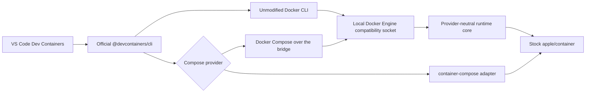

# devcontainer

<p align="center">
  
</p>

[](https://github.com/stephenlclarke/devcontainer/actions/workflows/ci.yml)
[](https://github.com/stephenlclarke/devcontainer/actions/workflows/codeql.yml)
[](https://github.com/stephenlclarke/devcontainer/actions/workflows/docs.yml)
[](LICENSE)

Run VS Code-compatible Development Containers on Apple silicon through stock [`apple/container`](https://github.com/apple/container), with first-class support for [`container-compose`](https://github.com/stephenlclarke/container-compose).

> [!IMPORTANT]
> This repository contains a functional development candidate, not a stable
> release. The Docker Engine bridge, stock Apple runtime adapter, optional
> `container-compose` provider, package builder, Homebrew formula generator,
> DocC site, and automated quality gates are implemented. Real Docker and the
> custom Apple Compose lane pass the checked-in fixture matrix locally; the
> isolated stock-runtime and live VS Code release evidence are still required
> before any combination is called supported.

## Design promise

The project keeps the official [Dev Containers](https://github.com/devcontainers) toolchain above a local Docker Engine compatibility service. VS Code and the reference [`@devcontainers/cli`](https://github.com/devcontainers/cli) remain unmodified; the service translates their tested Docker API subset into Apple-native runtime operations.



The `container-compose` integration is first-class but independently installed. The core does not import `ComposeCore`, and installing this project must never silently replace stock Apple `container` with Stephen's matched fork stack.

## Compatibility target

| Lane | Purpose | Stable-release requirement |
| --- | --- | --- |
| Real Docker | Behavioral oracle using pinned Docker Engine, Docker Compose, and `@devcontainers/cli` | Complete raw and normalized evidence |
| Stock Apple | Official `apple/container` only; Docker Compose uses the compatibility API | Zero semantic differences in every claimed fixture |
| Apple Compose | `container-compose` selected as the Compose provider, with its exact runtime provenance recorded | Zero semantic differences in every claimed fixture |

The test plan covers image, Dockerfile, Features, users, environment, lifecycle hooks, workspace mounts, ports, reuse, Compose services, networks, volumes, failure recovery, and real VS Code attach/rebuild behavior. See [TESTING.md](TESTING.md) and [COMPATIBILITY.md](COMPATIBILITY.md).

## Project layout

| Path | Purpose |
| --- | --- |
| [DESIGN.md](DESIGN.md) | Detailed architecture, data flow, runtime boundaries, security, and delivery phases |
| [TESTING.md](TESTING.md) | Three-lane Docker/Apple/Compose differential test harness |
| [QUALITY.md](QUALITY.md) | Software-quality analysis, measurable gates, and supply-chain controls |
| [RELEASE.md](RELEASE.md) | CI/CD, GitHub Pages, release authority, and Homebrew tap design |
| [COMPATIBILITY.md](COMPATIBILITY.md) | Compatibility contract and explicit claim policy |
| [Tests/Parity](Tests/Parity) | Machine-readable parity manifest and executable differential fixtures |
| `Sources/DevContainerDockerAPI` | Docker Engine API compatibility router |
| `Sources/DevContainerAppleRuntime` | Stock Apple runtime adapter and process/port/archive support |
| `Sources/DevContainerService` | Unix-socket compatibility engine |
| `Sources/DevContainerComposeProvider` | Optional external `container-compose` dispatcher |

## Development

Requirements are Xcode 26, Swift 6.2 or newer, Python 3, and `make`.
Runtime parity additionally requires a physical Apple-silicon Mac on macOS 26,
stock Apple `container`, real Docker, the pinned Dev Container CLI, and the
selected Compose provider.

```console
make check
make test
make docs
make serve-docs
```

Live runtime tests are deliberately not run on public pull-request code or GitHub-hosted macOS. They execute on an isolated physical runner only after a trusted exact commit has passed hosted checks.

## Primary upstream references

The design follows the maintained sources in the [Dev Containers GitHub organization](https://github.com/devcontainers):

- [Development Containers Specification](https://github.com/devcontainers/spec)
- [Dev Container CLI reference implementation](https://github.com/devcontainers/cli)
- [Dev Container Features](https://github.com/devcontainers/features)
- [Dev Container Templates](https://github.com/devcontainers/templates)
- [Dev Container Images](https://github.com/devcontainers/images)
- [Dev Container CI](https://github.com/devcontainers/ci)
- [containers.dev specification and supporting tools](https://containers.dev/)

Runtime references are [Apple container](https://github.com/apple/container), [Apple containerization](https://github.com/apple/containerization), and the [Apple container API documentation](https://apple.github.io/container/documentation/). VS Code behavior is documented in [Developing inside a Container](https://code.visualstudio.com/docs/devcontainers/containers).

## Installation

There is no supported package yet. Development archives and formulae can be
built with `make homebrew-formula`. The intended stable installation is:

```console
brew tap stephenlclarke/tap
brew trust --formula stephenlclarke/tap/devcontainer
brew install stephenlclarke/tap/devcontainer
container devcontainer doctor
```

The stable formula will install only this project. `container-compose` remains an explicit optional installation and provider choice. See [INSTALL.md](INSTALL.md) for the planned registration and migration behavior.

## Independence and trademarks

This is an independent open-source project. It is not affiliated with or endorsed by Apple, Docker, Microsoft, or the Dev Containers maintainers. Apple, Docker, Visual Studio Code, and other marks belong to their respective owners.

## License

Licensed under [Apache License 2.0](LICENSE), matching `apple/container` and
`apple/containerization`. The package builder includes third-party notices,
deterministic build metadata, checksums, and an SPDX 2.3 SBOM.
