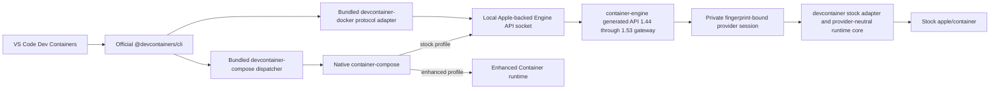

# devcontainer

<!-- markdownlint-disable MD013 MD033 -->
<p>
  
  <a href="https://github.com/stephenlclarke/devcontainer/actions/workflows/ci.yml?query=branch%3Amain"></a>
  <a href="https://github.com/stephenlclarke/devcontainer/actions/workflows/codeql.yml?query=branch%3Amain"></a>
  <a href="https://github.com/stephenlclarke/devcontainer/actions/workflows/docs.yml?query=branch%3Amain"></a>
  <a href="https://github.com/stephenlclarke/devcontainer/actions/workflows/homebrew.yml?query=branch%3Amain"></a>
  <a href="https://github.com/stephenlclarke/devcontainer/actions/workflows/prebuilt-binaries.yml?query=branch%3Amain"></a>
  <a href="https://sonarcloud.io/summary/new_code?id=stephenlclarke_devcontainer"></a>
  <a href="https://sonarcloud.io/summary/new_code?id=stephenlclarke_devcontainer"></a>
  <a href="https://sonarcloud.io/summary/new_code?id=stephenlclarke_devcontainer"></a>
  <a href="https://sonarcloud.io/summary/new_code?id=stephenlclarke_devcontainer"></a>
  <a href="https://sonarcloud.io/summary/new_code?id=stephenlclarke_devcontainer"></a>
  <a href="https://sonarcloud.io/summary/new_code?id=stephenlclarke_devcontainer"></a>
  <a href="https://sonarcloud.io/summary/new_code?id=stephenlclarke_devcontainer"></a>
  <a href="https://sonarcloud.io/summary/new_code?id=stephenlclarke_devcontainer"></a>
  
</p>
<br clear="left" />
<br>
<!-- markdownlint-enable MD033 -->

Run VS Code-compatible Development Containers on Apple silicon through stock [`apple/container`](https://github.com/apple/container), with first-class support for [`container-compose`](https://github.com/stephenlclarke/container-compose).

The project's north-star goal is 100% behavioural parity for the
Docker-independent Development Containers surface, with comparable or better
user-visible performance than the Docker oracle. Configurations that require a
host Docker daemon or mount its socket are deliberately outside the product
boundary. Current releases make narrower evidence-bound claims until the
remaining specification and performance objectives are proved. The audited
findings and solution designs are in the [full parity and performance
roadmap](PARITY-ROADMAP.md).

> [!IMPORTANT]
> Version 1.0.2 is the current release candidate; it is not yet an immutable
> stable baseline. The latest published stable release remains 1.0.1. Before
> 1.0.2 can be published, its exact source must pass all 19 CLI fixtures plus
> the real VS Code end-to-end fixture against real Docker, unmodified Apple
> `container` 1.4.1, and the separately maintained `container-compose` 0.15.1
> provider stack with zero normalized semantic differences.
> The provider pin is the verified `container-compose` 0.15.1 tag at commit
> `81a2263adf30127a3cf774ffdaf56bd23e2f81c1`.
> [COMPATIBILITY.md](COMPATIBILITY.md) records the current pins, bounded claim,
> and evidence requirements.

<!-- dockerless-contract -->

> [!NOTE]
> The install and every candidate runtime path are **100% Docker-less**: they do not
> install, discover, invoke, or depend on Docker, Colima, Podman, or nerdctl. The executable named
> `devcontainer-docker` is this project's Apple-backed protocol adapter, retained
> because VS Code calls its compatibility setting `dockerPath`. A pinned real
> Docker environment exists only in the isolated parity workflow as the
> behavioral oracle and is never packaged or installed.
> Dockerfile/Compose input syntax and open-source compatibility protocol/model
> libraries may retain their upstream names; none can discover or launch Docker
> software in a candidate lane.
> The local Unix socket is owned by this project and translates the protocol
> directly to Apple Container APIs. It never proxies or mounts a Docker socket.
> `DOCKER_HOST` and VS Code's `dockerPath` setting are compatibility field names
> required by the unmodified upstream clients; both point only at this project's
> adapter and private `engine.sock`, never at Docker software.
> Explicit runtime selection must resolve to an executable named `container`,
> and explicit socket selection rejects Docker daemon socket names, including
> symlink aliases, before launch or connection. Before its first workload
> request, the adapter also verifies a project-specific identity response from
> `devcontainer-engine`; a foreign Docker-compatible endpoint is rejected even
> when it uses a harmless-looking socket filename.
> Every product child-process launch passes through one shared policy that
> rejects Docker-family executable names and symlink targets before execution.
> Runtime provenance must identify either stock `apple/container` or the
> explicitly selected `stephenlclarke/container` distribution. A foreign or
> unidentified custom Container distribution is rejected before project work.
> `docker` is not accepted as a backend or Compose-provider configuration value.
> The official CLI entry point always runs the checksum-pinned packaged script;
> an environment variable cannot replace it with an external implementation.

The current source candidate additionally has a clean compile gate against unmodified Apple
`container` 1.4.1 and `containerization` 0.45.0. That build result is not a
substitute for the outstanding real-runtime parity rerun.

## See it work


The recording starts the local compatibility endpoint, runs the official
`@devcontainers/cli` against the checked-in [hello example](Examples/hello),
executes its lifecycle hook, reads the mounted workspace from the running
Apple container, and proves exact cleanup. It is generated from
[docs/devcontainer-demo.tape](docs/devcontainer-demo.tape) with
[VHS](https://github.com/charmbracelet/vhs); every displayed result comes from
the live command immediately above it. Recreate it on a release host with
`make demo`.

## Design promise

The project keeps the official [Dev Containers](https://github.com/devcontainers)
toolchain above a project-owned, Apple-backed Engine API adapter. VS Code and
the reference [`@devcontainers/cli`](https://github.com/devcontainers/cli)
remain unmodified; the adapter implements their tested Docker-shaped protocol
subset directly with Apple-native runtime operations and never proxies Docker
software.



The `container-compose` integration remains process-isolated. Release archives
bundle an exact, stock-profile build that uses the local Engine socket and
stock adapter rather than loading enhanced XPC types into Apple's service.
Users of the enhanced Container runtime may select it explicitly without
changing the Dev Containers installation. The core does not import
`ComposeCore`, and no product path may silently replace stock Apple `container`
with the enhanced stack. No product path installs or launches the Docker CLI,
Docker Compose, Docker Desktop, Docker Engine, Colima, Podman, or nerdctl.

The stock adapter can export a stopped container's canonical name, stable
Docker identifier, immutable Apple bundle key, and lifecycle snapshot for a
coordinated provider handoff. The export fails closed while a selected
container is running or any create, start, stop, restart, kill, rename, remove,
exec, or exit transition can race the snapshot; it never invents event history
that the legacy poller cannot prove.

## Compatibility target

| Lane | Purpose | Stable-release requirement |
| --- | --- | --- |
| Real Docker | Behavioral oracle using pinned Docker Engine, Docker Compose, and `@devcontainers/cli` | Complete raw and normalized evidence |
| Stock Apple | Official `apple/container` plus the required native Engine-socket `container-compose` provider; no Docker software | Zero semantic differences in every claimed fixture |
| Enhanced Container | Stephen Clarke's matched Container and native `container-compose` stack, with exact runtime provenance | Zero semantic differences in every claimed fixture |

The test plan covers image, Dockerfile, Features, users, environment, lifecycle hooks, workspace mounts, ports, reuse, Compose services, networks, volumes, failure recovery, and real VS Code attach/rebuild behavior. See [TESTING.md](TESTING.md), [COMPATIBILITY.md](COMPATIBILITY.md), and the explicit [standards conformance audit](CONFORMANCE.md).

Stock `apple/container` 1.4.1 does not expose create-time hostname, full Docker
privileged mode, or most Docker security-option fields. Requests for those
semantics fail before runtime creation; privileged mode is never approximated
with `CapAdd ALL`. Runtime-affecting container, exec, network, and volume
request objects use strict nested decoding. Unknown fields return a Docker
`400`, and known fields that the selected runtime cannot enforce return `501`,
before side effects. Arbitrary `runArgs` remain outside the compatibility
claim until their exact behaviour is certified. See
[CONFORMANCE.md](CONFORMANCE.md) before using security, device, resource, or
advanced mount options.

## Project layout

| Path | Purpose |
| --- | --- |
| [USER_GUIDE.md](USER_GUIDE.md) | Installation-to-operation user manual for the stock and optional provider paths |
| [DESIGN.md](DESIGN.md) | Implemented architecture, data flow, runtime boundaries, security, and release definition |
| [PARITY-ROADMAP.md](PARITY-ROADMAP.md) | North-star parity and performance criteria, audited defects, and designed solutions |
| [UNSUPPORTED-CAPABILITIES.md](UNSUPPORTED-CAPABILITIES.md) | Field-by-field implementation and certification design for every current unsupported capability |
| [CONFORMANCE.md](CONFORMANCE.md) | Complete audited Dev Containers property ledger and explicit 1.0.2 non-conformances |
| [PERFORMANCE.md](PERFORMANCE.md) | Full repeated-run parity timing analysis and optimization priorities |
| [TESTING.md](TESTING.md) | Docker, stock Apple, and separate `container-compose` differential harness |
| [QUALITY.md](QUALITY.md) | Software-quality analysis, measurable gates, and supply-chain controls |
| [BUILD.md](BUILD.md) | Current local build, test, coverage, sanitizer, parity, and package commands |
| [INSTALL.md](INSTALL.md) | Source, prebuilt, Homebrew, provider, and uninstall contract |
| [RELEASE.md](RELEASE.md) | CI/CD, GitHub Pages, release authority, and Homebrew tap design |
| [COMPATIBILITY.md](COMPATIBILITY.md) | Compatibility contract and explicit claim policy |
| [SECURITY.md](SECURITY.md) | Private vulnerability reporting and supported-version policy |
| [Tests/Parity](Tests/Parity) | Machine-readable parity manifest and executable differential fixtures |
| [Examples/hello](Examples/hello) | Minimal image-based Dev Container used by the live demonstration |
| `container-engine-api` revision `48e44d74d738ca3d24351ba02c4869be1a3e6998` | Shared executable, generated 107-operation compatibility API 1.44 through 1.53 ledger, wire/router/server contracts, schema-2 private provider-session transport, bounded raw/WebSocket streaming, deterministic listener ownership/shutdown, and provider-owned immutable state-root identity. |
| `Sources/DevContainerDockerAPI` | Stock-provider Docker Engine endpoint policy and DTO projection |
| `Sources/DevContainerAppleRuntime` | Stock Apple runtime adapter and process/port/archive support |
| `Sources/DevContainerService` | Stock-provider adapter; normal mode starts one internal private provider session behind the shared public gateway, while `--provider-socket` exposes only the private session for an external `container-engine` process |
| `Sources/DevContainerComposeProvider` | Process-isolated native `container-compose` dispatcher |

## Development

Requirements are Xcode 26, Swift 6.2 or newer, Python 3, Ruby 2.7 or newer
(including its standard JSON and Psych YAML libraries), and `make`.
Runtime parity additionally requires a physical Apple-silicon Mac on macOS 26,
stock Apple `container`, real Docker, the pinned Dev Container CLI, and the
selected Compose provider.

All multi-service product paths use native `container-compose`. Real Docker is
restricted to explicitly named reference-oracle parity jobs. Docker, Colima,
Podman, and nerdctl are never product, build, package, or Homebrew dependencies.

```console
make check
make test
make docs
make serve-docs
DEVCONTAINER_VSCODE_LIVE=1 make parity-vscode-docker
```

Use `devcontainer diagnostics --output devcontainer-diagnostics.tar.gz` to
create a bounded, privacy-redacted support archive whose JSON manifest is
printed before the archive is written.

Live runtime tests are deliberately not run on public pull-request code or GitHub-hosted macOS. They execute on an isolated physical runner only after a trusted exact commit has passed hosted checks.

## Documentation

Start with the [user guide](USER_GUIDE.md), then consult the
[compatibility contract](COMPATIBILITY.md), [standards conformance
audit](CONFORMANCE.md), [full parity and performance roadmap](PARITY-ROADMAP.md),
and [parity timing analysis](PERFORMANCE.md). The
generated [DocC site](https://stephenlclarke.github.io/api/devcontainer/) in the
[Container developer API collection](https://stephenlclarke.github.io/api/)
contains the public Swift API reference plus architecture, use, compatibility,
conformance, testing, and performance articles. GitHub Pages publishes it from
the exact `main` commit that passes the documentation workflow.

## Primary upstream references

The design follows the maintained sources in the [Dev Containers GitHub organization](https://github.com/devcontainers):

- [Development Containers Specification](https://github.com/devcontainers/spec)
- [Dev Container CLI reference implementation](https://github.com/devcontainers/cli)
- [Dev Container Features](https://github.com/devcontainers/features)
- [Dev Container Templates](https://github.com/devcontainers/templates)
- [Dev Container Images](https://github.com/devcontainers/images)
- [Dev Container CI](https://github.com/devcontainers/ci)
- [containers.dev specification and supporting tools](https://containers.dev/)

Runtime references are [Apple container](https://github.com/apple/container), [Apple containerization](https://github.com/apple/containerization), and the [Apple container API documentation](https://apple.github.io/container/documentation/). VS Code behavior is documented in [Developing inside a Container](https://code.visualstudio.com/docs/devcontainers/containers).

## Install

Requirements are an Apple-silicon Mac running macOS Tahoe 26 or later and
Apple [`container` 1.4.1](https://github.com/apple/container/releases/tag/1.4.1).
The commands below are the Docker-free **1.0.2 installation procedure after
1.0.2 is published**. The currently published 1.0.1 Homebrew formula is a
legacy package that still declares Docker dependencies and does not satisfy
this source candidate's installation contract; do not install or upgrade to
1.0.1 for a Docker-free setup. Install Apple's signed package first, then
install `devcontainer` once the stable formula reports 1.0.2:

When macOS asks whether the selected runtime's `container-runtime-linux` may
find and connect to devices on the local network, choose **Allow**. Stock mode
uses Apple's signed helper; the optional provider stack uses its separately
installed helper. macOS can list them as distinct Local Network entries.
Denying either helper leaves its host listener open but resets connections with
`No route to host`.

```console
brew tap stephenlclarke/tap
brew trust --tap stephenlclarke/tap
brew install stephenlclarke/tap/devcontainer
/usr/local/bin/container system start
brew services start stephenlclarke/tap/devcontainer
devcontainer doctor --container /usr/local/bin/container
```

Use the compatibility socket only in the shell that needs it:

```console
eval "$(devcontainer context)"
npx --yes @devcontainers/cli@0.89.0 up \
  --workspace-folder /path/to/project
```

For VS Code, configure both bundled adapters once and launch the workspace from that configured shell:

```json
{
  "dev.containers.dockerPath": "/opt/homebrew/bin/devcontainer-docker",
  "dev.containers.dockerComposePath": "/opt/homebrew/bin/devcontainer-compose"
}
```

```console
eval "$(devcontainer context)"
code /path/to/project
```

Optional Apple CLI plug-in registration is explicit and reversible:

```console
devcontainer plugin register
container devcontainer doctor
```

Beginning with 1.0.2, the stable formula installs this project, Node.js, and a
pinned stock-profile native Compose provider in the same archive. It does not
install Docker software, Colima, an external Compose formula, or a container
runtime. The published legacy 1.0.1 formula is excluded from this statement.
Plug-in registration is an explicit, reversible symlink into the active
runtime's reported install root, and it never replaces a foreign registration.
See [INSTALL.md](INSTALL.md) for stock/custom runtime selection,
service management, upgrades, verification, troubleshooting, and removal.

## Independence and trademarks

This is an independent open-source project. It is not affiliated with or endorsed by Apple, Docker, Microsoft, or the Dev Containers maintainers. Apple, Docker, Visual Studio Code, and other marks belong to their respective owners.

## License

Licensed under [Apache License 2.0](LICENSE), matching `apple/container` and
`apple/containerization`. The package builder includes third-party notices,
deterministic build metadata, checksums, and SPDX 2.3 SBOMs. The bundled
stock-profile Compose provider carries its own complete legal notice and SBOM
inventory for the exact SwiftPM graph, vendored Go module graph, and Go
standard library compiled into that process-isolated payload.
