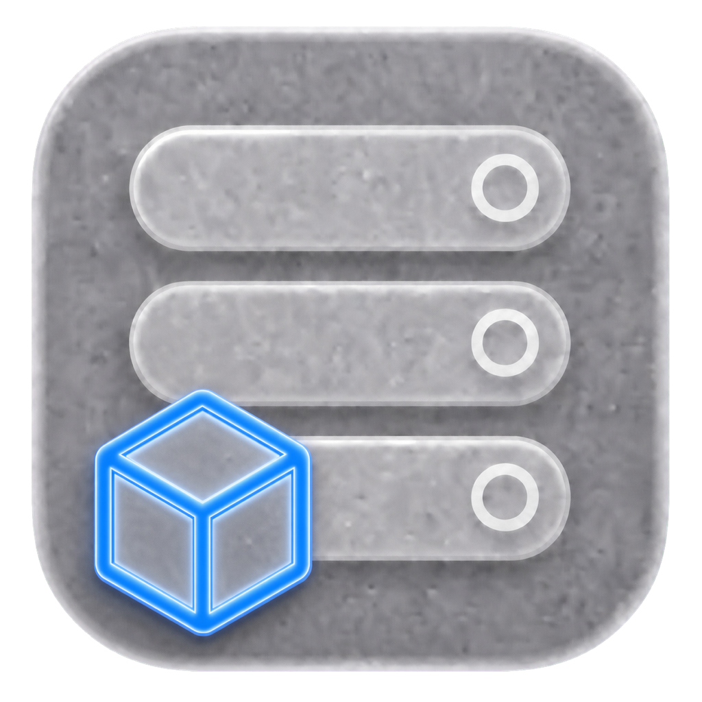
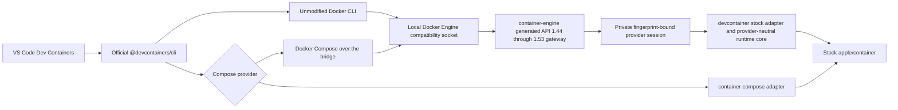

# devcontainer

<!-- markdownlint-disable MD013 MD033 -->
<p>
  
  <a href="https://github.com/stephenlclarke/devcontainer/actions/workflows/ci.yml?query=branch%3Amain"></a>
  <a href="https://github.com/stephenlclarke/devcontainer/actions/workflows/codeql.yml?query=branch%3Amain"></a>
  <a href="https://github.com/stephenlclarke/devcontainer/actions/workflows/docs.yml?query=branch%3Amain"></a>
  <a href="https://github.com/stephenlclarke/devcontainer/actions/workflows/homebrew.yml?query=branch%3Amain"></a>
  <a href="https://github.com/stephenlclarke/devcontainer/actions/workflows/prebuilt-binaries.yml?query=branch%3Amain"></a>
  <a href="https://sonarcloud.io/summary/new_code?id=stephenlclarke_devcontainer"></a>
  <a href="https://sonarcloud.io/summary/new_code?id=stephenlclarke_devcontainer"></a>
  <a href="https://sonarcloud.io/summary/new_code?id=stephenlclarke_devcontainer"></a>
  <a href="https://sonarcloud.io/summary/new_code?id=stephenlclarke_devcontainer"></a>
  <a href="https://sonarcloud.io/summary/new_code?id=stephenlclarke_devcontainer"></a>
  <a href="https://sonarcloud.io/summary/new_code?id=stephenlclarke_devcontainer"></a>
  <a href="https://sonarcloud.io/summary/new_code?id=stephenlclarke_devcontainer"></a>
  <a href="https://sonarcloud.io/summary/new_code?id=stephenlclarke_devcontainer"></a>
  
</p>
<br clear="left" />
<br>
<!-- markdownlint-enable MD033 -->

Run VS Code-compatible Development Containers on Apple silicon through stock [`apple/container`](https://github.com/apple/container), with first-class support for [`container-compose`](https://github.com/stephenlclarke/container-compose).

The project's north-star goal is 100% behavioural parity with Docker-based Development Containers, with comparable or better user-visible performance. Current releases make narrower evidence-bound claims until the complete specification and performance objectives are proved. The audited findings and solution designs are in the [full parity and performance roadmap](PARITY-ROADMAP.md).

> [!IMPORTANT]
> Version 1.0.1 is the latest immutable stable baseline. Its exact tag
> certification ran all 18 CLI fixtures plus the real VS Code end-to-end
> fixture against real Docker, unmodified Apple `container` 1.1.0, and the
> separately maintained `container-compose` 0.10.1 provider stack with zero
> normalized semantic differences. [COMPATIBILITY.md](COMPATIBILITY.md)
> records those exact release fingerprints without rewriting the historical
> evidence as the source dependency graph changes.

The external native Compose dependency qualification and release are complete and authenticated: signed arm64 frontend `0.15.1` at `2ef7e13532481351f9ec216e43b353c113b50f5c` is paired with Container runtime `f86fea2236fab118c0e0c6f8be5eb7672df894e2` and the exact released guest and builder archives. Its full local product qualification passes, and the published `4fc0c0d9` package and provenance were freshly downloaded and verified. The Compose SDK release `1a96` is also published and verified. Its provenance still records `signedDistributionReady: false` because the vendor/header notice closure remains open; this qualified prerelease remains an external test input, is not bundled into Devcontainer, and is not a GA claim. Devcontainer's fresh final-source qualification, signed package, E13 component, complete 84-observation qualification, and final release remain pending. Earlier failed runtime evidence remains preserved.

The historical 15 September 2026 `main` checkpoint (`1b71fe3ec105`) passed hosted CI,
the stock Apple compile/test lane, documentation, Homebrew validation,
AddressSanitizer, ThreadSanitizer, CodeQL, and SonarQube. Its 15 September 2026
SonarQube analysis reports 95.5% coverage, 0.1% duplicated lines, and zero
bugs, vulnerabilities, code smells, or security hotspots. The live runtime
workflow did not produce the expected lane result files, so this source is not
yet a replacement for the immutable 1.0.1 runtime-parity baseline. At that checkpoint, the published Current package pointed to July source
`b31e80b2b9c09`; these historical checks do not qualify the current release candidate.

Current source has distinct dependency profiles. The stock profile resolves
unmodified Apple `container` 1.4.1 and `containerization` 0.45.0; the enhanced
profile resolves the exact Stephen-owned revisions recorded in
[COMPATIBILITY.md](COMPATIBILITY.md). Neither profile has replaced the 1.0.1
runtime-parity baseline; the new Devcontainer release still requires its complete
exact-source runtime qualification.

## See it work


The recording starts the local compatibility endpoint, runs the official
`@devcontainers/cli` against the checked-in [hello example](Examples/hello),
executes its lifecycle hook, reads the mounted workspace from the running
Apple container, and proves exact cleanup. It is generated from
[docs/devcontainer-demo.tape](docs/devcontainer-demo.tape) with
[VHS](https://github.com/charmbracelet/vhs); every displayed result comes from
the live command immediately above it. Recreate it on a release host with
`make demo`.

## Design promise

The project keeps the official [Dev Containers](https://github.com/devcontainers)
toolchain above a local Docker Engine compatibility service. VS Code and the
reference [`@devcontainers/cli`](https://github.com/devcontainers/cli) remain
unmodified; the service translates their tested Docker API subset into
Apple-native runtime operations.


```mermaid
flowchart LR
    VS["VS Code Dev Containers"] --> DC["Official @devcontainers/cli"]
    DC --> Docker["Unmodified Docker CLI"]
    Docker --> API["Local Docker Engine compatibility socket"]
    API --> Shared["container-engine generated API 1.44 through 1.53 gateway"]
    Shared --> Session["Private fingerprint-bound provider session"]
    Session --> Core["devcontainer stock adapter and provider-neutral runtime core"]
    Core --> Stock["Stock apple/container"]
    DC --> ComposeChoice{"Compose provider"}
    ComposeChoice --> DockerCompose["Docker Compose over the bridge"]
    ComposeChoice --> ContainerCompose["container-compose adapter"]
    DockerCompose --> API
    ContainerCompose --> Stock
```

The `container-compose` integration is first-class but independently installed.
The core does not import `ComposeCore`, and installing this project never
silently replaces stock Apple `container` with the matched fork stack.

The stock adapter can export a stopped container's canonical name, stable
Docker identifier, immutable Apple bundle key, and lifecycle snapshot for a
coordinated provider handoff. The export fails closed while a selected
container is running or any create, start, stop, restart, kill, rename, remove,
exec, or exit transition can race the snapshot; it never invents event history
that the legacy poller cannot prove.

## Compatibility target

| Lane | Purpose | Stable-release requirement |
| --- | --- | --- |
| Real Docker | Behavioral oracle using pinned Docker Engine, Docker Compose, and `@devcontainers/cli` | Complete raw and normalized evidence |
| Stock Apple | Official `apple/container` only; Docker Compose uses the compatibility API | Zero semantic differences in every claimed fixture |
| `container-compose` provider | Stephen Clarke's separately installed `container-compose`, with its exact runtime provenance recorded | Zero semantic differences in every claimed fixture |

The test plan covers image, Dockerfile, Features, users, environment, lifecycle hooks, workspace mounts, ports, reuse, Compose services, networks, volumes, failure recovery, and real VS Code attach/rebuild behavior. See [TESTING.md](TESTING.md), [COMPATIBILITY.md](COMPATIBILITY.md), and the explicit [standards conformance audit](CONFORMANCE.md).

Stock `apple/container` 1.1.0 does not expose create-time hostname, full Docker
privileged mode, or most Docker security-option fields. Requests for those
semantics fail before runtime creation; privileged mode is never approximated
with `CapAdd ALL`. Runtime-affecting container, exec, network, and volume
request objects use strict nested decoding. Unknown fields return a Docker
`400`, and known fields that the selected runtime cannot enforce return `501`,
before side effects. Arbitrary `runArgs` remain outside the compatibility
claim until their exact behaviour is certified. See
[CONFORMANCE.md](CONFORMANCE.md) before using security, device, resource, or
advanced mount options.

## Project layout

| Path | Purpose |
| --- | --- |
| [USER_GUIDE.md](USER_GUIDE.md) | Installation-to-operation user manual for the stock and optional provider paths |
| [DESIGN.md](DESIGN.md) | Implemented architecture, data flow, runtime boundaries, security, and release definition |
| [Docker-free review and design](docs/docker-free-review-and-design.md) | September 2026 audit, current defects, stock/enhanced architecture, Compose reuse, and optimisation/test plan; proposed work |
| [PARITY-ROADMAP.md](PARITY-ROADMAP.md) | North-star parity and performance criteria, audited defects, and designed solutions |
| [UNSUPPORTED-CAPABILITIES.md](UNSUPPORTED-CAPABILITIES.md) | Field-by-field implementation and certification design for every current unsupported capability |
| [CONFORMANCE.md](CONFORMANCE.md) | Complete audited Dev Containers property ledger and explicit 1.0.1 non-conformances |
| [PERFORMANCE.md](PERFORMANCE.md) | Full repeated-run parity timing analysis and optimization priorities |
| [TESTING.md](TESTING.md) | Docker, stock Apple, and separate `container-compose` differential harness |
| [QUALITY.md](QUALITY.md) | Software-quality analysis, measurable gates, and supply-chain controls |
| [BUILD.md](BUILD.md) | Current local build, test, coverage, sanitizer, parity, and package commands |
| [INSTALL.md](INSTALL.md) | Source, prebuilt, Homebrew, provider, and uninstall contract |
| [RELEASE.md](RELEASE.md) | CI/CD, GitHub Pages, release authority, and Homebrew tap design |
| [COMPATIBILITY.md](COMPATIBILITY.md) | Compatibility contract and explicit claim policy |
| [SECURITY.md](SECURITY.md) | Private vulnerability reporting and supported-version policy |
| [Tests/Parity](Tests/Parity) | Machine-readable parity manifest and executable differential fixtures |
| [Examples/hello](Examples/hello) | Minimal image-based Dev Container used by the live demonstration |
| `container-engine-api` | Shared executable and libraries use the exact stock/enhanced revisions in [COMPATIBILITY.md](COMPATIBILITY.md), with wire/router/server and private provider-session contracts. Source component evidence remains separate from stable-release qualification. |
| `Sources/DevContainerDockerAPI` | Stock-provider Docker Engine endpoint policy and DTO projection |
| `Sources/DevContainerAppleRuntime` | Stock Apple runtime adapter and process/port/archive support |
| `Sources/DevContainerService` | Stock-provider adapter; normal mode starts one internal private provider session behind the shared public gateway, while `--provider-socket` exposes only the private session for an external `container-engine` process |
| `Sources/DevContainerComposeProvider` | Optional external `container-compose` dispatcher |

## Development

The eight stock/enhanced compiled dependency layers were refreshed through their maintained producers and focused tests. Their published archives and evidence were downloaded and verified in Foundation, Containerization/Engine API, then Container SDK order. The product build consumes these exact released inputs; full package qualification remains a separate gate.

The Docker frontend uses a first-party bounded Unix HTTP transport for requests, event/build streams, and attach/exec upgrades. It validates the current-user socket, enforces absolute request and upgraded-session deadlines, interrupts socket work on cancellation, preserves output received with the upgrade response, and supports stdin half-close. This compatibility adapter retains the shared wire and response types while leaving the Enhanced API 48 pin and all published dependency layers unchanged. See [the transport handoff](docs/PR-docker-frontend-transport.md).

The hosted CLI smoke check explicitly selects the Docker provider and disables standalone Compose autodiscovery so it uses the pinned test fixture. The native provider remains the product default.

Release quality checks retain the original assertions and thresholds. Shared test-fixture helpers and fixed Docker protocol routes are reviewed as analysis false positives, with recorded usage evidence. The exported test-support initializer keeps its existing source interface under a documented compatibility exception. Actual source findings are corrected before a fresh exact-commit scan.

Hosted changed-source coverage recognizes a strict subset of protocol-only Swift declarations that LLVM does not instrument. Executable or unrecognized missing sources still fail the gate; the overall and changed-code coverage thresholds remain unchanged.

Native release-harness inputs are declared in a separate release package so changes to that data closure do not invalidate the product build recipe used by released dependency layers. Layer admission still requires exact recipe and archive identities; harness checks and four-product consumption proof remain separate.

Current and stable publication require successful CodeQL analysis for the exact main commit, alongside the existing source-quality and runtime release gates. Keep the repository variable `CODEQL_ENABLED=true` for release validation; disabling it makes main checks fail. Draft pull requests retain their analysis skip.

Release-comparison work now includes a [published devcontainer 1.0.1 baseline adapter and live results](docs/bazel-test-harness.md#published-devcontainer-baseline). The current stock candidate passes image-configuration and lifecycle checks that 1.0.1 fails on image identity/lookup. This demonstrates correctness improvements, not speedups: failed cases are excluded from timing ratios. Quiet previous/new stable-release benchmarks remain outstanding.

The [workspace-launch observations](docs/evidence/previous-current-d01-20260920.md) and [lifecycle observations](docs/evidence/previous-current-e02-20260920.md) now include reproducible JSON evidence with exact product hashes, source commits and original case seals. The [read-only previous/current reporter](docs/bazel-test-harness.md#previouscurrent-observation-reports) keeps local candidates separate from published releases, requires matched harness/provider/guest inputs, and never pools away a failed sample. These reports do not establish a measured speed improvement.

Coverage builds now use atomic counters and sandboxed Swift compilation to prevent the diagnosed parallel-counter loss and stale incremental-object reuse. `make bazel-coverage-counters` checks an exact parallel-counter inventory before the normal unit/checkpoint coverage path. Ordinary builds retain worker and action-cache reuse. Complete unit inventories pass the 90% gate: stock `7f4fe20` has 675 reported cases and **91.8845%** measured line coverage; enhanced `a3ae038` has 677 cases and **91.7956%**. [Exact evidence and remaining quality gates](docs/bazel-test-harness.md#process-io-cancellation-and-coverage-integrity) distinguish these measurements from integration, SonarQube and release certification.

Coverage cleanup removes stale profiles and reports only from the selected SwiftPM build’s `codecov` output directory. It leaves dependency checkouts and their tracked configuration files untouched.

The unreleased Bazel candidate preserves published ports when a delivered signal does not stop the container and joins restored-container observers during shutdown. [Signal implementation and evidence](docs/bazel-test-harness.md#foreground-init-attachment-development) distinguish passing component tests from the unresolved Docker duplicate-signal oracle, native qualification and release gates.

The Bazel E08 foreground fixture passes all seven observations on Docker and stock Apple: terminal resize, detach/reconnect of the same init process, acknowledged exit status and automatic removal. Stock proof includes the corrected `AutoRemove` inspection and resize-route declaration. E09 exercises the real Compose CLI's piped input, separate output streams, exit status and automatic removal; E10 applies those checks with `run --quiet`. Enhanced runtime, complete foreground parity, quiet-machine performance and stable release qualification remain open. See the [exact evidence and remaining requirements](docs/bazel-test-harness.md#foreground-init-attachment-development).

The unreleased init-attachment path connects input/output before native startup, preserves independent clients and real exit status, and joins cleanup before replacing a process generation. Source-tagged output is now journaled before live delivery, with atomic history/live handover and demand-driven HTTP replay. The HTTP adapter applies stream selection, stdin EOF policy, TTY detach keys and generation-checked post-start resize. An acknowledged native exit registration survives auto-removal independently of output drainage; the matching Compose foreground client is component-tested. [Runtime and HTTP evidence](docs/bazel-test-harness.md#foreground-init-attachment-development) records the bounded history policy and distinguishes component tests from the still-pending full live parity and release gates. Invalid compiler coverage counters still prevent release-quality certification.

The gateway candidate also preserves explicit entrypoint clearing, environment removals and descriptor-bound image command defaults through native launch and saved metadata. Native creation projects memory/shm size, read-only rootfs, sysctls and stop signal; this is not a claim of Docker cgroup accounting parity. [Component evidence](docs/bazel-test-harness.md#c02-dependency-health-and-service-selection) is recorded separately from pending live parity and release gates.

The unreleased gateway now retains explicit DNS settings through Apple creation, inspection and recovery from older metadata. Component tests pass; this is preparation for the Compose startup-path fix, not a new stable release or live parity claim. See [candidate evidence](docs/bazel-test-harness.md#c02-dependency-health-and-service-selection).

C02 passes all four original startup-DNS, running DNS, dependency health and selected-service observations on the real Docker reference and the current packaged stock pair: devcontainer `f744a85` and Compose `8acef00b` (`82123a6c-9462-4f8c-83da-8e7cbced2d3d`). Both retain exact-resource cleanup evidence. The supporting E07 attachment fixture passes all eight observations in Docker and stock Apple, including saved startup logs followed by byte-exact live output on an independent output-only connection. Full foreground qualification, enhanced-lane qualification and quiet paired timings remain outstanding. See the [C02 contract, timings and evidence](docs/bazel-test-harness.md#c02-dependency-health-and-service-selection).

The Bazel E14 real-PTY probe now passes all seven observations on Docker and stock Apple, including bounded post-start terminal-size convergence and host-initiated resizing. First-query bytes and earlier failed assertions remain retained. The separate E15 explicit create-time dimension check passes Docker but is rejected by the stock-backed candidate before guest creation; automatic cleanup of that acknowledged rejection now passes. Enhanced execution, controlled benchmarks, uncertain-create recovery and native explicit initial sizing remain unqualified; this is not full foreground or release parity. See the [foreground evidence and limits](docs/bazel-test-harness.md#foreground-init-attachment-development).

D06 passes actual CLI forwarding metadata, guest and host HTTP access, a specific owned-container port collision and cleanup in Docker (`524dce17-469a-4819-9258-a210a414d7cb`) and stock Apple Container (`ecf30eb5-335e-4144-8747-65c91e32975b`). The candidate frontend projects explicit IPv4/fixed TCP publish options without Docker, and inspection reports recorded port bindings. Enhanced live qualification and fresh-machine image distribution remain outstanding; these functional runs are neither quiet paired benchmarks nor a released support claim. See the [D06 contract](docs/bazel-test-harness.md#d06-published-ports).

C03's original environment-file, named-volume, alias and peer-connectivity fixture now passes the downloaded Docker reference. The first stock run timed out preparing the volume helper; the harness now admits its private builder before stack startup, keeping helper build time inside the operation. Unreleased volume-label projection and conflict checks have failing-before/passing-after component proof. [Exact evidence and remaining live qualification](docs/bazel-test-harness.md#c03-compose-resources) are separate from quiet release comparisons; no speedup or stable-release claim follows.

The packaged stock candidate now passes all four C03 observations and automatic zero-residue cleanup. The native Compose handoff declares the adapter's existing creation-time alias support so configured aliases reach it. Enhanced execution and quiet previous/new published-release comparisons remain required; this is functional proof, not a measured speedup or stable release.

C01 Compose-service configuration now passes all three original service, hook and workspace observations on the pinned Docker reference and the Docker-free stock Apple candidate. The stock run uses devcontainer `aa56f00` with Compose `1fe36f56`, validates network/image identity and leaves zero owned resources with clear recovery. Enhanced live qualification remains outstanding after verified local guest-archive import; this is not a new stable release or a quiet paired benchmark. Run the admitted candidates with `COMPOSE_CANDIDATE_INVOCATION` alongside `CANDIDATE_INVOCATION`. See the [C01 contract and exact evidence](docs/bazel-test-harness.md#c01-compose-service).

D07 reuse/rebuild/cleanup now passes all six original observations and cleanup on Docker and stock Apple. The stock candidate preserves named volumes, reuses the original container and replaces it on rebuild through exact-ID native removal, leaving no owned resources. Enhanced live qualification and fresh-machine image distribution remain outstanding. See the [D07 evidence](docs/bazel-test-harness.md#d07-reuse-and-cleanup) for exact revisions, timings and limitations; separate functional runs do not qualify a release or quiet paired benchmark.

D04 lifecycle hooks passes the original host-initialization and ordered guest-hook assertions plus cleanup in Docker (`7c41a35a-01bc-4aaa-b866-2a580cb3c560`) and stock Apple (`76ebd27c-8b98-4df1-969b-fa12c3f2e159`). The candidate reused the `533f9a7` archive without rebuilding. Enhanced live qualification remains outstanding; these separate functional runs are not quiet paired benchmarks or complete release proof. See the [D04 evidence](docs/bazel-test-harness.md#d04-lifecycle-hooks).

D05 locked Features passes all four original observations and cleanup in Docker (`9cd52ed5-55cc-4245-8058-8671ba0e948d`) and stock Apple (`f80ebfc8-b5c8-45d1-b155-b6a1e9006e2e`), without a product rebuild. Missing frozen locks must fail for the specific lockfile reason; unrelated errors cannot pass. Enhanced live qualification remains outstanding, and these are functional observations rather than quiet benchmarks. See the [D05 evidence](docs/bazel-test-harness.md#d05-locked-features). This does not change the stable release's support claims.

D03 users/environment passes all seven observations and cleanup in the Docker reference and the Docker-free stock Apple candidate: non-root UID 1000, home directory, container/remote variables, expansion and post-create output through the pinned official CLI. Stock proof uses source `533f9a7`, invocation `495adb97-3b5e-435f-83ec-2e9bccd9b674`; enhanced live qualification remains outstanding after verified local guest-archive import. See the [exact evidence and isolation boundary](docs/bazel-test-harness.md#d03-users-and-environment). These functional runs are not quiet paired benchmarks or full three-lane release qualification.

New configurations select Docker Compose for the stock backend and the separately installed `container-compose` frontend for the matched fork backend. Explicitly saved frontend choices are preserved. The wrapper supplies the resolved Engine socket and Container executable to the native frontend, overriding conflicting ambient Compose runtime settings. Project ownership follows the selected runtime backend independently of frontend choice. A missing frontend fails before creating project state, without trying Docker as a fallback. This unreleased correction does not change the published compatibility matrix or remove the remaining Homebrew Docker dependencies; Devcontainer native runtime qualification remains outstanding.

Native container creation finishes mount and kernel preparation before journalling possible submission. A failed prerequisite can be repaired and retried without leaving a spurious pending-create record; errors after submission still retain recovery evidence. This development correction is covered by focused stock/enhanced tests, not yet a released runtime guarantee.

The opt-in [native Bazel build](docs/bazel-workflow.md) builds the native executables and runs the unit suites against either stock Apple or enhanced dependencies. Use `make bazel-configure` once, then `make bazel-build` and `make bazel-unit`; add `BAZEL_PROFILE=stock` for the stock graph. `make bazel-package` consumes the released dependency chain and includes four production executables plus the checksum-pinned private Node/Dev Containers CLI and licences. A named package configuration keeps Swift test interfaces out of the archived binaries. It tests the unsigned extracted executable/plugin layout, provenance, real private CLI configuration reading and explicit native Compose-provider handoff without installing or starting services. `make bazel-docs` reuses optimized native modules to generate and test a standalone DocC site without a second SwiftPM build; publication remains in the final documentation phase. Scratch and caches stay on the enrolled external SSD; test evidence and candidate archives are retained together on internal storage, with authenticated restore that requires no rebuild. Runtime qualification, signing and publication remain separate release phases.

Heavy runtime qualification runs once on the laptop through the maintained `native-parity-release` controller. GitHub Runtime parity authenticates its retained receipt against an independently configured checksum, verifies the exact source/package and restored host, and recomputes both comparisons without starting guests, editors or services. Missing, stale, partial or quarantined qualification fails the check. The signed public package workflow attaches that exact successful main-push verification for its source commit before attesting or staging release assets. It pins the parity run, comparison artifact ID and GitHub-reported SHA-256, then verifies the 27 CLI fixtures and V01 VS Code fixture in all three lanes against the same stock finalized archive, finalization provenance and current parity-harness identity. The four comparison JSON/Markdown files, original local qualification receipt and a checksum/source/run provenance sidecar ship as release assets. Provenance identifies local execution separately from GitHub verification. Existing zero-difference, cleanup, timing and publication gates remain authoritative; the timing policy is unchanged and the attached measurements do not claim a speedup.

The release installation check trusts only its generated formula in a temporary tap, then removes that trust during cleanup. It requires no interactive Homebrew trust prompt.

The [layered dependency workflow](docs/devcontainer-layers.md) imports published ArgumentParser, foundation, Containerization, Engine API and Container SDK binaries in both profiles. `make bazel-compiled-consumers LAYER_EVIDENCE=FRESH_ABSOLUTE_DIR` builds all four executables and checks their actual imported archives and action inputs. `make bazel-layers LAYER_EVIDENCE=FRESH_ABSOLUTE_DIR` separately runs all eleven source-unit suites in six ordered groups for both profiles. Exact dependency pins, toolchain and release evidence are checked before reuse; full product release qualification remains separate.

Legacy layer-reuse admission runs with the operational `/usr/bin/python3` AST format. Python versions whose `ast.dump` suppresses empty fields by default fail closed for those legacy receipts; `make lint` tests admission with `/usr/bin/python3` and checks that newer interpreter behavior explicitly.

In the unreleased candidate, `devcontainer configure` preserves existing settings omitted from the command, including strict compatibility. Use `--strict` or `--no-strict` to change that setting explicitly; new configurations remain strict by default. Changing only the socket no longer silently resets stored strictness. Backend and Compose frontend choices remain independent.

The candidate also preserves progress from failed Apple image builds and returns a Docker-compatible error record without recording success. Preflight rejection, cancellation and abandonment remain distinct failures. [Component tests](docs/bazel-test-harness.md#image-build-contract) cover this in both profiles; live E04 build parity and stable publication are still required.

The opt-in E04 harness now downloads the published builder images with `make bazel-prepare-builders` (`OFFLINE=1` for verified reuse), submits owned image builds, checks the intended failing command actually ran, and verifies scoped cleanup. It does not rebuild reference runtimes or modify your Container configuration. Interrupted builds with uncertain completion remain quarantined; complete live parity and unattended recovery qualification are still pending.

For a completed E04 Docker build whose cleanup was interrupted, `make bazel-recover-runtime` reports the exact owned images without changing state. `make bazel-recover-runtime-apply CASE_ID=<reported-id>` revalidates the original downloaded tools, VM process identities and complete build responses before removing those images and stopping only the owned test VM. Recovery preserves the failed test result and never resubmits a build. Unknown build completion or interrupted VM shutdown still requires explicit reconciliation.

Use `make bazel-coverage-report INVOCATION=ID` to export a retained unit run's LCOV and Sonar XML without rerunning tests. `Tools/bazel/run.sh coverage-report ID --minimum-percent 90` also checks the raw measured percentage and fails below the target, while leaving the report available for diagnosis. The receipt identifies the tested commit/profile; exporting historical coverage does not make it current-head quality evidence. The shared checker also supports Compose's reviewed profile-specific test and production-source inventories.

Consumer coverage keeps unit-only evidence distinct from an explicitly declared `unit-cli` inventory. Compose's combined inventory includes all unit targets plus its native no-runtime CLI contracts; use `--inventory=unit-cli` at its quality gate. The receipt and gate bind that choice as well as source/profile/policy. Devcontainer's current native aggregate remains unit-only; neither scope establishes live integration or parity.

New Bazel build/test invocations also retain elapsed timings, platform/toolchain identity and cache metrics. Use `make bazel-build-timings INVOCATION=ID BASELINE=ID` to compare matching configurations. Ordinary timings are labelled observations; controlled quiet-machine benchmarks remain a separate performance gate.

The [test-harness replacement](docs/bazel-test-harness.md) is in progress. `make bazel-harness` runs its deterministic recovery and real Unix-socket component tests, including Engine negotiation, lifecycle, exec-stream, archive-copy and network/volume assertions, and journalled test-resource ownership, under Bazel without building products or starting container services. These checks do not yet establish live runtime parity; all 19 existing fixtures remain required for cutover.

The separate opt-in [service-process integration checks](docs/bazel-test-harness.md#bounded-service-http-probes) exercise startup, private provider access, a rejected recovery request and clean shutdown with a fake runtime command and a real disposable macOS Keychain in an isolated SSD HOME. They do not edit the login Keychain. Their test executable runs from a byte-identical SSD copy outside Bazel's incomplete test-bundle directory so strict code-identity validation remains enabled. These checks do not launch container VMs or establish released-binary performance. [Unattended authorization](docs/bazel-workflow.md#unattended-authorization-requirement) is mandatory: routine runs must fail with recoverable evidence rather than wait for approval; complete host/signing qualification remains pending. [Stable-path activation](docs/bazel-workflow.md#fixed-native-runtime-locations-qualification-pending) now clears the background-service ownership blocker and passes both file-staging/admission checks and all sixteen executable-signature checks, but does not grant macOS permission. Native runtime launches remain paused pending authorization qualification.

The new harness has a [recorded three-lane E01 functional comparison](docs/evidence/released-common-e01-20260918b.md), with [exact fingerprints and raw timings](docs/evidence/released-common-e01-20260918b.json). It passes that protocol fixture only, not the complete matrix or performance gate. Raw Apple-lane operation ratios exceed 10x and require quiet paired investigation. `make bazel-parity-report CAMPAIGN=<id>` reads sealed results without rerunning workloads; missing fixtures fail instead of silently narrowing scope. Select one fixture explicitly with `CASE_FIXTURE=<id>` and choose JSON, Markdown or JUnit with `REPORT_FORMAT=json|markdown|junit`. Private logs and unexpected payloads are never exported.

The [final delivery contract](docs/bazel-workflow.md#final-delivery-and-public-evidence) includes stable releases of both projects, a full published-binary test cycle, public quiet-host benchmark evidence, both DocC sites, and installation-first live demos. Stock E01 passes against published binaries; E02 lifecycle, E03 exec/streams, E05 archive copy and E06 network/volume fixtures now have passing retained-candidate results against stock Apple. E05's archive-permission difference under a restrictive host file mask was fixed and passed its unchanged live assertions. These results do not replace the certified historical release matrix, close the transport coverage shortfall or establish new full parity.

The development native-create path uses a durable creation journal; current state schema 6 stores raw source-tagged output plus versioned saved-log records and natural per-source EOF. Failed or uncertain creates remain inspectable but cannot be started, restarted, executed, renamed or used for archive transfers through the bridge until reconciled. Ordinary deletion does not erase unresolved creation intent. An operator reconciliation interface remains unfinished; do not treat this draft recovery path as release-ready. Metadata migration supports schemas 2/3/4/5; older binaries cannot reopen schema 6. Existing schema-5 output journals remain raw-readable but cannot certify Docker log history or resume capture: retain their evidence and recreate those disposable development containers. Back up a quiescent production state root before migration and retain it for rollback. See [creation recovery](DESIGN.md#native-creation-recovery) and [output capture](DESIGN.md#source-aware-output-history).

C02 partial-create recovery now has a receiver-side freeze check: an exited CLI alone cannot authorize cleanup. It verifies stopped command groups, an unchanged engine epoch, no pending native creation and exact owned resource identities. The unreleased shared gateway now admits the service's explicit version-1 recovery capability through the authenticated provider; stock/enhanced component and real service-process checks pass. Frozen inspection cannot start health probes; unresolved attached or detached sessions and failed mutations keep recovery quarantined. [Live fault qualification](docs/bazel-test-harness.md#bounded-service-http-probes) and general operator reconciliation remain unfinished. This does not change the published release's support claims or establish a performance improvement.

`make bazel-prepare-guest-images` prepares pinned initialization and workload images without Docker or a VM, reusing Compose's OCI validator. On a fresh machine, first supply the exact enhanced archive with `make bazel-import-guest-image GUEST_ARCHIVE_NAME=enhanced-vminit GUEST_ARCHIVE_PATH=/absolute/path/to/archive.tar`; [the import policy and evidence](docs/bazel-test-harness.md#pinned-guest-image-preparation) explain the still-missing public distribution path. The original read-only archive is preserved. Homebrew Skopeo downloads the registry-backed stock/workload inputs. Staging stays on the enrolled SSD; verified archives remain on internal storage. `OFFLINE=1` reuses retained inputs without network access. `make bazel-prepare-guest-kernel` separately prepares the pinned stock Container 1.4.1 kernel using Homebrew Zstandard; it also supports offline reuse. These commands do not install or boot a guest. Local enhanced archive import is verified, but fresh-machine distribution and complete guest-runtime qualification remain outstanding.

Finalized native-package qualification also requires explicit activation of the exact current stock and Compose/Q runtime releases into their stable internal slots; it rejects stale or mixed prepared/active paths and never activates a slot on the operator's behalf. It performs a bounded native API startup/readiness/restoration check for both providers before Docker fixtures, records the activation receipt identities, and stops before fixture work if either API cannot start or restore. This check does not grant macOS privacy permission. See the [stable-provider handoff](docs/PR-stable-native-provider-handoff.md); final runtime authorization remains a separate host gate.

`make bazel-prepare-releases` verifies the pinned GitHub releases, extracts them on the enrolled SSD, and retains their verified executable trees on internal storage as long-lived assets. It does not install packages or rebuild products. Add `OFFLINE=1` to use verified retained downloads. Repeated preparation reuses complete durable trees without re-extraction; interrupted publication resumes only its registered files, and changed sealed files fail closed. Disposable state/build/test work remains on SSD. This prepares binaries only, not the complete guest-image, Docker-oracle or VS Code runtime environment.

`make bazel-prepare-docker-oracle` prepares the pinned published Colima/Lima tools and compressed Docker VM image through that same path; `OFFLINE=1` supports verified reuse. `make bazel-prepare-docker-cli` separately downloads the existing Docker 29.6.2 oracle's exact Homebrew bottle from public GitHub Packages using Skopeo, checks its executable checksum against the parity manifest, and retains the client plus licence/notices without installing Homebrew packages. `OFFLINE=1` verifies the retained client without downloading, extracting or repairing it. Neither preparation command starts a VM, changes Docker contexts or touches existing Colima profiles. The opt-in `make bazel-engine-case CAMPAIGN=<id> LANE=docker` adapter uses a private SSD VM for E01, E02, E03, E05 and E06; live qualification and interrupted-VM recovery remain unfinished. It does not connect to an installed Docker daemon. Docker is a test reference only, not a product installation dependency.

`make bazel-prepare-devcontainers-cli` prepares the pinned official Dev Container CLI 0.88.0 and a private prebuilt Node 24.21.0 for the Docker reference lane. These tools use their official npm/Node distributions, an explicit exception to GitHub-release sourcing; no source build, global install, npm hook or VM startup occurs. Downloads and extraction stage on SSD; verified archives, executables and licences remain on internal storage. `OFFLINE=1` verifies retained inputs without download or repair. This command prepares test-reference tools only. Separately, the native candidate archive now packages the same pinned Node/CLI versions behind its public lifecycle facade; neither path certifies D01 parity or makes Docker an installation dependency. See [reference-tool preparation](docs/bazel-test-harness.md#dev-container-reference-tools).

The opt-in `make bazel-engine-case CAMPAIGN=<id> LANE=docker CASE_FIXTURE=D01-image-config` uses that pinned official CLI in the private Docker VM. It copies the existing fixture to SSD, fetches its exact published image digest, runs `up` and `exec`, and verifies environment, workspace, post-create output and user without rebuilding the products. Candidate D01 uses `LANE=apple-stock` or `LANE=container-compose` with `CANDIDATE_INVOCATION=<prepared-schema-2-archive-invocation>` and invokes the packaged public CLI; old archives without the private bundle fail admission. Stock candidate D01 now passes its four observations and cleanup; enhanced guest prerequisites and live qualification remain outstanding. See [D01 execution and recovery](docs/bazel-test-harness.md#d01-image-configuration-reference); this is not full parity or release certification.

Native process input cancellation now interrupts a full socket or terminal queue; descriptor closure remains on its owning worker. CLI-backed, PTY and direct-API output share a nonblocking reader with cancellation-resistant cleanup joins. Reader-owned closure and callbacks finish before the session closes its frame stream. Terminal cancellation waits for the real child exit status. The matching prepared Compose foreground path reuses these bounded I/O patterns but still requires live qualification. Native Bazel coverage gates reject malformed counters and coverage-merger diagnostics, even when Bazel reports successful tests. Atomic coverage instrumentation and isolated compiler actions corrected the reproduced counter defect; recorded stock/enhanced unit checkpoints pass the unchanged 90% gate. Final release-head coverage, live parity and SonarQube authority remain separate requirements; see [current cancellation and coverage evidence](docs/bazel-test-harness.md#process-io-cancellation-and-coverage-integrity).

The unreleased `//:devcontainer-docker` target implements local version probes, server version, JSON info, typed image/container inspection, quiet container lookup, non-TTY `exec`, foreground `run` and JSON `events` through the shared Unix gateway. Exec supports the pinned upstream client's `-i`, `-u`, `-e NAME=value` and `-w` forms, preserves stdin EOF, separate stdout/stderr and the observed exit status, and accepts native UUID identities. Terminal-state publication is observed for at most five seconds after output EOF; malformed responses and identity changes fail immediately. The development CLI uses a finite 24-hour interactive execution ceiling, 30-second metadata calls and bounded diagnostic writes. Custom library input/output callbacks must cooperate with cancellation; the built-in providers do. The output writer requires sole ownership of writes and the executable's SIGPIPE policy, without changing inherited pipe flags. TTY mode, unsupported commands/flags, Buildx and remote endpoints fail rather than invoking Docker. `Tools/bazel/run.sh test --config=stock //:DevContainerDockerClientTests` exercises parsing, framing, cancellation and the actual executable against a private socket with no Docker clients on `PATH`. The native candidate includes this frontend and the private CLI lifecycle facade. Live candidate proof and signed production packaging remain unfinished; it is not yet included in stable/Homebrew packages.

Foreground `run` currently accepts the recorded `--sig-proxy=false`, stdout/stderr attachment, explicit environment/labels, entrypoint and absolute bind-mount forms. It attaches before start, preserves creation warnings and output, and waits for the real exit status under one execution deadline; output EOF alone is not completion. It does not auto-remove a created container after failure or disconnection. JSON `events` accepts event/label filters, applies output backpressure, limits partial records to 1 MiB and preserves their original JSON numbers. HTTP error bodies are diagnostic-only. Unsupported run modes, quoted mount CSV and event filters fail before connecting or creating resources. These commands are component-tested, not yet live D01-qualified.

The public source CLI also registers `up`, `build`, `exec`, `read-configuration` and `run-user-commands`. These forward unchanged arguments to an installation-private Node/Dev Containers CLI bundle, use exact project frontend paths, and preserve process streams and exit status. Backend-path overrides (including upstream camelCase aliases) and Node startup hooks cannot redirect this boundary. Missing private assets fail clearly without npm or Docker fallback. Forwarding unit tests use a stand-in child; native package tests additionally use the real bundled runtime for configuration reading against an isolated inventory socket and plugin help. Live lifecycle qualification and signed distribution remain pending, so currently installed stable/Homebrew packages do not yet expose this implementation. The source-owned Homebrew formula template now installs all four public binaries and the private runtime; its install test checks the runtime-lock versions and performs the same fixture configuration read against a local inventory socket. Hosted Homebrew checks render and lint that template only, so installed-formula qualification remains a release gate.

The Docker D01 reference now passes all four observations and verified cleanup (`83e7687b-5db8-4788-8dc2-5cf3b33ca656`, source `c6daa35`). Its retained functional-run timings are not quiet paired benchmarks or evidence that either candidate D01 lane passes.

The first live stock candidate started successfully but exposed a harness cleanup error around the CLI's persistent attachment. That failed result is preserved; the owned test instance was removed and original services restored. The corrected harness (`e346eed`) removes the verified guest before waiting for its attachment to exit. Stock D01 now passes all four unchanged observations and cleanup in `46a33e35-686a-45f4-9168-80ba6ecafa31`, reusing the retained `f8dc210` product without rebuilding. Setup, operation and cleanup took 6.772554542, 2.210318375 and 1.615386041 seconds. These are functional-run timings, not quiet paired benchmarks, complete three-lane parity or a new stable release.

D02 Dockerfile configuration passes all four unchanged observations and cleanup in both the isolated Docker reference (`0686509c-bf9c-4ba3-a405-02fb0ebca041`, source `05cae9e`) and the Docker-free stock Apple candidate (`3530b684-a77e-42fb-b1a0-11e4c507e401`, source `106144a`). The reference uses the legacy Engine build path, not an unpinned global Buildx builder. Its setup/operation/cleanup took 17.683057833/1.214592000/2.948016291 seconds; the stock candidate took 11.082251250/5.716879250/2.264501042 seconds. No owned resources remain and runtime recovery is clear. These are functional observations from separate campaigns, not quiet paired benchmarks or complete three-lane parity. The enhanced lane remains blocked by its pinned guest-release prerequisite; reference execution does not create a Docker installation dependency for the product.

The unreleased frontend also implements the observed `build -f FILE -t TAG --target STAGE --build-arg NAME=value CONTEXT` path. It uploads a local tar context to the selected Unix gateway, preserves external generated Dockerfiles without adding them to `COPY .`, and fails on streamed build errors even under HTTP 200. Preparation has a 60-second deadline, a 64 MiB archive limit and a 1 MiB regular Dockerfile limit. `TMPDIR` selects staging (the Bazel workflow sets it to SSD); SIGINT/SIGTERM cancel and join owned work before exit. Existing root or Dockerfile-specific `.dockerignore` files, remote/stdin contexts, implicit environment build arguments and unsupported flags currently fail explicitly. They are not silently ignored or certified as supported. Native image inspection now supplies ordered `RootFS.Layers` from descriptor-bound OCI configuration; older providers lacking that data omit the field rather than invent ancestry.

`make bazel-engine-case CAMPAIGN=<explicit-id> LANE=apple-stock` runs the released Engine negotiation case; use `LANE=container-compose` for the enhanced runtime binary. It requires already prepared releases, serializes access with Compose, and retains case evidence internally. On an idle host it temporarily suspends the explicitly scoped family services/CI listeners, starts the selected released API with SSD-only state, and restores the original services afterward. This opt-in metadata/protocol test does not launch guest workloads or establish full parity. See the harness document for quarantine and recovery limitations before using legacy runtime workflows alongside it.

For development-only integration, first run `make bazel-prepare-candidate CANDIDATE_INVOCATION=<retained-build-id>`, then add that same `CANDIDATE_INVOCATION` to `make bazel-engine-case`. This restores and authenticates a clean native candidate without rebuilding; the provider and guest inputs still come from published assets. Results are explicitly marked `local-candidate-integration-only`, cannot mix with a published-release comparison, and do not satisfy final release parity. Retained candidate admission works after disposable SSD build outputs have been removed.

The runtime harness owns a disposable keychain inside each isolated SSD test HOME; it does not reset or change your login keychain. Creation/deletion helpers are journalled, bounded and noninteractive. The keychain is prepared before either the Apple API server or the devcontainer engine starts, and removed only after both have stopped. Uncertain helper completion retains quarantine instead of deleting its files. See [test-keychain recovery](docs/bazel-test-harness.md#isolated-test-keychain) if a run stops during credential initialization.

Adding `CASE_FIXTURE=E02-container-lifecycle`, `CASE_FIXTURE=E03-exec-streams`, `CASE_FIXTURE=E05-archive-copy` or `CASE_FIXTURE=E06-network-volume` selects the guest-backed adapter. It authenticates the retained kernel, exact provider initialization image and workload image before changing services, then loads those archives only into the disposable provider store. Stock has focused passing cases; enhanced E02 and workspace fixtures D01-D07 pass with automatic cleanup. D06 passed after the operator approved a dialog, without rebuilding or further intervention. The [engine follow-up](docs/evidence/enhanced-engine-20260920.md) adds E04/E05/E06/F01 passing evidence and a devcontainer-only E08 terminal-identity fix. Enhanced E03 and E07 attachment/transfer failures remain unresolved. The [workspace evidence](docs/evidence/enhanced-workspaces-20260920.md) and engine report retain exact candidate identities, timings and original failures without claiming speedups. Fresh-machine guest publication, uncertain-outcome recovery, full parity and release qualification remain open; see [current evidence and limits](docs/bazel-test-harness.md#execution-boundaries). Never bypass outstanding host authorization or quarantine.

After an interrupted transaction, `make bazel-recover-runtime` reports whether its journal can be reconciled without changing services. If it reports `ready-to-restore`, `ready-to-retain-and-restore`, `ready-to-remove-stopped-docker` or `ready-to-clear`, use `make bazel-recover-runtime-apply CASE_ID=<reported-case-id>` to finish the identified cleanup. Apple cases retain missing verified-stopped setup diagnostics and restore recorded services; Docker cases require a verified VM-shutdown receipt and recheck process/socket absence without starting or signalling anything. Both remove only the authenticated owned scratch directory and can resume interrupted deletion. Recovery preserves the original failed case and refuses live or uncertain client processes; it is not permission to bypass quarantine or rerun a failed case.

Uncertain native-create recovery must also match the durable intent to the exact runtime identifier, strictly verified persisted native configuration and creation timestamp before it may atomically publish metadata and clear the intent. Missing inventory, absence, replacement or any identity/configuration mismatch must retain quarantine and must not delete or clear state based on an identifier or owner label alone. An initial SwiftPM test attempt stopped before compilation while the manifest selected conflicting Containerization revisions `b404e03` and `6db1619`; the pins have since been aligned, and package resolution plus live source-graph validation now pass. The refreshed enhanced Foundation qualification passes 57 CLI and 25 Service cases, including the capability-gated recovery routes. The complete enhanced Apple runtime source suite also passes all 287 cases, including creation recovery and image labels, at clean source `3990ecc`. The refreshed Foundation, Containerization, Engine API and [Container SDK](https://github.com/stephenlclarke/container/releases/tag/layer-container-sdk-enhanced-ea37bb64a50d39a90c89) releases are published, freshly downloaded and admitted. The SDK's required source-mode runtime suite passes all 287 cases at clean producer `07ab7fc`; final Devcontainer product and live qualification remain pending. See [the PR 83 recovery review handoff](docs/PR-native-release-review-recovery.md).

Requirements are Xcode 26, Swift 6.2 or newer, Python 3, Ruby 2.7 or newer
(including its standard JSON and Psych YAML libraries), and `make`.
Runtime parity additionally requires a physical Apple-silicon Mac on macOS 26,
stock Apple `container`, real Docker, the pinned Dev Container CLI, and the
selected Compose provider.

The stock multi-service path uses the upstream `docker-compose` client over
this project's compatibility socket. The separately selected
`container-compose` provider remains optional and independently installed.

```console
make check
make test
make docs
make serve-docs
DEVCONTAINER_VSCODE_LIVE=1 make parity-vscode-docker
```

Hosted stock tests use the same explicit sequential test runner as `make test`, with one attempt and a five-minute test-execution deadline after compilation. Failures and timeouts retain their logs; a SwiftPM helper signal does not count as success in this job. Blocking socket readiness checks in the async input fixtures run on an OS queue while preserving their existing five-second deadlines.

SQLite output journaling bounds each lock-contention sequence with a monotonic one-second deadline, including the best-effort failure marker. A released competing lock still permits the append; the existing four-second failure assertion and incomplete-history checks remain in place.

Thread Sanitizer builds identify their instrumented test fixtures explicitly. Normal process cancellation retains its two-second assertion; only a sanitized child executable receives a four-second exit bound for sanitizer finalization, with the original five-second watchdog and cleanup checks. Fixtures retain race reporting and use the absolute system symbolizer when their PATH excludes external clients.

Native package metadata includes the private Node runtime and official Dev Containers CLI as separately pinned SPDX entries, alongside the selected Swift dependency lock. `Tools/release/prepare-native-legal.py` collects complete root license and notice texts from those exact Git revisions into internal retained storage without building dependency checkouts. Stock and enhanced profiles use their own strict selected license ledger. These metadata checks are components of the pending full distribution workflow; signing, runtime parity and release acceptance remain required.

The opt-in `native-package-stage`, `native-package-sign`, and `native-package-finalize` targets consume retained Bazel products and trusted receipt hashes without compiling them again. Staging requires the same-source four-product consumer proof and selected legal bundle; signing covers all six executables, including the private Node runtime. `NATIVE_STAGE` is the staging container, while `NATIVE_PACKAGE_ROOT` selects its `devcontainer-VERSION` payload for signing. Keep acceptance evidence in private internal storage outside that payload. Resume the existing notarization transaction with `NATIVE_NOTARY_RESUME=1`. Finalization restores the accepted submitted archive on SSD and atomically retains the completed package internally. `BAZEL_PROFILE` selects stock or enhanced dependencies; `DEVCONTAINER_PACKAGE_LANE` selects development, current, or stable distribution metadata. The executable retains its original candidate build identity. Required `NATIVE_*` inputs are listed beside these targets in the Makefile.

The signed stable/current package path consumes the completed native archive through `DEVCONTAINER_NATIVE_FINALIZED_DIRECTORY`, its independently recorded `DEVCONTAINER_NATIVE_FINALIZATION_SHA256` and enrolled `DEVCONTAINER_NATIVE_SSD_SCRATCH`. The public workflow selects the stock compile profile and verifies source, distribution context, legal metadata, archive inventory and accepted notarization before publishing the same bytes and finalization provenance. It fails before compiling if native inputs are missing. Unsigned hosted package checks still use SwiftPM. Compiling SwiftPM Make targets first prepare their actual scratch tree with the same checksum-pinned zstd, Containerization and Engine API patches used by the enhanced Bazel graph. Preparation authenticates the selected recipient checkouts and their local mirrors, rejects unrelated or partial changes, and is idempotent only for the exact reviewed output. Stock preparation validates the authoritative stock lock without applying patches; signed native packaging bypasses source preparation. See [the source-check preparation handoff](docs/PR-swiftpm-dependency-patches.md). Finalization records `distributionReady: false`: complete quality, runtime parity, installation, restoration, exact-source release authority and publication gates remain required. Signing requires independently supplied candidate and staging-provenance hashes; legacy three-product invocations without these inputs cannot use the new signing helper.

The temporary Homebrew installation test preserves the existing `devcontainer` and `devcontainer-current` kegs, links and owned service before testing the downloaded candidate. It restores and independently verifies that original state on success or failure, without rebuilding or downloading the original version. Formula trust is limited to the temporary candidate and revoked afterward. Uncertain restoration retains its private backup and fails publication; a public outcome receipt accompanies the GitHub test evidence.

The native qualification contract selects locked Apple `container` 1.4.1 and the authenticated external chain: signed `container-compose` 0.15.1 at `2ef7e13532481351f9ec216e43b353c113b50f5c`, Container runtime `f86fea2236fab118c0e0c6f8be5eb7672df894e2`, and the exact released guest and builder archives. The prerelease dependency is an external test input, not bundled into the finalized Devcontainer package and not a GA claim. Fresh evidence for all 28 fixtures in all three lanes remains required, along with Devcontainer's own package and release gates. Hosted source checks keep their own toolchain configuration. See [published binary inputs](docs/bazel-workflow.md#published-binary-inputs) for the admission boundary.

`make native-parity-release` qualifies the same finalized stock package with both native runtime providers and the pinned Docker oracle. Supply `DEVCONTAINER_NATIVE_FINALIZED_DIRECTORY`, independently recorded `DEVCONTAINER_NATIVE_FINALIZATION_SHA256`, accepted `DEVCONTAINER_NATIVE_NOTARY_STATE` and exact `DEVCONTAINER_NATIVE_SOURCE_COMMIT`, plus the explicit provider, Docker, Docker Compose, Docker Buildx, Colima, VS Code and VSIX paths listed by the target. Set `NATIVE_PARITY_DOCKER_BUILDX_BIN` to the retained executable. Buildx must be the manifest-pinned 0.37.1 executable; the controller checks its bytes and reported version before changing host state, then exposes only that explicit binary through its isolated Docker CLI plugin directory. The controller authenticates the package before changing services, owns a shared runtime lease, journals displaced services, uses a private Apple HOME and Keychain, checks fixture cleanup and restores initial Colima/service state. Suite logs and command receipts are retained outside runner-owned output directories so a runner can safely recreate those directories. Uncertain cleanup preserves the host guard and private diagnostics. Only a complete passing 84-observation campaign with verified restoration can seal an internal content-addressed qualification receipt. Configure `DEVCONTAINER_NATIVE_QUALIFICATION_DIRECTORY` and its independently recorded `DEVCONTAINER_NATIVE_QUALIFICATION_SHA256` for GitHub verification of the exact `main` push before stable publication. GitHub rechecks source, harness, package, pinned inputs and authenticated comparison rows; it does not rerun the heavy campaign or rebuild a baseline. A changed source, package, harness or runtime fingerprint requires new qualification. These inputs also select the finalized archive for `bazel-engine-case`; unsigned `CANDIDATE_INVOCATION` remains a separate development-only input.

`make native-parity-component` checks only E13 in all three lanes against the same finalized package and pinned inputs. It uses the controller's package admission, runtime lease, guest cleanup and host restoration boundaries, then compares the measured signal streams exactly. Supply the same explicit inputs as `native-parity-release`; editor sessions are skipped. Its separate `component-result.json` declares `scope: component-only` and `releaseAuthority: false`. Even a passing component cannot seal a qualification receipt or replace the complete 84-cell campaign.

Native runtime Compose fixtures invoke the signed `devcontainer-compose` wrapper with explicit lane selections. Stock Apple selects the manifest-pinned Docker Compose client over the owned compatibility socket; the matched fork selects the authenticated external `container-compose` provider. Both lanes bind their Container executable, private empty TOML configuration, backend, state database and Engine socket. The isolated child environment preserves these selections alongside private HOME and provider roots, preventing ambient configuration or executable discovery.

The controller validates the implemented Engine fixture dispatch before changing host state. E01-E06 and F01 retain their protocol probes; E07-E15 reuse the maintained guest and terminal probes through the lane's already-owned Engine endpoint, with authenticated guest inputs and journalled resource cleanup. They do not acquire a second runtime lease or start another provider. Docker V01 copies its small workspace beneath the repository's `.build/parity-workspaces` directory and verifies both configuration and lifecycle-script bytes from Colima before opening VS Code. The host controller applies a monotonic 60-second deadline to each attach, rebuild and reopen phase; the overall fixture ceiling remains 1,800 seconds. Failed or uncertain resource cleanup retains the copied workspace and diagnostics. These changes require fresh complete runtime qualification; focused tests alone do not authorize a release.

Private compatibility sockets use the canonical temporary directory (`/private/tmp` on macOS), retain owner-only permissions and must fit Darwin's Unix socket path limit. Native inventory retains each IPv4 address's CIDR prefix so Docker network inspection can report its subnet and network settings can derive the address and prefix length. Focused regressions cover both dependency profiles; complete runtime qualification is still required.

E13 records the actual guest signal output rather than assuming that one host signal produces one guest trap. Each complete-release lane must retain a validated signal-stream hash, count and order; comparison requires exact agreement with that campaign's Docker oracle. Raw stdout and stderr remain in the private journal. Compose progress diagnostics retain their existing stderr allowance, while guest stderr must appear once and cannot contain merged guest stdout or signal lines. Standalone cases without measured stream evidence cannot establish E13 output parity.

Private Apple startup also admits the generated image and machine-helper definitions and gives those owned jobs the same private test home, after proving the provider has no workloads. Executable digests come from authenticated released-package inventories. The sealed provider evidence records the locked asset, prepared receipt, inventory and helper digests; GitHub re-admits those inputs when verifying qualification. The controller journals the narrowly verified account service-file write made by Apple startup and restores its original bytes before restoring services; a foreign or changed definition keeps the runtime quarantined. It never changes the account-wide Keychain or launchd environment.

Service handoff checks captured service processes and exact outgoing provider executables; an unrelated CI listener does not count as an owned survivor. Shutdown polling has a monotonic elapsed-time bound in addition to its signal alarm. After a failed or cancelled campaign, exact restoration permits clearing the host guard when remaining lanes were never started; absent fixtures still fail qualification and cannot produce a release receipt. The default Colima socket is derived from its protected account profile, so cold startup does not require a Docker context that Colima removes on shutdown; daemon version, commit, API and executable hashes remain mandatory before fixtures start.

Use `devcontainer diagnostics --output devcontainer-diagnostics.tar.gz` to
create a bounded, privacy-redacted support archive whose JSON manifest is
printed before the archive is written.

In the unreleased candidate, `devcontainer doctor` rejects invalid output formats before running commands and applies a five-second deadline to each runtime/Compose probe, followed by owned-process cleanup. Socket checks verify ownership, type and private permissions only; a missing socket is a warning, and a metadata pass is not an HTTP health check. Candidate process launch uses Compose's POSIX-spawn approach to avoid fork-error teardown deadlocks. Service lifetime cleanup now runs after startup, waiter and cancellation failures; these component-tested changes still require live release qualification.

The unreleased Compose bridge limits project-name and remaining-volume discovery to 30 seconds per probe (or an earlier caller deadline), drains and reaps cancelled children, and rejects output exceeding 1 MiB per stream. Uncertain volume discovery retains project ownership; caller cancellation is not reported as success. These limits do not shorten the actual Compose operation or change the default provider.

Support-archive collection in current source also limits each external probe to five seconds. An individual timeout is recorded in the archive and other probes continue; cancellation or an expired enclosing request aborts collection and removes staging rather than returning a successful partial bundle. These changes are not in published 1.0.1.

Live runtime tests are deliberately not run on public pull-request code or GitHub-hosted macOS. They execute on an isolated physical runner only after a trusted exact commit has passed hosted checks.

## Documentation

Start with the [user guide](USER_GUIDE.md), then consult the
[compatibility contract](COMPATIBILITY.md), [standards conformance
audit](CONFORMANCE.md), [full parity and performance roadmap](PARITY-ROADMAP.md),
and [parity timing analysis](PERFORMANCE.md). The
generated [DocC site](https://stephenlclarke.github.io/api/devcontainer/) in the
[Container developer API collection](https://stephenlclarke.github.io/api/)
contains the public Swift API reference plus architecture, use, compatibility,
conformance, testing, and performance articles. GitHub Pages publishes it from
the exact `main` commit that passes the documentation workflow.

## Primary upstream references

The design follows the maintained sources in the [Dev Containers GitHub organization](https://github.com/devcontainers):

- [Development Containers Specification](https://github.com/devcontainers/spec)
- [Dev Container CLI reference implementation](https://github.com/devcontainers/cli)
- [Dev Container Features](https://github.com/devcontainers/features)
- [Dev Container Templates](https://github.com/devcontainers/templates)
- [Dev Container Images](https://github.com/devcontainers/images)
- [Dev Container CI](https://github.com/devcontainers/ci)
- [containers.dev specification and supporting tools](https://containers.dev/)

Runtime references are [Apple container](https://github.com/apple/container), [Apple containerization](https://github.com/apple/containerization), and the [Apple container API documentation](https://apple.github.io/container/documentation/). VS Code behavior is documented in [Developing inside a Container](https://code.visualstudio.com/docs/devcontainers/containers).

## Install

Requirements are an Apple-silicon Mac running macOS Tahoe 26 or later and
Apple [`container` 1.1.0](https://github.com/apple/container/releases/tag/1.1.0).
Install Apple's signed package first, then install `devcontainer`:

When macOS asks whether the selected runtime's `container-runtime-linux` may
find and connect to devices on the local network, choose **Allow**. Stock mode
uses Apple's signed helper; the optional provider stack uses its separately
installed helper. macOS can list them as distinct Local Network entries.
Denying either helper leaves its host listener open but resets connections with
`No route to host`.

```console
brew tap stephenlclarke/tap
brew trust --tap stephenlclarke/tap
brew install stephenlclarke/tap/devcontainer
/usr/local/bin/container system start
brew services start stephenlclarke/tap/devcontainer
devcontainer doctor --container /usr/local/bin/container
```

Use the compatibility socket only in the shell that needs it:

```console
eval "$(devcontainer context)"
npx --yes @devcontainers/cli@0.88.0 up \
  --workspace-folder /path/to/project
```

For VS Code, configure the Compose wrapper once and launch the workspace from
that configured shell:

```json
{
  "dev.containers.dockerComposePath": "/opt/homebrew/bin/devcontainer-compose"
}
```

```console
eval "$(devcontainer context)"
code /path/to/project
```

Optional Apple CLI plug-in registration is explicit and reversible:

```console
devcontainer plugin register
container devcontainer doctor
```

The stable formula installs this project with upstream Docker CLI and Docker
Compose protocol-client dependencies; it does not install a container runtime.
Plug-in registration is an explicit, reversible symlink into the active
runtime's reported install root, and it never replaces a foreign registration.
Current source builds bound installation discovery to five seconds and reap a stalled probe before returning; `--install-root` skips discovery. This improvement is not yet in the published 1.0.1 release.
`container-compose` remains an explicit optional installation and provider
choice. See [INSTALL.md](INSTALL.md) for stock/custom runtime selection,
service management, upgrades, verification, troubleshooting, and removal.

## Independence and trademarks

This is an independent open-source project. It is not affiliated with or endorsed by Apple, Docker, Microsoft, or the Dev Containers maintainers. Apple, Docker, Visual Studio Code, and other marks belong to their respective owners.

## License

Licensed under [Apache License 2.0](LICENSE), matching `apple/container` and
`apple/containerization`. The package builder includes third-party notices,
deterministic build metadata, checksums, and an SPDX 2.3 SBOM.
