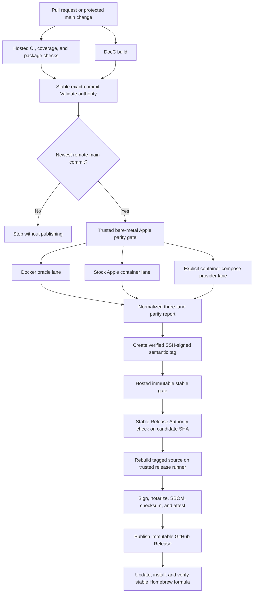

# Release Design

<!-- markdownlint-disable MD013 -->

> Version 1.0.1 uses the release process in this document. Its authoritative
> version, deterministic signed package, notarization evidence, checksums, SBOM,
> GitHub attestation, hosted and physical parity gates, Homebrew promotion,
> SonarQube analysis, and DocC publication are bound to one immutable release
> commit and signed tag.

This document defines how `devcontainer` validates and publishes an arm64
macOS command-line tool for Apple's stock `container` runtime. Docker is the
behavioral oracle, stock Apple `container` is the required runtime, and
`container-compose` is an optional provider tested in a separate, explicitly
identified parity lane.

## Release Principles

- `main` is the releasable integration branch.
- One checked-in value, `DEVCONTAINER_VERSION` in `Makefile`, is the authoritative product version.
- Bare `MAJOR.MINOR.PATCH` tags are immutable stable release identities.
- `current` is the only mutable tag and points to the newest release-eligible `main` commit.
- A package is authorized by an exact commit, never by a branch name alone.
- Live Docker, stock Apple, and Compose-provider parity runs only on trusted bare-metal Apple silicon.
- GitHub-hosted macOS validates source, tests, coverage, package structure, formula rendering, and documentation, but is not accepted as live Virtualization.framework evidence.
- Releases never install, replace, or start a custom `container` runtime as a side effect.
- Releases never install `container-compose` as a side effect.
- Missing runtime or provider prerequisites fail the strict release gate; they are not reported as successful skips.
- Stable assets, tags, notes, checksums, SBOMs, and formula versions are immutable.
- GitHub Actions are pinned to complete commit SHAs, with the readable release version retained in a comment.
- Prebuilt macOS artifacts are Developer ID signed and submitted to Apple's notary service before publication.
- Every package publishes build metadata, a checksum, an SBOM, and GitHub build provenance.

## Version Authority

The version mechanism deliberately follows `container-compose`'s current release model:

- The product version is read from a Makefile assignment.
- Stable version selectors are resolved relative to the newest bare semantic tag.
- `--+`, `-+-`, and `+--` mean patch, minor, and major increments.
- `current` uses a monotonically increasing Homebrew version based on the Actions run number and source SHA.
- Stable publication requires the checked-in product version to equal the semantic tag.
- Stable tags are annotated, SSH-signed, pushed, and verified by GitHub before package publication.

The `devcontainer` adaptation removes `container-compose`'s duplicated version
literals. The only tracked product-version declaration is:

```makefile
DEVCONTAINER_VERSION ?= 1.0.1
```

Source code does not contain a second editable copy. The
`GenerateDevContainerVersion` SwiftPM build-tool plug-in declares `Makefile` as
an input and generates the Swift build identity. Packaging writes the same
authoritative values into `build-info.json`. The executable's `version` command
uses an explicit `development` lane unless a release build supplies its commit
and lane.

The implemented helper layout is:

```text
Makefile
Tools/release/current-formula-version.py
Tools/release/devcontainer.rb.in
Tools/release/package-context.py
Tools/release/publish-github-release.sh
Tools/release/release-version.py
Tools/release/render-homebrew-formula.py
Tools/release/sign-and-notarize.sh
Tools/release/update-tap-readme.py
Tools/release/verify-package.py
Tools/release/write-build-info.py
Tools/release/write-notarization-evidence.py
```

`Tools/release/release-version.py` is the reusable implementation of selector parsing and validation. It:

- reads `DEVCONTAINER_VERSION` from `Makefile`;
- lists only tags matching `[0-9]+\.[0-9]+\.[0-9]+`;
- sorts numeric components rather than lexical strings;
- resolves an explicit version or exactly one `+` in a three-character selector;
- rejects a requested version that is not newer than the newest stable tag;
- rejects a requested version lower than the checked-in product version;
- updates only the Makefile declaration during stable release preparation.

Selectors retain `container-compose` semantics:

| Selector | Meaning | Example from `1.4.2` |
| --- | --- | --- |
| `--+` | Patch | `1.4.3` |
| `-+-` | Minor | `1.5.0` |
| `+--` | Major | `2.0.0` |
| `2.1.0` | Explicit semantic version | `2.1.0` |

Version resolution is read-only:

```sh
make release-version VERSION_SELECTOR=-+-
```

Stable release preparation is the only version target that mutates the Makefile:

```sh
make prepare-release VERSION_SELECTOR=-+-
```

### Current Channel

Every eligible successful CI run for the newest `main` commit may refresh:

- Mutable lightweight tag: `current`
- Mutable prerelease title: `Current build`
- Commit-identified asset: `devcontainer-current-<sha12>-arm64.tar.gz`
- Formula: `devcontainer-current.rb`
- Homebrew version: `current.<github_run_number>.<sha12>`

The formula version uses the same validated algorithm as `container-compose`:

```text
current.418.0123456789ab
```

Automatic Current publication is gated by the repository variable `DEVCONTAINER_CURRENT_PUBLISH_ENABLED=true`. It remains disabled until a repository-scoped runner with the `devcontainer-release` label, a Developer ID Application identity, the configured notary profile, and the tap token are all provisioned. Manual dispatch remains fail-closed against the same prerequisites.

The full source identity remains the lowercase 40-character commit SHA. The 12-character prefix is only a display and asset-name convenience.

Current publication must be staged safely:

1. Build immutable commit-identified assets.
2. Sign, notarize, validate, checksum, inventory, and attest those assets.
3. Upload candidate assets to the existing Current prerelease without moving `current`.
4. Render and commit `devcontainer-current.rb` using the commit-identified URL and checksum.
5. Install and test that formula.
6. Recheck that the candidate is still the remote `main` head.
7. Move the unsigned lightweight `current` tag.
8. Finalize the Current release object.
9. Remove superseded Current assets only after the new channel is verified.

This ordering keeps the old Current formula valid if publication is interrupted.

### Stable Channel

A stable release uses:

- Annotated, SSH-signed bare tag: `MAJOR.MINOR.PATCH`
- Release title: `MAJOR.MINOR.PATCH`
- Immutable asset: `devcontainer-release-arm64.tar.gz`
- Formula: `devcontainer.rb`
- Homebrew version: `MAJOR.MINOR.PATCH`

Stable publication requires:

- The tag is the newest semantic source tag.
- The tag resolves to the prepared source commit.
- GitHub reports the annotated tag signature as verified.
- `DEVCONTAINER_VERSION` equals the tag.
- The release object does not already exist, except for an explicit formula-only recovery.
- Exact-commit CI, dependency review, Scorecard, documentation, and hosted release checks succeeded.
- The trusted live parity gate succeeded for the same commit.
- The candidate-bound `Stable Release Authority (MAJOR.MINOR.PATCH)` check succeeded.
- Signing, notarization, SBOM generation, package validation, checksum verification, attestation, and Homebrew installation succeeded.

An existing stable release is immutable. Recovery may recreate only a missing or incorrect Homebrew formula from already published, re-downloaded, checksum-verified assets. It must never retag, rebuild, replace, or use `--clobber` on stable assets.

## Generated Build Information

`make package-release` generates `build-info.json` from the authoritative version and release inputs. The minimum payload is:

```json
{
  "buildType": "release",
  "commit": "0123456789abcdef0123456789abcdef01234567",
  "containerDistribution": "apple",
  "containerVersion": "1.1.0",
  "lane": "stable",
  "provider": "none",
  "source": "stephenlclarke/devcontainer",
  "version": "1.0.1"
}
```

Current packages use the same product version but set `lane` to `current`. Provider parity evidence records the provider executable, provider version, and underlying runtime distribution separately; it must not rewrite the package's stock-Apple identity.

`devcontainer version --format json` exposes this payload. Release validation compares its version, lane, commit, architecture, and source with the selected release context.

## CI And Release Authority

The implemented workflow split is:

| Workflow | Runner | Purpose |
| --- | --- | --- |
| `ci.yml` | `macos-26`, Ubuntu aggregate | Format/lint, unit/contract/integration tests, both coverage gates, build, CLI smoke, and `Validate` aggregation |
| `codeql.yml` | `macos-26` | Temporarily disabled; ready-pull-request Swift analysis when re-enabled |
| `dependency-review.yml` | Hosted Ubuntu | Exact-range vulnerability and Apache-compatible license review |
| `scorecard.yml` | Hosted Ubuntu | OpenSSF analysis, authenticated result publication, and SARIF upload |
| `quality.yml` | `macos-26` | ASan and TSan on pull requests, pushes, schedules, and dispatch |
| `docs.yml` | `macos-26`, then Ubuntu | Build and publish DocC Pages |
| `homebrew.yml` | `macos-26` | Render the candidate package/formula, check Ruby syntax and formula style, and upload evidence |
| `parity.yml` | Trusted bare-metal Apple silicon | Live Docker, stock Apple, and Compose-provider parity |
| `stable-release-gate.yml` | Ubuntu and hosted macOS | Resolve immutable candidate and record release authority |
| `prebuilt-binaries.yml` | Trusted bare-metal Apple silicon | Sign, notarize, package, attest, release, and update the tap |



### Stable Aggregate Checks

Branch protection requires stable context names:

- `Validate`

Heavy and documentation-only paths must both conclude through a real
`Validate` job or a separately verified exact-commit release authority. A
no-op path may report why an expensive analysis was unnecessary, but the
aggregate must fail if no accepted validation path completed.

Every release resolver must query runs by exact commit and inspect final job and step conclusions. A workflow-level success is insufficient when a required step may have skipped. Current publication should require an exact-main successful Sonar step when Sonar is enabled; transient API failures must fail closed rather than masquerade as absent evidence.

### Candidate-Bound Stable Authority

`stable-release-gate.yml`:

1. Validate the bare semantic input.
2. Resolve the signed tag to a 40-character commit.
3. Verify the GitHub tag object's signature.
4. Verify exact-commit CI, documentation, and parity authorities.
5. Checkout the candidate and release-control revision separately.
6. Run the hosted release gate without live virtualization.
7. Upload `stable-authority-MAJOR.MINOR.PATCH-SHA`, containing the candidate,
   tag, workflow, and run identifiers.

The package workflow downloads that exact authority artifact and verifies its
payload, source workflow, event, completion, and successful conclusion.

## GitHub Actions Supply-Chain Policy

Actions are pinned to full commit SHAs. The workflow uses the reviewed pins
shown below:

```yaml
- uses: actions/checkout@3d3c42e5aac5ba805825da76410c181273ba90b1 # v7.0.1
- uses: actions/cache@55cc8345863c7cc4c66a329aec7e433d2d1c52a9 # v6
- uses: actions/upload-artifact@043fb46d1a93c77aae656e7c1c64a875d1fc6a0a # v7
- uses: actions/download-artifact@3e5f45b2cfb9172054b4087a40e8e0b5a5461e7c # v8
- uses: github/codeql-action/init@e4fba868fa4b1b91e1fdab776edc8cfbe6e9fb81 # v4
- uses: github/codeql-action/analyze@e4fba868fa4b1b91e1fdab776edc8cfbe6e9fb81 # v4
- uses: actions/attest-build-provenance@0f67c3f4856b2e3261c31976d6725780e5e4c373 # v4.1.1
```

Dependabot updates the grouped GitHub Actions ecosystem weekly. Any new action
is reviewed and pinned before merge.

Permissions begin at read-only and escalate per job. The attestation job alone receives `id-token: write` and `attestations: write`; the release job alone receives `contents: write`; the stable-authority job alone receives `checks: write`; and the Pages deployment receives `pages: write` and `id-token: write`.

Self-hosted workflows must never run pull-request code. They accept only protected `main`, a GitHub-verified stable tag, or an explicit trusted dispatch. The release runner registration is repository-scoped.

## Trusted Bare-Metal Parity Gate

The live gate requires:

```yaml
runs-on: [self-hosted, macOS, ARM64, devcontainer-release]
```

The runner must provide:

- Apple silicon.
- A supported macOS Tahoe release with `kern.hv_support=1`.
- A deliberately installed stock Apple `container` distribution.
- A deliberately installed Docker engine and pinned Docker Compose oracle.
- An explicitly configured `container-compose` executable for the provider lane.
- `gh`, `git`, `jq`, `make`, `python3`, `shasum`, `ssh-keygen`, `swift`, and `tar`.
- A noninteractive Developer ID signing identity.
- A `notarytool` profile in the local keychain.
- Git identity and SSH signing configuration for release commits and tags.

The gate must capture versions and executable paths before testing. It must reject a stock lane when `container system version --format json` identifies a custom distribution.

The three lanes are:

| Lane | Runtime | Compose | Release meaning |
| --- | --- | --- | --- |
| Docker oracle | Pinned Docker engine | Pinned Docker Compose | Expected Dev Containers behavior |
| Stock Apple | Apple-signed `container` | None | Required core compatibility |
| Compose provider | Explicitly supplied runtime and `container-compose` | Required | Optional multi-service integration evidence |

The provider lane must state whether its underlying runtime is `apple` or
`custom`. Current supported `stephenlclarke/tap/container-compose` depends on a
custom matched runtime, so installing that formula is forbidden in the stock
lane. Until the provider works against stock Apple, its live evidence is valid
only as a separately labelled provider comparison and cannot be used to claim
that Apple supplies Compose support.

Each lane uses:

- A unique project and resource prefix.
- An isolated, marked runtime state directory.
- Explicit binary paths.
- A cleanup trap.
- A preflight that fails in strict mode.
- Deterministic fixtures.
- Normalized JSON results.
- Per-fixture monotonic durations and candidate/Docker timing ratios. Comparable or better performance (`<=1.00x` Docker) is the objective; any completed result above `2.50x` requires further investigation. Non-completion or missing or invalid timing evidence fails the gate, while a completed timing ratio alone does not alter functional parity. See [`PARITY-ROADMAP.md`](PARITY-ROADMAP.md).
- Sequential execution on a shared host.

The aggregate release gate fails if any required lane is unavailable, the Docker oracle version differs from its pin, stock Apple is replaced by a custom distribution, cleanup fails materially, or an undocumented parity difference appears.

### Upstream Stephen-Stack Defects

Parity may identify a defect owned by `stephenlclarke/container`,
`stephenlclarke/containerization`, `stephenlclarke/container-builder-shim`, or
`stephenlclarke/container-compose`. Fix and test that defect through a focused
pull request in the owning repository. `devcontainer` consumes the result only
by recording and validating the exact reviewed commit.

Never carry a silent local patch, unpublished worktree state, or ad hoc fork modification in a parity or release build. Never publish an unreviewed cross-repository change from `devcontainer` release automation. Cross-repository source promotion remains the owning repository's reviewed responsibility.

## Documentation And DocC Pages

`docs.yml` builds the package's DocC site on `macos-26`. Pull requests build
and upload an ordinary artifact. Only protected `main` in
`stephenlclarke/devcontainer` uploads and deploys the Pages artifact.

Use full-SHA pins:

```yaml
- uses: actions/configure-pages@45bfe0192ca1faeb007ade9deae92b16b8254a0d # v6
- uses: actions/upload-pages-artifact@fc324d3547104276b827a68afc52ff2a11cc49c9 # v5
- uses: actions/deploy-pages@cd2ce8fcbc39b97be8ca5fce6e763baed58fa128 # v5
```

The workflow uses a stable `Documentation` context and a deployment environment
named `github-pages`. Documentation publication is independent of package
publication but remains exact-commit evidence for stable releases.

## Signing And Notarization

Source identity and binary identity are separate requirements:

- Release-preparation commits are SSH-signed.
- Stable annotated tags are SSH-signed and GitHub-verified.
- The arm64 Mach-O executable is signed with a Developer ID Application identity, hardened runtime, and secure timestamp.
- The exact signed executable is submitted to Apple's notary service.
- GitHub provenance attests the final distributed archive and SBOM.

The release runner should hold signing and notarization material in the macOS keychain. Private keys, certificates, API keys, and notary credentials must not be copied into pull-request workflows, logs, artifacts, repository files, or generic Actions secrets.

Verification includes:

```sh
codesign --verify --strict --verbose=2 /path/to/devcontainer
xcrun notarytool submit /path/to/notarization.zip --keychain-profile devcontainer-release --wait
```

A standalone Mach-O executable cannot be stapled like an app, pkg, or dmg. The
release does not claim stapling unless the distribution format changes to one
supported by `stapler`. For the tarball, automation submits a ZIP containing
the exact signed binaries for notarization, then creates the release tarball
from those unchanged signed bytes. Release evidence records the notary
submission identifier and accepted status without publishing credentials.

After downloading the published asset, validate the signature again and run an appropriate Gatekeeper assessment on a clean test account or host.

## SBOM, Checksums, And Attestation

Every Current and stable package publishes:

- `devcontainer-<lane>-arm64.tar.gz`
- Matching `.sha256`
- `devcontainer-sbom.spdx.json`
- `build-info.json`
- Release notes with exact CI, documentation, parity, signing, and notarization links

The repository-owned deterministic SPDX 2.3 generator records the exact source
commit, source-date epoch, and every pin in `Package.resolved`. A checked-in
ledger assigns a reviewed Apache-compatible SPDX license to every pin; any
missing or stale entry fails packaging. Release archives also contain complete
root license and notice texts for all pins. Package validation rejects
dependency, version, revision, source, license, relationship, notice,
provenance, normalized-archive-metadata drift, and packaged README links that
are relative or bound to a different source commit.

`actions/attest-build-provenance` attests the final archive, checksum, SBOM, and
build-info assets. Release verification uses `gh attestation verify` against
the published repository.

Checksums are calculated only after signing and notarization, because those bytes are the distributed identity. Formula rendering downloads the published archive and checksum again, verifies both, checks required archive entries, and derives the Homebrew SHA from that verified archive.

Publication is a retryable two-phase transaction. The workflow first uploads
the candidate as a public prerelease, commits the candidate tap state locally,
and installs and tests that exact local commit. It then pushes the tested tap
commit and only afterward finalizes a stable release. Failed stable attempts
may replace assets only while the release remains a prerelease; a finalized
stable release is immutable. Current remains a prerelease and moves its
deliberately mutable source tag only after the tap promotion succeeds.

## Homebrew Design

The producer repository owns the formula template and renderer. The tap owns the generated live formula.

Stable formula:

```ruby
class Devcontainer < Formula
  desc "Dev Containers compatibility for Apple's container runtime"
  homepage "https://github.com/stephenlclarke/devcontainer"
  url "https://github.com/stephenlclarke/devcontainer/releases/download/1.0.1/devcontainer-release-arm64.tar.gz"
  sha256 "RELEASE_SHA256"
  license "Apache-2.0"

  depends_on arch: :arm64
  depends_on "docker"
  depends_on "docker-compose"
  depends_on macos: :tahoe

  def install
    bin.install "bin/devcontainer"
    bin.install "bin/devcontainer-engine"
    bin.install "bin/devcontainer-compose"
    libexec.install "libexec/container"
    pkgshare.install "share/devcontainer"
  end

  def caveats
    <<~EOS
      This formula installs devcontainer and requires the upstream Docker CLI
      and Docker Compose protocol clients.
      Install Apple's stock container runtime separately from Apple.
      Register the optional Apple CLI plugin explicitly:
        devcontainer plugin register
    EOS
  end

  test do
    assert_match version.to_s, shell_output("#{bin}/devcontainer version --short")
    assert_match "DOCKER_HOST", shell_output("#{bin}/devcontainer context")
    assert_path_exists libexec/"container/plugins/devcontainer/config.toml"
    assert_predicate libexec/"container/plugins/devcontainer/bin/devcontainer", :executable?
  end
end
```

Homebrew infers the stable version from the immutable tag-bearing URL, so the stable formula does not repeat a redundant `version` declaration. The Current formula uses `DevcontainerCurrent`, a commit-identified URL, an explicit `current.<run>.<sha12>` version, and a conflict with `devcontainer` because both channels install the same commands. Users must uninstall the active channel before switching.

The formula must not:

- Depend on `stephenlclarke/tap/container`.
- Depend on `stephenlclarke/tap/container-compose`.
- Install, unlink, remove, or replace `/usr/local/bin/container`.
- Start or stop the Apple runtime.
- Add a `container-compose` plugin link.
- Mutate Apple package receipts, launch daemons, or user runtime data.

Tap updates are serialized and use a dedicated token. Automation verifies the tap push remote, commits only the intended formula, pushes one Conventional Commit, waits for tap CI, installs the formula, runs `brew test`, and compares the installed binary's build info with the selected commit.

## Release Operator Commands

The checked-in Make targets are the local release authority:

```console
make check
make test-asan
make test-tsan
make parity-release
make release-gate-hosted
make package-release
```

For stable 1.0.1 publication:

1. Push the exact candidate to protected `main` and require every workflow in
   the stable gate to succeed for that commit.
2. Run the serialized three-lane parity workflow and retain its raw, normalized,
   VS Code, and cleanup evidence.
3. Create and push the annotated SSH-signed `1.0.1` tag.
4. Dispatch `stable-release-gate.yml` with `ref=1.0.1`.
5. After its candidate-bound authority artifact is present, dispatch
   `prebuilt-binaries.yml` with `ref=1.0.1`.
6. Verify the finalized GitHub release, attestations, tap commit, fresh
   `brew install stephenlclarke/tap/devcontainer`, formula test, build identity,
   and a stock-runtime smoke.

The publication workflow performs Developer ID signing, notarization, staged
release upload, formula rendering, strict audit/fetch/install/test, tested tap
push, and final release promotion as one fail-closed transaction.
