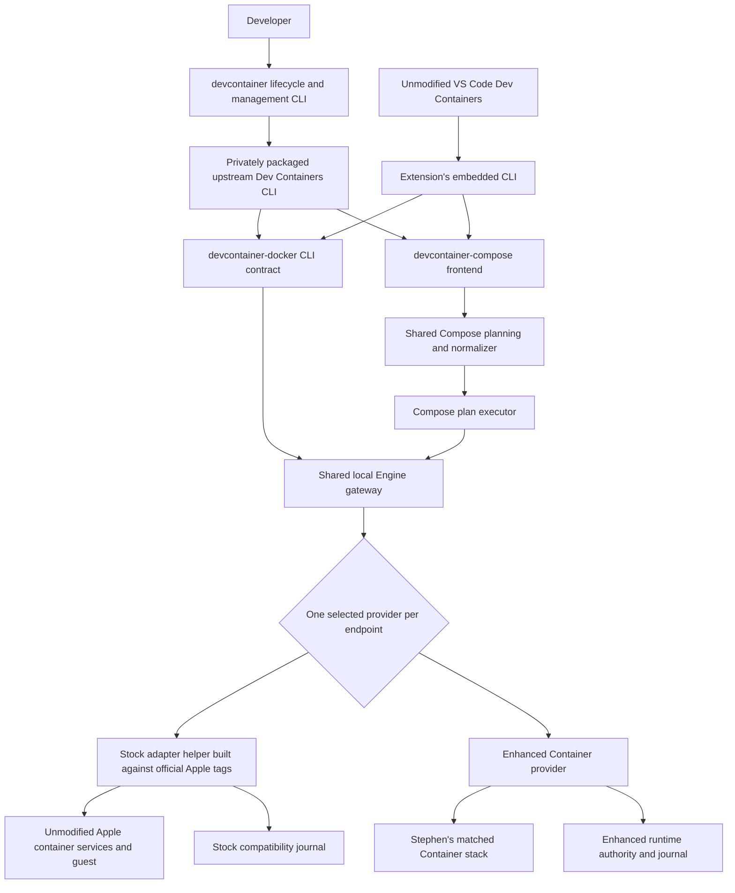
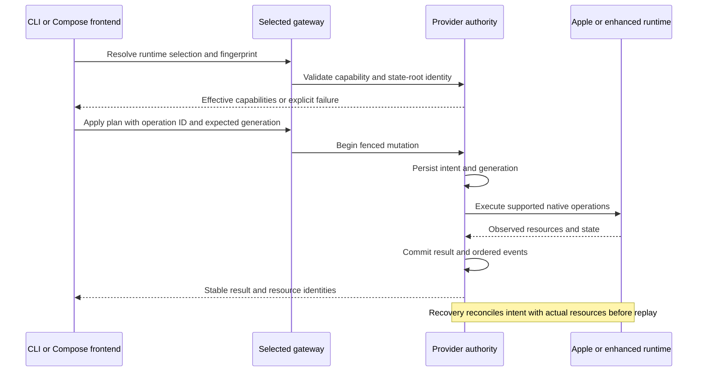

# Docker-free Dev Containers: review and implementation design

Review date: 10 September 2026. Status: proposed architecture and remediation plan; no runtime implementation changes are made by this review.

## Decision

Build a Docker-free Dev Containers product that uses unmodified, tagged Apple `container` as its baseline and can select Stephen's enhanced Container implementation explicitly. Reuse the Dev Containers reference configuration/lifecycle engine and the useful parts of Container Compose. Replace the remaining Docker CLI and Docker Compose executable dependencies with project-owned frontends. Preserve the existing shared Engine gateway as a compatibility boundary; speaking the Docker protocol does not require installing Docker.

The current repository does not yet meet this goal. It is an Engine compatibility service with a configuration CLI, not a standalone implementation of the `devcontainer up/build/exec` commands. Homebrew installs Docker clients, the default Compose path invokes them, the Swift dependency graph uses Stephen's forks, and the latest main revision has failing build and parity checks.

"Docker-free" in this design means no Docker Desktop, Docker Engine daemon, Docker CLI, Docker Compose executable, Buildx executable, or Colima installation is required to install or use either candidate runtime. OCI images, Dockerfile syntax, Compose files, Docker-compatible command/protocol contracts, and the BuildKit implementation already used by Apple's builder remain acceptable. The real Docker stack remains an isolated test oracle. This is an installation/runtime independence requirement, not a prohibition on all open-source code originating in Docker or Moby.

Stock support is mandatory. Enhanced support must never be obtained by silently replacing Apple's executable, services, guest image, or package dependencies. Full Docker-equivalent behavior cannot be promised for host capabilities that stock Apple does not expose, particularly GPU/device and certain namespace/security operations. Those need explicit capability results and conformance entries. Installing Compose alone cannot supply a missing kernel or guest-runtime primitive.

## Evidence and limits

The application opened this session in `/Users/sclarke/Documents/devcontainer`, an empty Git repository. The implementation reviewed is `/Users/sclarke/github/devcontainer`, matching GitHub main at the revision below. Existing worktrees and the running Container services were left untouched.

| Source | Reviewed revision or evidence |
| --- | --- |
| `devcontainer` main | `d0d72eb74f5e79a91136d5f69d713ea1923f5e20` |
| `container-compose` local checkout | `dbbf85d8afbefd6156b5692c9801ad14b3706cad`, branch `docs/refresh-apple-handoff-map`; reuse inspection, not a release certification |
| Stephen's `container` local main | `e653616e62ab7763c3a7d10e88c365d6dca7e0c4` |
| Stephen's `containerization` local main | `bd8130fea851f6ee264f00fc684e2543a7d2faa3` |
| `container-engine-api` local checkout | `84830606abf971110071248e087a80ff4abb86d4`, also the devcontainer dependency pin |
| `container-builder-shim` local checkout | `5373d9b4363c6e536dc6401199da269c7045abf9` |
| Latest official Apple Container release checked | [1.4.1](https://github.com/apple/container/releases/tag/1.4.1), published 9 September; tag commit `9a8917ca2da5cd6ba059b9ba5ca5a74892e9bb7d` |
| Current parity manifest | Apple `1.1.0`, Compose `0.10.1`, Dev Containers CLI `0.88.0`; these are older certification inputs, not the current source graph |
| Latest published Current artifact | `b31e80b2b9c09ecc73bb3badf9cd5cf16550a538`, updated 30 July; stable release remains `1.0.1` |

The review inspected the dependency graph, CLI configuration and dispatch, runtime inventory/create/build/process/archive/network paths, mutation coordination, shared gateway integration, release formula, conformance ledger, performance reports, parity comparator and workflows, current GitHub issues/checks, and upstream sources. It is not an exhaustive proof that no other defects exist.

Validation performed for this review:

- All 76 Python parity-harness unit tests passed locally. Their mocked VS Code output is harness evidence, not a fresh VS Code runtime test.
- The manifest validator passed with `--release`, and the specification-coverage validator passed. These validate declared structure, not actual runtime conformance.
- In-memory comparator reproductions returned `passed` for identical observations at both 10x and 100x slowdown, for three empty fixture lists, and for lane-level `status: failed` with individually passing fixtures.
- [Current-head runtime parity](https://github.com/stephenlclarke/devcontainer/actions/runs/33977600302) fails: both candidate builds reject the resolved dependency file; Docker preflight rejects the installed CLI digest. [Current-head CodeQL build](https://github.com/stephenlclarke/devcontainer/actions/runs/33977600347) records the dependency-resolution error and competing `swift-nio-ssl` origins.
- The public Sonar API reports gate `OK`, 95.5% coverage, and zero bugs, vulnerabilities, code smells, and hotspots. Its latest analysis is **`5d2facc69520cad421a027cd99fa6f0c5beb466d` on 5 September**, not reviewed main `d0d72eb`. These metrics cannot certify the current source.
- No Swift rebuild, live runtime parity, fresh timing benchmark, packaging, release, service restart, or remote repository mutation was performed for this design review. Current build failures are supported by exact-revision CI logs, not represented as a new local build result.

## Findings and repair contracts

P0 means a blocker for the requested Docker-free/stock-first deliverable or a gate that can accept invalid evidence. P1 means a correctness, operability, or substantial performance defect. P2 means an evidence, maintenance, or optimisation gap. Each finding names the change and the test required to close it.

### DF-01 - P0: Docker is still a product dependency

**Evidence:** [`Tools/release/devcontainer.rb.in`](../Tools/release/devcontainer.rb.in), lines 8-10, declares `docker` and `docker-compose`. [`DevContainerConfiguration.swift`](../Sources/DevContainerCore/DevContainerConfiguration.swift), lines 21-36, defaults Compose to `.docker`. [`DevContainerComposeCommand.swift`](../Sources/DevContainerComposeCLI/DevContainerComposeCommand.swift), lines 323-345, dispatches that path to `DockerComposeCommand`. Selecting `container-compose` replaces orchestration but does not replace the Docker CLI used by the official Dev Containers client.

**Fix design:** ship a `devcontainer-docker` compatibility executable and a `devcontainer-compose` frontend backed by reusable Compose planning. Configure the reference CLI and VS Code to use these exact executables. Remove Homebrew Docker dependencies only after real client tests pass without either Docker executable. Never replace them with a wrapper that invokes Docker internally.

**Acceptance:** fresh installation, image/Dockerfile/Features/Compose workflows, attach/rebuild/reopen/cleanup, and diagnostics work in a Docker-free installation. An executable-launch recorder proves no `docker`, `docker-compose`, `docker-buildx`, or `colima` invocation, including absolute paths. A trap executable failing with a distinct diagnostic tests accidental fallback; a clean installation environment is the final proof.

### DF-02 - P0: the stock adapter has acquired fork-only source dependencies

**Evidence:** [`Package.swift`](../Package.swift), lines 60-92, pins Stephen's Container, Containerization and NIO SSL forks. The nominal stock adapter unconditionally imports `ContainerLogRecord` and invokes `ContainerClient.logRecords` / `logRecordStream` in [`AppleContainerRuntimeLoggingHandoff.swift`](../Sources/DevContainerAppleRuntime/AppleContainerRuntimeLoggingHandoff.swift), lines 12-40. Those symbols are absent from the official Apple `1.4.1` source tree checked in this review. Changing a runtime executable path does not make this an upstream-only source build.

**Fix design:** compile the stock provider exclusively against official Apple tags and upstream dependency origins. Put enhanced logging/handoff integrations behind the neutral provider protocol in a separately built enhanced provider. Keep process and core types independent of fork-only APIs. Do not attempt to link two packages both named `container` or `containerization` into one SwiftPM graph. Separate package manifests/products and locked build roots provide that isolation.

**Implementation status:** the package now has explicit `stock` and
`enhanced` compile profiles. The checked stock lock selects unmodified
`apple/container` 1.4.1, `apple/containerization` 0.45.0 and Apple's NIO SSL;
a clean copied checkout builds all products from that graph with automatic
resolution disabled. Fork-only logging handoff code and capability advertising
compile only in the enhanced profile. Separate shipped provider processes and
real-runtime certification remain outstanding.

**Acceptance:** clean stock build with all Stephen-owned Container/Containerization/NIO SSL overrides absent, followed by tests against the official signed stock runtime. Separately build and test the enhanced provider against one matched fork graph. Each resulting SBOM must expose its actual source provenance.

### DF-03 - P0: main is not reproducibly buildable

**Evidence:** current-head CI emits `an out-of-date resolved file was detected ... automatic dependency resolution is disabled`. It also warns that Apple and Stephen NIO SSL URLs resolve to the same SwiftPM identity. The local-path override mechanism can obscure this when a developer builds with different dependencies. [Issue #47](https://github.com/stephenlclarke/devcontainer/issues/47) remains open; its older missing-type/IPv4 description is not the complete current failure.

**Fix design:** define the stock and enhanced graphs first, reconcile their transitive origins, and regenerate each lockfile with its declared toolchain. Add a clean-checkout gate that clears only the gate's private dependency cache and builds every shipped product with automatic resolution disabled. Reject undeclared path overrides in release builds. Coordinate pins after dependency and consumer tests pass, not merely after `swift package resolve` succeeds.

**Implementation status:** main's enhanced lock is current and builds, and CI
now has an independent stock test lane using `Package.stock.resolved`. The enhanced
fork graph still emits a conflicting NIO SSL identity warning introduced by
its transitive dependencies; that must be fixed in the enhanced Container
family before this finding is closed.

**Acceptance:** a fresh isolated checkout builds all packaged executables without changing its lockfile, without environment-only source overlays, and without conflicting package identities. Update #47 with the actual current failure and close it only with complete source/dependency/binary evidence.

### DF-04 - P1: runtime identity, orchestration choice and configuration disagree

**Evidence:** [`AppleContainerRuntime.swift`](../Sources/DevContainerAppleRuntime/AppleContainerRuntime.swift), lines 190-212, returns `provider: .stock` regardless of the executable's distribution. [`DevContainerServiceCommand.swift`](../Sources/DevContainerService/DevContainerServiceCommand.swift), lines 131-157, declares profile `.stock` and kind `.devcontainerStock`. The application also conflates a `container-compose` orchestration choice with a runtime provider. [`ConfigureCommand.swift`](../Sources/DevContainerCLI/ConfigureCommand.swift) writes a config file, but the service's startup options do not load it; [`ContextCommand.swift`](../Sources/DevContainerCLI/ContextCommand.swift) prints its default socket unless an option is repeated explicitly. A configured custom socket can therefore disagree with `devcontainer context`.

**Fix design:** one immutable `RuntimeSelection` separates distribution (`apple-stock`/`enhanced`), transport endpoint, orchestration implementation, source/runtime/guest identity, capabilities and state-root identity. CLI, service, Compose, doctor and generated VS Code settings use the same resolution function with explicit precedence: CLI options, documented environment, configuration file, stock default. Mandatory strict behavior is not a decorative saved toggle. Reject selection conflicts and do not infer stock identity solely from an installation path or an absent distribution string.

**Implementation status:** runtime descriptors now classify Apple's
distribution as stock and a custom distribution as enhanced, and the Engine
provider profile is derived from that probe. Unifying CLI/configuration/socket
selection and separating enhanced runtime naming from Compose orchestration
remain outstanding.

**Acceptance:** configure a non-default socket and enhanced executable, then confirm every public command and service reports the same effective selection. Switching distributions with owned resources fails until the designed down/recreate or migration procedure completes. A mislabeled fork cannot enter the stock test lane.

### DF-05 - P1: selecting a CLI does not prove direct API calls use the same runtime

**Evidence:** [`AppleContainerRuntime.swift`](../Sources/DevContainerAppleRuntime/AppleContainerRuntime.swift), lines 132-152, constructs `ContainerClient()` independently of `executable`; the network adapter also constructs `NetworkClient()` independently. The selected environment is stored for subprocesses. Apple's `1.4.1` `ContainerClient` constructor connects to `com.apple.container.apiserver`. The relationship between the selected binary, direct XPC service, runtime root and guest must therefore be proved, not assumed.

**Fix design:** resolve and bind the runtime connection once. Where Apple exposes no per-client service selector, launch the stock adapter helper in the supported service context and refuse a mismatched selection. Pass the proven connection through all inventory/file/network/process clients. Use a real service lock for stock lanes that cannot coexist in isolated XPC namespaces; directory separation alone does not isolate XPC. Enhanced namespace support stays an enhanced capability.

**Acceptance:** install both implementations, use deliberately different inventories, and prove version, list, exec, copy, network and cleanup all reach the selected instance. Wrong-root, wrong-service and wrong-guest configurations must fail before mutation. Do not stop unrelated services to obtain a test pass.

### DF-06 - P1: anonymous volumes do not have real volume semantics

**Evidence:** [`AppleContainerRuntime.swift`](../Sources/DevContainerAppleRuntime/AppleContainerRuntime.swift), lines 776-791, returns no mount arguments for any volume marked `anonymous`. This affects image-declared volumes and anonymous mounts produced by the router. The comment explicitly leaves storage in the writable root filesystem. The separate non-anonymous path creates a host-backed managed volume. [`CONFORMANCE.md`](../CONFORMANCE.md) records the image case as NC-007.

**Fix design:** use real runtime volumes, immutable volume IDs and ownership references; perform Docker-compatible image copy-up once into newly allocated empty volumes. Reuse the Compose image-volume planning/initialization contract. Keep anonymous-volume lifetime distinct from container rootfs lifetime and preserve it through recreation according to the specific command's semantics. Report actual backing storage in inspection. Use host bind-backed storage only for workloads whose POSIX semantics have been certified.

**Acceptance:** image `VOLUME`, explicit anonymous mounts, copy-up contents/modes/ownership, read-only mounts, shadowing, recreate/renew-anon-volumes, `rm -v`, auto-remove and crash cleanup match the oracle. Reusing a populated volume must not overwrite it with image contents.

### DF-07 - P1: build progress and large data are still buffered

**Evidence:** [`AppleContainerRuntime.swift`](../Sources/DevContainerAppleRuntime/AppleContainerRuntime.swift), lines 1152-1205, accepts an entire context in `Data`, extracts it, waits for a captured `container build` process, and then yields one stdout chunk. Stderr progress is not streamed through the successful result. Its `AppleCommandRunner` in [`AppleProcessSession.swift`](../Sources/DevContainerAppleRuntime/AppleProcessSession.swift), from line 873, accumulates stdout and stderr in `Data`. Image load also stages full `Data`; archive output is accumulated before returning. The separate [`ProcessRunner.swift`](../Sources/DevContainerProcess/ProcessRunner.swift), lines 81-114, likewise allows unlimited captured output when no maximum is supplied. This is not end-to-end streaming despite stream-shaped return types.

**Fix design:** make transfer inputs owned file descriptors or demand-driven byte streams. Spool uploads to private, quota-limited files when random access is needed; avoid repeated tar/Data copies. Stream stdout/stderr progress while the builder runs, retain bounded diagnostics, and bind cancellation to the process, temporary files, guest build session and mutation transaction. Prefer Apple's supported builder interface; adopt the enhanced builder-shim context cache only when its fingerprint and semantics match.

**Acceptance:** first progress arrives before build completion; 1 GiB contexts do not require 1 GiB extra resident memory; interrupted and failing builds leave no guest process, temporary file, mount or project lease. Test context traversal, symlink escape, `.dockerignore`, build secrets/SSH, network, platform, target and cache behavior before advertising each option.

### DF-08 - P1: asynchronous stream types still permit unbounded producer queues

**Evidence:** `ProcessSessionIO` in [`AppleProcessSession.swift`](../Sources/DevContainerAppleRuntime/AppleProcessSession.swift) uses the default unbounded `AsyncThrowingStream.makeStream()`. [`AppleContainerRuntimeSupport.swift`](../Sources/DevContainerAppleRuntime/AppleContainerRuntimeSupport.swift), lines 646-672, pumps frames into another default stream with synchronous `yield`. The shared HTTP server's awaited writes cannot automatically exert backpressure through these queues.

**Fix design:** introduce byte-budgeted, suspending producer/consumer channels and propagate demand from the socket to the process/file source. Do not use `bufferingNewest`/`bufferingOldest` to drop protocol bytes or log records. Bound the aggregate across concurrent requests, close all channel waiters on cancellation, and preserve the working stdin half-close/PTY ownership implementation.

**Acceptance:** a fast producer plus a deliberately slow reader has bounded RSS and byte-exact output; a disconnected reader cancels owned work and releases every waiter. Exercise 4 MiB duplex traffic, large logs, repeated attach/detach, TTY resize, ASan, TSan and macOS leaks checks at a coherent checkpoint.

### DF-09 - P1: snapshot polling cannot supply a complete event history

**Evidence:** [`AppleContainerRuntimeEvents.swift`](../Sources/DevContainerAppleRuntime/AppleContainerRuntimeEvents.swift), lines 141-180 and 213-261, reconciles inventories after wakeups or a 200 ms timeout and derives events from snapshot differences. Create/start/exit/remove between snapshots can disappear; assigning the observation time cannot reconstruct original event time or ordering. Subscribers also use unbounded stream continuations. Identity handoff intentionally exports no portable event history from this source.

**Fix design:** on the enhanced path, consume the existing runtime's durable identity/lifecycle/event authority. On stock, record bridge-owned mutations durably and use native events where a tagged public API provides them; otherwise label externally observed state as reconciliation, with an explicit replay limitation. Use ordered sequence cursors, retention watermarks and gap errors rather than invented events. Keep polling shared and adaptive only as a reconciliation fallback.

**Acceptance:** sub-200 ms containers, external native CLI mutations, daemon restart, cursor reconnect, retention expiry and slow subscribers preserve every advertised event contract. If stock cannot observe arbitrary external transient events, retain that as a stock limitation rather than claiming complete history.

### DF-10 - P1: orchestration still has multiple transaction writers

**Evidence:** each `devcontainer-compose` process creates its own `ProjectCoordinator` and SQLite connection. [`ProjectCoordinator.swift`](../Sources/DevContainerCore/ProjectCoordinator.swift), lines 421-437, locks only within that actor instance. `beginMutation` reads a generation and writes intent/state in separate store calls; [`SQLiteStateStore.beginOperation`](../Sources/DevContainerState/SQLiteStateStore.swift) inserts an operation without a cross-process project lock. Two Compose invocations can both proceed at the same generation. The service also calls `failUnfinishedOperationsForManualRecovery()` at startup, which needs coordination with any still-active external writer. Existing persistent provider claims are useful, but do not serialize the complete operation.

**Fix design:** move mutation execution to one authority per selected runtime/state root. Compose submits a normalized plan and operation ID to that authority. Use atomic generation compare-and-swap, durable operation phase and result records, and a runtime resource reconciliation step. No long SQLite transaction spans a native RPC. When an external provider must perform work, give it a fenced operation token; stale tokens cannot commit. Recovery resumes or compensates from observed resources, rather than treating all unfinished operations as abandoned. Make lock acquisition deadline- and cancellation-aware.

**Acceptance:** concurrent `up/down/recreate` from two processes, service restart during an external Compose operation, process death after native creation/before DB commit, and repeated idempotency keys produce one generation and one authoritative result. Cancellation while waiting for a lock completes within a bounded interval.

### DF-11 - P1: the network projection drops IPv6-only attachments

**Evidence:** [`AppleContainerRuntimeSupport.swift`](../Sources/DevContainerAppleRuntime/AppleContainerRuntimeSupport.swift), lines 67-75, maps only `attachment.ipv4Address` and omits entries with no IPv4 address. The newer optional-IPv4 fix prevents a type error, but does not preserve IPv6. The model's network-to-single-address representation is insufficient for dual-stack inspection and forwarding.

**Fix design:** represent an attachment as network ID, IPv4 addresses/prefixes, IPv6 addresses/prefixes, gateways, aliases and effective routes. Project appropriate Docker fields without deriving IPv6 from IPv4. Port forwarding and managed DNS must select a supported address family or fail explicitly. Stock and enhanced adapters translate to this same neutral model.

**Acceptance:** IPv4-only, IPv6-only and dual-stack inspect/connectivity/forwarding, restart and external adoption tests. Preserve scope identifiers where required. Current untested IPv6 support must not be inferred from the absence of an exception.

### DF-12 - P0: parity comparison accepts incomplete evidence

**Evidence:** [`compare_results.py`](../Tools/parity/compare_results.py), lines 34-46, derives the required fixture set from the union of whatever results are supplied. It never requires that set to match the manifest and does not validate the top-level lane outcome. Three empty result lists return `status: passed`; a failed lane containing passing fixtures also returns `passed`. The workflow separately validates the manifest's declarations, but does not join those declarations to the observed fixture set in this comparator. This review reproduced both cases without modifying files or running runtimes.

**Fix design:** require an explicit suite descriptor containing exact fixture IDs, assertion IDs and lane IDs. Reject empty, duplicate, missing or unexpected records, failed top-level status, missing cleanup proof, incompatible source/runtime fingerprints and reused evidence from another run. Validate CLI and VS Code suites against their respective expected sets. Compute certification only after evidence completeness passes.

**Implementation status:** the comparator now binds CLI and VS Code runs to
their exact implemented manifest fixture sets. It rejects empty, missing,
duplicate and unexpected fixture records, failed parent lanes and incorrect
backend identities. Negative tests cover those boundaries. Assertion-level,
cleanup-proof and complete cross-lane fingerprint binding remain outstanding.

**Implementation status:** the comparator now binds CLI and VS Code runs to
their exact implemented manifest fixture sets. It rejects empty, missing,
duplicate and unexpected fixture records, failed parent lanes and incorrect
backend identities. Negative tests cover those boundaries. Assertion-level,
cleanup-proof and complete cross-lane fingerprint binding remain outstanding.

**Acceptance:** negative tests cover all-empty lanes, the same missing fixture in every lane, duplicate IDs, missing assertions, a failed parent status, stale fingerprints and missing cleanup. The complete genuine fixture set still passes. Record this as a gate defect, not as proof that a particular earlier release fabricated results.

### DF-13 - P1: the 10x timing failure rule is absent

**Evidence:** [`compare_results.py`](../Tools/parity/compare_results.py), lines 17-18 and 121-155, uses a 1.0x target and 2.5x investigation trigger but never fails a completed slowdown. Identical observations with Docker at one second and each candidate at 10 or 100 seconds returned `passed` in the review reproduction. This conflicts with the user's explicit order-of-magnitude rule and the shared testing guidance.

**Fix design:** keep `functionalParityStatus` separate from `timingStatus`, but make the overall acceptance fail for a timeout, non-completion, missing/invalid timing, or candidate/reference duration **at least 10.0** for the same fixture. Completed ratios below 10.0 are informational for acceptance. The existing 2.5x investigation trigger and 1.0x aspiration may remain advisory. Use unrounded values for the decision and record the threshold in each evidence file.

**Implementation status:** comparison schema 3 now reports functional and
timing status separately and fails overall acceptance at an unrounded ratio of
10.0x or greater. Unit tests cover 9.999x, exactly 10x and 100x.

**Implementation status:** comparison schema 3 now reports functional and
timing status separately and fails overall acceptance at an unrounded ratio of
10.0x or greater. Unit tests cover 9.999x, exactly 10x and 100x.

**Acceptance:** 9.999x passes with an advisory, exactly 10x fails, 100x fails, and invalid/zero-reference durations fail evidence validation. Preserve raw monotonic times in JSON, JUnit and the comparison report. Do not retry or normalize away a timeout or a 10x regression.

### DF-14 - P1: current certification does not establish either requested candidate

**Evidence:** the ledger declares 28 of 76 tracked property paths certified and 48 blocked across ten groups. That is a ledger inventory, not a percentage of standard conformance. There are 18 CLI fixtures and one representative VS Code fixture, with the candidate frontends still using Docker. The manifest pins the old Compose implementation implicated in [#36](https://github.com/stephenlclarke/devcontainer/issues/36). The current run cannot reach runtime tests because of DF-03 and an oracle executable digest mismatch. [#60](https://github.com/stephenlclarke/devcontainer/issues/60) and [#61](https://github.com/stephenlclarke/devcontainer/issues/61) explicitly retain real-client and performance work.

**Fix design:** certify client choice and runtime choice independently. Add Docker-free stock and Docker-free enhanced lanes; retain the real Docker oracle. Pin the complete stock/fork graph including guest init, kernel, builder, normalizer, official CLI/extension and toolchain. Provision immutable oracle tools into a test-owned prefix instead of relying on mutable Homebrew paths. Expand fixtures per property/behavior, not just per example configuration.

**Acceptance:** full required suite with matching fingerprints and zero semantic differences; each supported property has positive, negative and lifecycle evidence. A passing manifest/schema check is never counted as runtime proof. Close #36 only after the complete matched provider suite, including C04 recreation, passes.

### DF-15 - P2: quality and release status are not tied consistently to the reviewed revision

**Evidence:** Sonar's green dashboard is for the preceding revision; current main's Sonar job fails. Branch protection requires only `Validate`, whose CI aggregator needs only the test job, not parity or Sonar. Five open code-scanning alerts currently concern Scorecard Best Practices, review, fuzzing, maintenance and SAST; these are governance findings, not five demonstrated code vulnerabilities. The Current release remains on July source. CI and sanitizer YAML still use hosted macOS jobs despite the current Container-family local-MBP workflow. Several documents describe historical baselines as current architecture.

**Fix design:** generate quality and compatibility summaries from an evidence manifest keyed to source/dependencies/toolchain. Add an aggregate acceptance check over the required local/self-hosted authorities. Keep CodeQL in the release boundary according to current family policy, with an explicit exception only where hosted execution is technically necessary. Bind Pages, README status and release records to the same evidence. Publish a new Current/stable artifact only after the repaired stack is verified. Do not delete old evidence or widen scan exclusions to make badges green.

**Acceptance:** no green release claim from a prior SHA; failed or missing parity/Sonar blocks the relevant promotion; dependency-only changes invalidate affected evidence. Report source coverage and changed-code coverage of at least approximately 90%, plus actual sanitizer/leaks results, without equating coverage with compatibility.

### DF-16 - P1: there is no standalone user-facing Dev Containers lifecycle CLI

**Evidence:** [`DevContainerCommand.swift`](../Sources/DevContainerCLI/DevContainerCommand.swift), lines 28-47, registers version, doctor, configure, context, backend, diagnostics and plugin. It does not implement `up`, `build`, `exec`, `read-configuration` or `run-user-commands`. Its `devcontainer` executable name also overlaps the upstream npm package's command.

**Fix design:** retain this public executable and add a lifecycle facade that invokes a privately packaged, pinned upstream CLI with the project's explicit backend paths. Put the reference CLI and its Node runtime under `libexec/devcontainer/reference/`, with no second global `devcontainer` executable and no network download on first run. Keep the reference CLI's configuration merge, Feature installation, UID update, user environment probe and lifecycle ordering semantics. This is less risky than a new Swift implementation of the entire specification. A future native configuration engine would require a separate justification and complete differential proof.

**Acceptance:** public `devcontainer up/build/exec/read-configuration/run-user-commands` works in a clean shell without global npm or Docker installations; existing management subcommands still work. The bundled CLI/runtime/native modules have reproducible versions, notices, SBOM entries and applicable macOS signatures. VS Code's embedded CLI is tested independently from this bundle.

## Target architecture

### Components and ownership



The current gateway, wire types, request validation, archive validation, subprocess supervisor and useful tests are retained. The two providers are alternative resource authorities; the design does not add a second enhanced identity database. The stock compatibility journal contains only information that the stock runtime cannot supply. Native clients and the enhanced runtime continue to own their actual resources.

| Component | Responsibility and dependency rule |
| --- | --- |
| `devcontainer` | Public management and lifecycle facade; owns user configuration and diagnostics; no Apple/fork DTOs in CLI contracts |
| Private reference CLI | Exact upstream configuration/lifecycle implementation, bundled with runtime and native dependencies; does not discover Docker on PATH |
| `devcontainer-docker` | Implements the command forms actually emitted by supported upstream CLI and VS Code versions, through a typed client of the shared gateway |
| `devcontainer-compose` | Implements the Compose invocation contract consumed by the reference client; obtains plans from shared Compose code and sends mutations through the selected authority |
| Shared Compose planning | Reuses normalization, interpolation, profiles, project identity, dependency graph, volume planning and progress semantics; kept outside `DevContainerCore` |
| `container-engine-api` | Shared Unix transport, bounded wire streaming, route ledger, provider identity and exclusive selection; remains independent of Apple/Compose APIs |
| Stock provider helper | Separate package graph using only official Apple Container/Containerization packages; adapts their available primitives and declares limitations |
| Enhanced provider | Uses the improved Container implementation and its durable controllers; optional, separately fingerprinted and separately built |

### Replacing Docker CLI without forking VS Code

The upstream CLI exposes `--docker-path` and `--docker-compose-path`; VS Code exposes corresponding Dev Containers settings. These are the integration seams. A project-owned implementation can satisfy that invocation contract without copying the Docker executable or modifying the extension. Microsoft's documentation describes alternative compliant CLIs but does not officially support them, so compatibility is this project's tested promise, not a Microsoft endorsement.

Configure the exact certified extension with settings equivalent to the following, generated from the installed prefix:

```json
{
  "dev.containers.dockerPath": "/opt/homebrew/opt/devcontainer/bin/devcontainer-docker",
  "dev.containers.dockerComposePath": "/opt/homebrew/opt/devcontainer/bin/devcontainer-compose"
}
```

These paths are proposed installation paths, not claims that those new commands exist today. Before release, verify the settings and every emitted command against both the pinned extension and its bundled CLI.

Capture an invocation ledger from the real reference workflow: argv, stdin/TTY mode, expected stdout/stderr structure, signals, status and streaming behavior. Implement `version`, `info`, image/container inspect and list, pull, build, create/run/start/stop/remove, exec/attach, copy, events, network/volume and the required Compose forms. The ledger determines exact aliases, flags and template expressions; it is not enough to recognize command names. Implement the required Go-template subset using shared Compose template support where semantically equivalent. Unsupported flags and Buildx probes must fail truthfully and exercise the upstream fallback path. Never claim a successful Buildx version without its actual build/session behavior.

Start with this CLI using the already-shared Engine protocol to reduce duplicated semantics. A native RPC fast path is a later optimisation only if measured protocol overhead is material; both transports must then dispatch to the same authority, not separate implementations of create/exec/cleanup.

### Runtime and capability contract

Separate static build provenance from runtime discovery. A connection handshake returns provider identity, protocol version, actual runtime version/commit, guest and builder identities, immutable state-root ID and fine-grained capabilities. The stock provider uses a version-tested behavior table plus conservative probes for the actual official release. An absent or unknown capability is unavailable. Never infer complete `privileged`, GPU, network or mount semantics from a help flag alone.

Represent requests as desired policy and results as effective/observed state. For example, VM memory sizing and Docker workload cgroup limits are different capabilities; a stock VM memory option must not be advertised as complete Docker memory-limit parity. Compose availability and runtime distribution remain independent choices.



### What to reuse from Container Compose

Reuse maintained components through a versioned neutral boundary, not copied source trees or the entire fork-bound plugin target. Although `ComposeCore` and `ComposeRuntimeSPI` themselves are separated from Apple's runtime imports, the top-level Compose package manifest still declares fork dependencies. Selecting just one product does not establish a clean upstream-only package graph. Provide a neutral package boundary or a separately built frontend artifact from that repository.

| Existing code | Reuse design | Required qualification |
| --- | --- | --- |
| `Tools/compose-normalizer` | Package its compose-go normalizer behind a versioned JSON request/result interface; reuse interpolation, include/extends, profiles and canonical model behavior | Review its complete Go dependency/SBOM closure; using compose-go must not spawn Docker Compose or carry an unnecessary Docker client runtime |
| `ComposeCore/ComposeOrchestratorPlanning.swift`, dependencies and validation helpers | Reuse dependency planning and capability preflight in a Compose adapter layer | Do not import Compose models into the Dev Containers configuration core |
| `ComposeOrchestratorParallelism.swift` | Reuse bounded task scheduling, ordering and cancellation semantics | Preserve dependency/health ordering; set explicit resource limits rather than unbounded VM starts |
| `ComposeOrchestratorImageVolumes.swift` and `ComposeRuntimeImageVolumes.swift` | Reuse volume allocation/copy-up planning and the initialization request contract | Supply a stock implementation using official primitives and prove cleanup/persistence before enabling |
| Compose structured-template implementation | Reuse the compatible subset required by the Docker CLI command facade | Differential test exact templates emitted by Dev Containers; do not assume Compose formatting covers all Docker templates |
| `ComposeRuntimeSPI` capability/create/resource/logging interfaces | Align neutral policy types where they match | Translate at a thin adapter; avoid a second competing authority or unreviewed model merger |
| `container-engine-api` gateway/session/handoff implementation | Continue shared transport and authority adoption already underway | Pin one coherent source graph; stock code must not compile enhanced-only runtime calls |
| `container-builder-shim` content-addressed file transfer cache | Use through the enhanced builder, or adopt generic improvements through a tagged Apple-compatible build path | Preserve context boundaries, `.dockerignore`, symlink handling, secrets, invalidation and builder provenance |

Compose services must share the same provider, identity and generation contract as single-container projects. On a system with the optional full Compose plugin installed, reuse it only after it reports a compatible protocol/capability set and can bind to the selected authority. Do not let an external Compose executable silently select a different Container distribution.

## Stock and enhanced conformance plan

Do not carry July's Apple `1.1.0` assumptions forward as claims about all later releases. Official `1.4.1` source has fields for resources, read-only root and sysctls, which deserve focused support work. Its checked `ContainerConfiguration` still has no container hostname field and its `ProcessConfiguration` has no privileged field. Those observations are narrower than proving the full behavior of every CLI/runtime combination.

| Area / existing entry | Stock repair path | Enhanced repair path | Certification condition |
| --- | --- | --- | --- |
| Arbitrary `runArgs` / NC-001 | Typed required-field mappings and explicit unsupported diagnostics | Same mapping with additional negotiated capabilities | Requested fields are enforced, not merely echoed in inspect |
| GPU/device requests / NC-002 | Remain unavailable absent an official guest-visible implementation | Discover actual supported devices; do not treat Model Runner host GPU use as container GPU passthrough | Run the requested workload, not only a device enumeration |
| Privileged / NC-003 | Explicit unavailable result until the complete required contract is supported | Use enhanced security/device/namespace controllers | Privileged is not equivalent to `capAdd ALL`; test mounts, device access and denial changes |
| Security options / NC-004 | Precisely scoped supported policies; keep default security differences explicit | Apply enhanced policy through typed controllers | Compare effective kernel security state and failure phase |
| Hostname / NC-005 | Use a tagged native UTS-hostname primitive when available; aliases are a separate feature | Reuse enhanced Container's hostname field | `hostname`, `/etc/hostname`, inspect, DNS aliases and recreate all agree |
| Advanced mounts / NC-006 | Implement only supported mount options using public APIs | Use enhanced storage capabilities | Propagation, consistency, subpaths, `nocopy`, tmpfs size/mode and permissions each have evidence |
| Anonymous image volumes / NC-007 | Real volume allocation/copy-up via official storage APIs | Reuse enhanced volume authority | Independent data lifetime and Docker-compatible renewal/removal |
| Dynamic network attachments / NC-008 | Require a tagged attach/detach primitive; do not recreate containers to mimic it | Reuse enhanced network authority | Stable container identity and exact connectivity/events before and after attachment |
| Resource, namespace, DNS, restart, stop policies / NC-009 | Separate host/VM sizing from workload controls; implement available read-only/sysctl/rlimit/DNS primitives individually | Consume enhanced controllers for cgroups, namespaces and lifecycle | Positive and negative enforcement probes; no unsupported-field omission |
| Variables, metadata merging, UID/GID and environment probe | Preserve upstream configuration engine; add missing fixture coverage | Same reference engine | Merged image/Feature/config metadata, root/non-root and resume behavior match |
| Lifecycle, Features, Templates, lockfiles, secrets and CI/prebuild | Bundle and pin upstream engine; provide truthful builder/transport support | Same with optional enhanced build capabilities | Full order/error/idempotency tests, OCI integrity, credential redaction and cancellation |
| Editor behavior | Real VS Code tests over custom frontend | Same test matrix over enhanced provider | Image, Dockerfile, Feature and Compose open/attach/terminal/forward/rebuild/reopen/cleanup |

A supported common profile must pass on stock alone. Enhanced-only features must be listed separately with their precise prerequisites. A full-standard claim remains blocked while required coverage rows or semantic gaps remain open; neither a high coverage percentage nor matching the current nineteen example fixtures closes that gap.

## Optimisation programme

### Measurement basis

The retained [`PERFORMANCE.md`](../PERFORMANCE.md) contains July measurements, not timings for September main. In its three-run release baseline, stock CLI fixtures totalled 106.733 s versus Docker's 81.080 s; enhanced/Compose totalled 116.573 s. The repeated C01 Compose-service and E06 network/volume ratios were among the largest, while D05 Features was the largest absolute fixture at roughly 25 seconds. Later reported matrices have unbalanced cache state and must not be used to claim current speedups.

No new speedup percentage is promised by this design. Optimise the measured critical path after functional corrections are in place. Record frontend startup, reference-CLI startup, normalization, gateway calls, image resolution/pull, context transfer, build solve, VM start, readiness, UID/environment probe, hooks, VS Code readiness and cleanup separately.

### Prioritized changes

| Priority | Improvement | Why it should help | Owner and acceptance |
| --- | --- | --- | --- |
| 1 | Remove redundant Docker client/Compose process startup and repeated version/config probes | Short workflows repeatedly pay executable startup and model parsing costs | Devcontainer frontend plus Compose adapter; count process launches and compare warm single-container/C01/reopen time |
| 1 | Stream contexts, archive and build/log output; use bounded spool files | Removes repeated full-payload copies and reduces time to first progress/RSS | Devcontainer + shared gateway; fixed-size buffers, 1 GiB transfer, cancellation and integrity tests |
| 1 | Reuse typed stock inventory/image/network clients and indexed lookups | Avoids repeated CLI execution, whole-inventory JSON parsing and repeated image resolution | Stock adapter; identity-bound caches invalidated by mutations/reconnect; test external changes |
| 2 | Normalize a Compose project once per input identity | The current dispatcher may run `config --format json` to discover a name, then execute another process that normalizes again | Compose planning; cache key includes file contents, includes/extends, profiles, interpolation environment, project directory, CLI overrides and normalizer version |
| 2 | Bounded parallel pull/build/create of independent services | Shortens the dependency graph critical path without violating `depends_on` | Reuse Compose scheduler; preserve health/one-shot dependencies and compare 1/3/10-service workloads |
| 2 | Reuse native builder and content-addressed context transfer | Warm rebuilds should send changed content and reuse valid layers | Apple builder for stock; builder-shim enhancements for enhanced; cache keys include platform, frontend, build inputs and context semantics |
| 2 | Native event-driven waits, shared reconciliation and fewer `/etc/hosts` transfers | Avoids readiness polling and repeated guest exec/copy operations | Per-provider capability; preserve restart/recreate host-cache invalidation and all externally visible events |
| 3 | Keep a helper alive for repeated reference/model operations, if startup cost is material | Amortizes Node/normalizer startup on short edit/reopen loops | Measured opt-in design only; bound memory and credentials, isolate projects and invalidate changed inputs |
| 3 | More efficient volume backing for dependency/cache-heavy workspaces | Native Linux filesystem semantics and fewer cross-host metadata operations may improve package installs | Stock native volumes first; enhanced storage optimisations optional; benchmark real dependency trees and preserve ownership/case/symlink behavior |

Do not parallelize lifecycle hooks whose specification defines ordering. Do not remove integrity checks, capability validation, security checks or required readiness waits to improve timings. Do not copy the enhanced shared-sandbox topology into the stock profile: that would change the selected runtime contract. Keep existing correctly behaving fast exec and PTY paths until evidence identifies a specific bottleneck.

### Timing protocol

Run the Docker oracle and each candidate on the same quiet MBP with exact source/dependency/binary/guest/tool fingerprints, using the same fixture inputs and explicit cache states. Retain separate cold-install/image-pull, cold-build, warm-build, create, reopen, exec, copy and cleanup samples. Alternate lane order; never include a candidate's prewarmed cache as its cold measurement. Do not overlap benchmarks with compilation, sanitizers, scans or another benchmark.

Use at least ten measured repetitions for median and spread; use a larger sample, for example thirty, before drawing p95 conclusions. Record per-fixture wall-clock duration, time to first output, CPU time, peak RSS, process launches, RPC counts, transferred bytes and cache hit/miss counts. Persist raw samples and environment provenance, not only aggregates. Large absolute-time improvements and high-frequency operations generally deserve priority over a large ratio on a very short test.

Functional differences always fail. Timing acceptance follows DF-13: below 10x is informational; timeout, non-completion or at least 10x fails the timing/overall gate. A 2.5x investigation trigger and a comparable-or-better goal remain optimization signals. Apply the same policy to both this repository and reused Compose benchmarks.

## Test harness and quality design

### Required lane matrix

| Lane | Client frontend | Orchestration | Runtime | Required role |
| --- | --- | --- | --- | --- |
| Oracle | Official pinned Dev Containers CLI and VS Code | Real Docker Compose | Real Docker Engine | Behavioral reference only |
| Stock standalone | Public facade/private reference CLI + `devcontainer-docker` | Shared project-owned Compose frontend | Official signed Apple Container and matching guest/builder | Mandatory Docker-free baseline |
| Stock VS Code | Unmodified extension embedded CLI + project frontends | Same Compose frontend | Same stock runtime | Mandatory editor certification |
| Enhanced standalone | Same project frontends | Same planning contract | Matched improved Container/Containerization/guest/builder | Mandatory enhanced support |
| Enhanced VS Code | Unmodified extension embedded CLI + project frontends | Same planning contract | Same enhanced runtime | Mandatory editor certification |
| Optional installed Compose provider | Same project CLI plus compatible external Compose plugin | External plugin bound to the same authority | Independently selected stock or enhanced runtime | Required before advertising this integration |

Run Docker only for the oracle. Candidate tests use their own socket/root and may not reach Docker's endpoint. Stock and enhanced runtime switching must follow supported isolation; use sequential reserved runtime windows where upstream XPC/global services prevent concurrency. Never use test cleanup that stops or deletes another project.

### Tests needed beyond current fixtures

1. **Frontend contracts:** actual recorded argv/template parsing, stdin/TTY/signal behavior, exit codes, output/error framing, path quoting, Unicode, absent Docker and no fallback. Keep command-contract tests versioned with the supported upstream clients.
2. **Configuration/lifecycle:** all lifecycle hooks in string/array/object forms, `waitFor`, failure ordering, resume/rebuild, `shutdownAction`, `overrideCommand`, UID/GID changes, `remoteEnv`/`userEnvProbe`, metadata/Feature ordering and lockfiles.
3. **Storage/build:** anonymous/named/bind/image volumes, copy-up, archive ownership and symlinks, context boundaries, `.dockerignore`, large contexts, BuildKit secrets/SSH/cache/platforms and cancellation.
4. **Runtime semantics:** effective security/resource settings, IPv4/IPv6, aliases/hostname distinction, port publishing, restart/stop/wait, short-lived events and native external mutations.
5. **Concurrency/recovery:** two frontend processes, native creation before database commit, interrupted migration, old-writer fencing, idempotency across restart, disconnected clients and lock-wait cancellation.
6. **Evidence integrity:** missing/empty/duplicate fixtures and assertions, failed lane parent, stale SHA/digest, incomplete cleanup, malformed duration, exact 10x boundary, and suite-specific expected result sets.
7. **Real editor journeys:** separate image, Dockerfile, Feature and Compose workspaces; root/non-root terminals, forwarding, rebuild/reopen, multi-window isolation and explicit unsupported-feature diagnostics.

Run focused deterministic tests while implementing each boundary. At one immutable checkpoint, run complete affected repository tests with approximately 90% overall and changed-code coverage, the real runtime/editor matrix, ASan/TSan and the Compose-family macOS memory-leak methodology. Include long-lived idle and slow-reader memory measurements; sanitizers alone are not leak/performance proof. Retain fuzz corpora for CLI parsing, JSON/TOML, tar, Docker request DTOs, Compose model decoding and provider protocols. Known gaps remain visible with owners and acceptance criteria.

## CI/CD, Homebrew and documentation

Use local MBP execution for reproducible builds/tests/parity/analysis, and its self-hosted GitHub worker for authoritative check records. Add a fast dependency-closure check before expensive jobs. Cache by exact toolchain, graph and build flags; keep stock/enhanced caches separate. The aggregate acceptance check must verify source and runtime fingerprints and require the applicable evidence rather than accepting a stale dashboard badge.

The archive should install the public CLI, custom client frontend, Compose frontend/normalizer, shared service and stock adapter helper, plus the privately bundled reference CLI/runtime. Keep the enhanced provider optional and discovered explicitly. The formula must not depend transitively on Docker, Docker Compose, Buildx or Colima. The selected official Apple runtime must be installed from its verified distribution; never satisfy the stock dependency by installing Stephen's `container` formula under an ambiguous name.

Sign every shipped Mach-O executable and native module with Developer ID, notarize the actual distribution and verify its checksums/SBOM/provenance. Include MIT notices for the reference CLI and all runtime/dependency licenses in addition to the project's Apache-2.0 license. Keep the Compose-compatible semantic version selectors and separate immutable stable / moving Current lanes. A future release must be rebuilt from the verified revision; this report does not authorize publishing the currently failing source.

The Homebrew test must exercise lifecycle on the appropriate reserved runtime, not only `version` and `context`. Add clean install, upgrade, service start/stop, configuration persistence, existing-project reuse, uninstall and rollback tests. Verify a previously installed `devcontainer` does not collide with the privately bundled official CLI. Validate checksums, signatures and runtime selection after installation.

When implementation lands, update README, INSTALL, USER_GUIDE, DESIGN, CONFORMANCE, COMPATIBILITY, TESTING, PERFORMANCE and DocC from one capability/evidence ledger. Keep historical performance reports dated. Publish the DocC Pages site from the release source, and regenerate the README demonstration using the actual Docker-free commands. Documentation must distinguish architecture implemented now, proposed architecture, verified stock behavior and enhanced-only extensions.

## Delivery order and existing work

| Stage | Coherent deliverable | Completion evidence |
| --- | --- | --- |
| 1 | Reliable dependency and evidence foundation: DF-02/03/12/13 | Upstream-only stock build, coherent enhanced graph, negative evidence tests and valid baseline |
| 2 | Runtime selection and single-container Docker-free vertical slice: DF-01/04/05/16 | Clean install, image `up/exec/down`, actual VS Code attach, one runtime identity and no Docker process |
| 3 | Builder/Feature and storage slice: DF-06/07/08 | Real Dockerfile/Feature workflows, bounded streaming, anonymous-volume semantics, cancellation/recovery |
| 4 | Docker-free Compose and authority integration: DF-09/10/11 | Shared Compose planning, correct identities/events/networks, multi-process tests, stock/enhanced recreation |
| 5 | Full supported-profile and optional-capability certification | Property-ledger closure, expanded editor matrix, security, recovery, leaks, documentation and SQ evidence |
| 6 | Measured optimisation and release | Repeated timing analysis, no semantic regression, exact-revision signed release, Docker-free Homebrew and DocC |

Follow the Container-family critical-path execution contract: one substantial active user-visible contract, focused tests while editing, broad gates at coherent immutable checkpoints. Do not create a sequence of releases or documentation-only slices to disguise an unfinished vertical contract. Generic lower-level fixes belong in the owning Container/Containerization/Compose repository with focused tests and handoffs; keep Apple-bound publication separate from Stephen-owned integration.

Reuse and update existing issues instead of creating duplicate programmes:

- [#47](https://github.com/stephenlclarke/devcontainer/issues/47): dependency/build graph repair; update the historical diagnosis.
- [#36](https://github.com/stephenlclarke/devcontainer/issues/36): provider pin and complete C04/matched-stack certification.
- [#52](https://github.com/stephenlclarke/devcontainer/issues/52), [#53](https://github.com/stephenlclarke/devcontainer/issues/53), [#54](https://github.com/stephenlclarke/devcontainer/issues/54), [#57](https://github.com/stephenlclarke/devcontainer/issues/57): namespace, network, storage and security authority adoption.
- [#55](https://github.com/stephenlclarke/devcontainer/issues/55), [#56](https://github.com/stephenlclarke/devcontainer/issues/56), [#59](https://github.com/stephenlclarke/devcontainer/issues/59): gateway/socket, logging and identity/lifecycle/event handoff.
- [#60](https://github.com/stephenlclarke/devcontainer/issues/60), [#61](https://github.com/stephenlclarke/devcontainer/issues/61): real-client certification and external-client/cold-resource performance evidence.
- [#58](https://github.com/stephenlclarke/devcontainer/issues/58): Model/route adoption is a separate optional integration; it does not solve container GPU passthrough or belong on the mandatory Docker-free baseline path.

The earlier roadmap contains valuable completed fixes. Do not reopen JSON error escaping, unknown-field validation, label ambiguity, image ID projection, basic mutation wiring, state migration/retention, request telemetry or stdin half-close as wholly missing. Preserve them and address the narrower remaining boundaries identified above.

## Primary references

| Reference | How this design uses it |
| --- | --- |
| [Dev Containers organization](https://github.com/devcontainers) | Authoritative project index, including specification, CLI, Features, Templates, Images and CI |
| [Specification](https://github.com/devcontainers/spec), [JSON reference](https://github.com/devcontainers/spec/blob/main/docs/specs/devcontainerjson-reference.md), [lifecycle reference](https://github.com/devcontainers/spec/blob/main/docs/specs/devcontainer-reference.md) | Required configuration/metadata/lifecycle semantics; pin an immutable revision for certification |
| [Features specification](https://github.com/devcontainers/spec/blob/main/docs/specs/devcontainer-features.md), [schemas](https://github.com/devcontainers/spec/tree/main/schemas) | OCI Feature behavior, ordering and property coverage |
| [Reference CLI](https://github.com/devcontainers/cli), [CLI option source](https://github.com/devcontainers/cli/blob/main/src/spec-node/devContainersSpecCLI.ts), [Docker invocation source](https://github.com/devcontainers/cli/blob/main/src/spec-shutdown/dockerUtils.ts) | Preserve reference semantics; confirm configurable executable paths and the actual command contract |
| [Features](https://github.com/devcontainers/features), [Templates](https://github.com/devcontainers/templates), [Images](https://github.com/devcontainers/images), [CI](https://github.com/devcontainers/ci) | Interoperability fixtures, prebuilds, metadata and supply-chain inputs |
| [VS Code alternative Docker CLI guidance](https://code.visualstudio.com/remote/advancedcontainers/docker-options) | Editor integration settings; verify the chosen extension version explicitly |
| [Apple Container 1.4.1](https://github.com/apple/container/tree/1.4.1), [ContainerClient](https://github.com/apple/container/blob/1.4.1/Sources/Services/ContainerAPIService/Client/ContainerClient.swift), [configuration](https://github.com/apple/container/blob/1.4.1/Sources/ContainerResource/Container/ContainerConfiguration.swift) | Official baseline, direct API binding and available configuration fields |
| [Apple API documentation](https://apple.github.io/container/documentation/), [ContainerClient DocC](https://apple.github.io/container/documentation/containerclient/) | Direct API reference; static source was also checked because the fetched DocC page requires JavaScript |
| [Apple Containerization](https://github.com/apple/containerization) | Official lower-level runtime primitives; pin through the chosen upstream Container graph |
| [Container Compose](https://github.com/stephenlclarke/container-compose), [Engine API](https://github.com/stephenlclarke/container-engine-api), [builder shim](https://github.com/stephenlclarke/container-builder-shim) | Reusable planning, transport, authority and build functionality, subject to the source boundaries above |

These references describe upstream behavior and implementation seams. The architecture, prioritization and expected performance benefits in this document are engineering proposals derived from the reviewed source; they are not claims of completed implementation or newly measured speedups.
